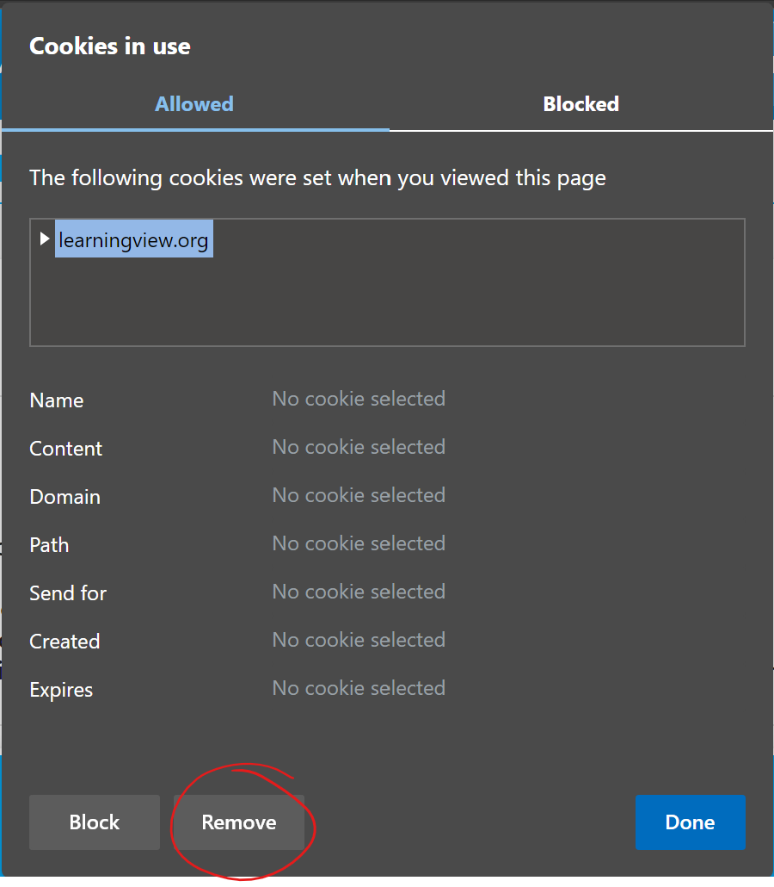
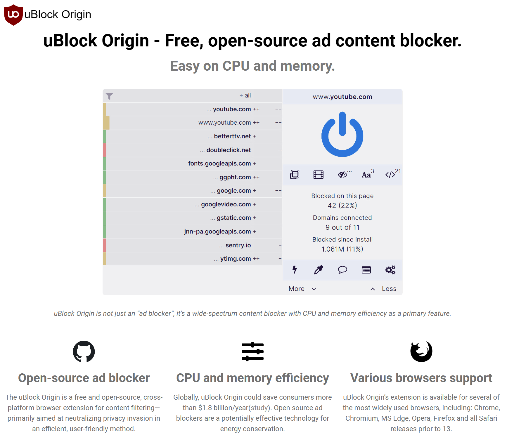

---
sidebar_custom_props:
  id: 1cba1cc7-4a2a-4dfe-94f3-32d87ea4dea0
---

# Datenschutz

## Wie weiss Google, welche Webseiten ich besucht habe?

Viele Webseiten nutzen z.B. den Dienst "Google Analytics". Öffnen wir solch eine Webseite wird auch Google Analytics gestartet und schon legt Google ein Cookie bei uns ab (ein sogenanntes Drittanbieter-Cookie). Cookies sind kleine Datenpakete, welche eine Webseite auf dem lokalen Computer (genau genommen im Browser) speichert. Öffnen wir danach eine andere Webseite die Google Analytics nutzt (das nutzen die meisten Webseiten) so kann Google die eigenen Cookies lesen und weiss welche Seiten wir in welcher Reihenfolge wie lange angesehen haben. Generell nutzen online-Werbeagenturen Information von ihren Drittanbieter-Cookies um nutzerspezifische Werbung schalten zu können. Die Browser-Ererweiterung "Thunderbeam-Lightbeam" für den Chrome-Browser macht die Spuren sichtbar, welche wir mit Cookies im Internet hinterlassen. 

::::aufgabe[Cookies]
<Answer type="state" webKey="166823e8-7dc9-4949-b6e4-563d1584e22f" />

Installieren 

1. Installieren Sie Sie sich die Chrome- bzw. Edge-Erweiterung [👉 Thunderbeam-Lightbeam](https://chrome.google.com/webstore/detail/thunderbeam-lightbeam-for/hjkajeglckopdkbggdiajobpilgccgnj)
2. Gehen Sie nun auf eine beliebige Webseite und klicken Sie auf das Erweiterungs-Symbol , welches oben rechts dargestellt wird.
3. Surfen Sie etwas herum.
4. Öffnen Sie nun wieder den Tab von Lightbeam und schauen Sie, wer alles etwas von Ihren Besuchen auf anderen Webseiten mitbekommen hat.
5. Challenge: Suchen Sie eine Webseite ohne Verbindungen zu anderen Webseiten.

<Answer type="text" webKey="49ec2cb9-10ee-490e-ab24-39c74c1dc2ea" />

:::info[OFI-Website]
Welche Cookies finden Sie auf der ofi.gbsl-Website?

<Answer type="text" webKey="ce1e8abf-4726-4c9c-98e8-9a295d87fe76" />
:::

::::

## Cookies Löschen

Drücken Sie die Tasten
- __Windows__: [[Ctrl]] + [[Shift ⇧]] + [[Delete]]
- __Mac__: [[Cmd ⌘]] + [[Shift ⇧]] + [[Löschen ⌫]]

Jetzt erscheint ein Fenster, in welchem Sie die gespeicherten Browserdaten löschen können. Sie können auch wählen, bspw. nur die Browserdaten der letzten Stunde/Woche zu löschen. Probieren Sie es aus.

### Alternativen zum Shortcut:

- [:mdi-microsoft-edge--teal: Edge: Cookies in Microsoft Edge löschen](https://support.microsoft.com/de-de/microsoft-edge/cookies-in-microsoft-edge-l%C3%B6schen-63947406-40ac-c3b8-57b9-2a946a29ae09)
- [:mdi-google-chrome--red: Chrome: Cache leeren und Cookies löschen - Computer - Google-Konto-Hilfe](https://support.google.com/accounts/answer/32050?co=GENIE.Platform%3DDesktop&hl=de)
- [:mdi-firefox--orange: Firefox: Cookies und Website-Daten in Firefox löschen | Hilfe zu Firefox (mozilla.org)](https://support.mozilla.org/de/kb/cookies-und-website-daten-in-firefox-loschen)
- [:mdi-apple-safari--blue: Safari: Verwalten von Cookies und Website-Daten mit Safari auf dem Mac - Apple Support](https://support.apple.com/de-ch/guide/safari/sfri11471/mac)

:::info[Variante]
In den meisten Browsern (alle ausser Safari) können Cookies auch direkt über das kleine Schloss 🔒 in der Adresszeile gelöscht werden:

:::

## Der eigentliche Zweck von Cookies

:::aufgabe
<Answer type="state" webKey="f8a5145d-08b4-4a63-aa19-3635da2e3e00" />

Löschen Sie alle Cookies der Seite https://ofi.gbsl.website und aktualisieren Sie die Webseite. Was stellen Sie fest?

<Answer type="text" webKey="355d500a-dfed-43a9-8f32-6f11fc37bdf9" />

Im Unterricht haben Sie gesehen, dass es nebst den Cookies auch noch weitere Möglichkeiten gibt, um Daten im Browser zu speichern. Welche Möglichkeiten gibt es noch? Wie können Sie diese löschen?

<Answer type="text" webKey="b161f488-cce4-4f77-9a35-eb63e672428f" />

:::

## Werbe-Cookies blockieren

Werbe-Cookies und aufsässige Werbung lassen sich mit Erweiterungen blockieren. Damit dies gelingt, muss das Werbeblocker-Plugin jedoch den ganzen Inhalt der Webseite analysieren und erhält, wenn man nicht aufpasst, allenfalls sogar Zugriff auf sensible Daten wie Tastatureingaben. Deshalb ist es wichtig, dass Sie sich vor der Installation eines Werbeblockers über die Seriosität der Erweiterung informieren. Die Nutzerstatistik und die Bewertungen alleine sind noch nicht wirklick aussagekräftig. So ist bspw. die bekannte Erweiterung *AdblockPlus* Opensource, daher der Quellcode ist offengelegt und man sieht, welche Daten wie verarbeitet werden. Dies ist gut. Allerdings ist die Erweiterung nicht wirklich kostenlos, denn die Entwickler erhalten Geld von den Werbeagenturen, damit diese nicht blockiert werden. Dies ist nicht gut.

### Empfehlungen: uBlock Origin

[👉 uBlock Origin](https://ublockorigin.com/) ist eine OpenSource Erweiterung für Chrome, Firefox, Edge, Safari und Opera

- :mdi-github: OpenSource [uBlockOrigin](https://github.com/gorhill/uBlock)
- Bis Dato keine negativen Schlagzeilen
- verbraucht nicht unnötig Ressourcen

## Der Nachfolger von Cookies: Fingerprinting

:::aufgabe[Artikel Lesen]
<Answer type="state" webKey="37f10195-58b0-4bb7-a98c-fd562ed60ea5" />

Lesen Sie den verlinkten Artikel

:btn[[Artikel](https://traffective.com/2020/09/01/browser-fingerprinting/)]

- Halten Sie Fragen fest
- Erklären Sie in eigenen Worten, was Fingerprinting ist

<Answer type="text" webKey="dfd05310-10e3-4b5d-bdeb-cd5b72978417" />

:::

### Am i Unique?

:::aufgabe[Am I Unique]
<Answer type="state" webKey="7b0b0752-5952-47e0-b878-d48b3f1530bf" />

"Am I Unique" ist eine Website, welche Ihren digitalen Browser Fingerabdruck auswertet und bereitstellt. Damit ist es möglich zu sehen, welche Informationen durch das Aufrufen einer Website preisgegeben werden. Testen Sie Ihren Browser - wie gut sind Sie identifizierbar? Wie sieht das Resultat auf Ihrem Smartphone aus? Ändert sich etwas, wenn Sie den Test in einem privaten Fenster durchführen?

- [https://amiunique.org/fingerprint](https://amiunique.org/fingerprint)

<Answer type="text" webKey="c627366f-ebdd-4df0-a50a-468fbba30a5f" />
:::

:::aufgabe[EFF Cover your tracks]
<Answer type="state" webKey="4360d1d3-559f-4d42-a007-5a337665cba4" />

Mit "EFF Cover your tracks" können Sie ebenfalls Ihren digitalen Fingerabdruck testen. Zusätzlich gibt Ihnen diese Website aber auch Hinweise dazu, wie gut Sie bspw. gegen Cookie-Tracking abgesichert sind. Wie steht es um Ihre Absicherung?

- [https://coveryourtracks.eff.org/](https://coveryourtracks.eff.org/)

<Answer type="text" webKey="7aaef1f4-ebc2-4809-bcf2-cbe6540be1d1" />

:::

## Alternative Browser mit Fokus auf Datenschutz

- [Brave](https://brave.com/)
- [:mdi-firefox--orange: Firefox](https://www.mozilla.org/de/firefox/new/)
- [DuckDuckGo](https://duckduckgo.com/)
- [:mdi-opera--red: Opera](https://www.opera.com/de)
- [Epic](https://www.epicbrowser.com/)
- [Vivaldi](https://vivaldi.com/de/)
- [Tor](https://www.torproject.org/de/)
