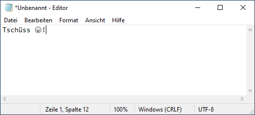
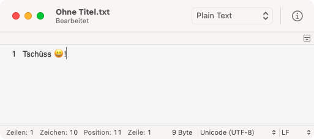
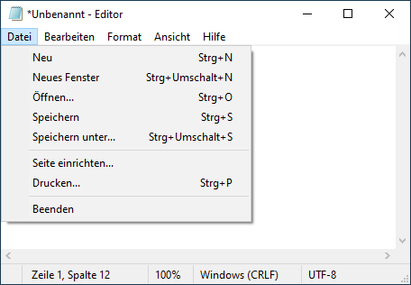

---
sidebar_custom_props:
  id: 60a2d33a-09ab-498d-afa3-d61b50543668
  source:
    name: S. Rothe, T. Jampen, R. Meyer
    ref: https://informatik.mygymer.ch/base/?page=code/3-text/5a-practical-windows/
---

import OsTabs from '@site/src/components/OsTabs'
import DecBinHexTransformer from "@site/src/components/VisualizationTools/DecBinHexTransformer";
import Hex2Bin from "@site/src/components/VisualizationTools/Hex2Bin";
import HexSystem from '@site/docs/Codes-and-Data/01-Codierung/_def-hexa.md';

# 7. Textcodierung

In dieser praktischen Übung speichern Sie auf Ihrem Computer eine Textdatei und überprüfst anschliessend, ob die in der Datei gespeicherten Bits tatsächlich der Unicode/UTF-8-Codierung des Texts entsprechen.

:::aufgabe[1. Texteditor öffnen]
<Answer type="state" webKey="528f373f-d9d7-4fe4-a211-c27726f18dd3" />

Der Editor ist eine App, in welcher man Textdateien erstellen und bearbeiten kann. Das kann man auch mit Word, dies ist jedoch umständlicher. Word-Dateien sind keine reinen Textdateien, sie enthalten auch andere Daten wie Formatierungen und Bilder.

<OsTabs>
<TabItem value="win">

Starten Sie die _Editor_-App, indem Sie im Startmenü nach «editor» suchen:


</TabItem>
<TabItem value="win10">

Starten Sie die _Editor_-App, indem Sie im Startmenü nach «editor» suchen:


</TabItem>
<TabItem value="mac">

Um in macOS Textdateien erstellen und bearbeiten zu können, installieren Sie am besten die App _CotEditor_ aus dem App Store:

- [👉 CotEditor im AppStore](https://apps.apple.com/de/app/coteditor/id1024640650)

</TabItem>
</OsTabs>

:::

:::aufgabe[2. Text eingeben]
<Answer type="state" webKey="6682dc2c-b472-4fad-98f4-eb8bbe6f42ab" />

Geben Sie einen kurzen Text ein. Dieser sollte nicht nur ASCII-Zeichen enthalten, sondern auch ein Umlaut wie «ä» und Emojis. 


<OsTabs>
<TabItem value="win">

Emojis können unter Windows mit dem Tastenkürzel [[:mdi-microsoft-windows:]] + [[.]] eingefügt werden.

</TabItem>
<TabItem value="mac">

Emojis können unter Mac OS X mit dem Tastenkürzel [[Ctrl]] + [[Cmd :mdi-apple-keyboard-command:]] +[[Leertaste :mdi-keyboard-space:]] eingefügt werden.

</TabItem>
</OsTabs>

Alternativ findet man unter [👉 Emojipedia](https://emojipedia.org) viele weitere Emojis.


<OsTabs>
<TabItem value="win">



</TabItem>
<TabItem value="mac">



</TabItem>
</OsTabs>
:::

:::aufgabe[3. Textdatei speichern]
<Answer type="state" webKey="b685dfdc-27eb-444a-a59f-019b315aa4af" />

Speichern Sie die Textdatei unter dem Namen __Unicode-Test.txt__ indem Sie


<OsTabs>
<TabItem value="win">

- die Tastenkombination [[Ctrl]]+[[s]] drücken oder
- den Menüpunkt `Datei > Speichern` auswählen.



</TabItem>
<TabItem value="mac">

- die Tastenkombination [[Cmd]]+[[s]] drücken oder
- den Menüpunkt `Datei > Sichern …` auswählen.


</TabItem>
</OsTabs>

:::

::::aufgabe[4. Datei als Bytes betrachten]
<Answer type="state" webKey="42f48306-1123-4161-a256-1eacc6ab8430" />

Mit dem Online-Tool _HexEd.it_ können Sie eine beliebige Datei Byte für Byte betrachten:

[👉 HexEd.it](https://hexed.it)

Klicken Sie auf **Datei öffnen** und wählen Sie die vorhin gespeicherte Textdatei aus. Nun sehen Sie die einzelnen Bytes, welche die Datei enthält, beispielsweise:

```
54 73 63 68 C3 BC 73 73 20 F0 9F 98 80 21
```

Die Bytes werden wie in der Informatik üblich als *Hexadezimalzahlen* angegeben. Wenn man über die einzelnen Bytes navigiert (mit den Pfeiltasten), sieht man auf der linken Seite die entsprechende Binärcodierung. Alternativ finden Sie hier auch einen Umrechner zwischen Binär-, Dezimal- und Hexadezimalzahlen.


:::details[⭐️ Hexadezimal Zahlen]
<HexSystem />
<DecBinHexTransformer />
:::

<Hex2Bin />

In der binären Darstellung sehen Sie sofort die Zeichen, welche mehrere Bytes benötigen. Sie beginnen mit einer 1. So ist `11000011 10111100` die Codierung des Buchstabens «ü».

Nun können Sie mit folgenden Hilfsmitteln überprüfen, ob die Bytes tatsächlich der Unicode/UTF-8-Codierung Ihres Textes entsprechen:

- [👉 ASCII-Tabelle](./03-Zeichencodierung.mdx#) für Bytes, die mit einer `0` starten
- [👉 Unicode-Tabelle](https://unicode-table.com/de/) für zusammengesetzte Zeichen mit mehreren Bytes

- Halten Sie die Hexadezimalzeichen Ihres Textes fest.
- Wo ist das erste Emoji? Überprüfen Sie, ob Sie den Dezimalwert des Emojis entziffern und auf 👉 https://unicode-table.com/de/ finden

<Answer type="text" webKey="a12363b7-4403-481e-8226-97f28624465f" />

<Hint>

Im vorliegenden Beispiel sieht das so aus:

<div className="small-table" style={{marginLeft: '2em'}}>

|       Byte(s) | Zeichen |
| ------------: | :------ |
|          `54` | T       |
|          `73` | s       |
|          `63` | c       |
|          `68` | h       |
|       `C3 BC` | ü       |
|          `73` | s       |
|          `73` | s       |
|          `20` | ␣       |
| `F0 9F 98 80` | 😀       |
|          `21` | !       |

</div>
</Hint>
::::

:::aufgabe[⭐️ Zusatzaufgabe - Andere Dateien]
<Answer type="state" webKey="132b7d4d-6605-45d6-a212-079d3487ec8a" />

Betrachten Sie andere Dateien in _HexEd.it_ und achten Sie auf folgendes:

- Finden Sie in anderen Dateien auch Unicode-codierten Text?
- Erkennen Sie ein Muster bei den ersten paar Bytes von Dateien des gleichen Typs?

<Answer type="text" webKey="cd4a4497-1fcb-4cd9-a522-cd9c8e58b88b" />
:::


