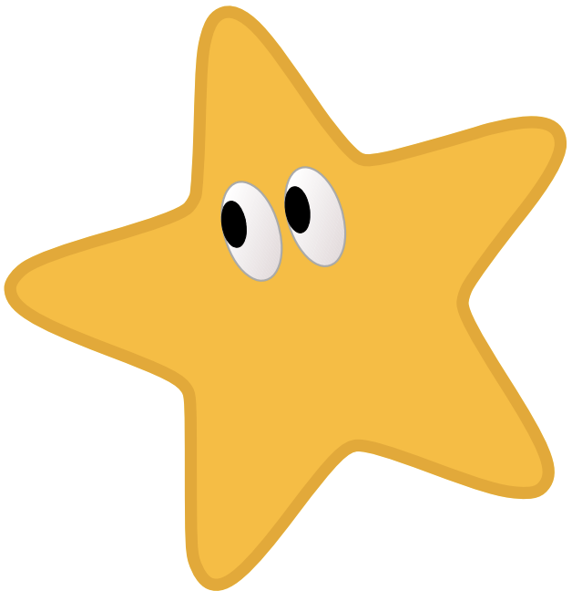

import Answer from '@site/src/components/Answer';
import Solution from '@site/src/components/Solution';

# 8. Sehsterne [^1]

:::flex --gap=3em --align-items=center
***--max-width=250px

***
Sehsterne (das sind Seesterne mit Augen) kennen nur die fünf 
Buchstaben `A` ,`C`, `I`, `N`, `T`, die sie auf einem gesunkenen Schiff entdeckt 
haben. Alle Wörter setzen sie aus diesen Buchstaben zusammen.
:::

## ACINT-Code
:::flex
Die Sehsterninformatiker haben eine binären Code für ihr
Alphabet entwickelt, den sie **ACINT-Code** nennen:

:::aufgabe 1. ACINT
1. Decodieren Sie die folgende Nachricht:
    ```
    ☆★★ ★☆☆ ☆☆☆ ☆★☆ ☆★★ ★☆☆ ☆★☆ ☆★★ 
    ★☆☆ ★☆☆ ☆☆★ ★☆★ ☆★★ 
    ```
    <Answer type="text" webKey="72a57969-9a05-43f4-9273-d60f398ad6f3" />

<Solution webKey="ff6cf304-08df-4ba4-be7f-91dc68e55e20">

IN CINCINNATI
</Solution>

2.  Codieren Sie die folgende Nachricht in ACINT-Code:
    ```
    A CAT CAN ACT
    ```
    <Answer type="text" webKey="e8094981-e445-41fd-a44d-1cdbaa0d2318" />

<Solution webKey="ff6cf304-08df-4ba4-be7f-91dc68e55e20">

`☆☆★  ☆☆☆   ☆★☆  ☆☆★  ★☆★  ☆☆☆   ☆★☆  ☆☆★  ★☆☆  ☆☆☆   ☆☆★  ☆★☆  ★☆★`
</Solution>

:::
***--max-width=250px


:::

## Gebärdensprache
:::flex
Die Sehsterne haben keinen Mund. Sie kommunizieren, indem sie
nacheinander für jeden Buchstaben den entsprechenden Arm heben.
Eines Tages entdecken die Sehsterne ein weiteres gesunkenes Schiff
mit fünf neuen Buchstaben: `E`, `H`, `J`, `M`, `R`.

:::aufgabe 2. Gebärdensprache
1. Schlagen Sie den Sehsternen ein System vor, wie sie alle zehn
Buchstaben durch Heben der fünf Arme darstellen können.

<Answer type="text" webKey="1fa57dee-89b4-4b5b-8794-ba574029cd2f" />
<Solution webKey="ff6cf304-08df-4ba4-be7f-91dc68e55e20">

Es gibt viele Ansätze. Eine einfache Möglichkeit ist, die zusätzlichen Buchstaben durch Heben zweier benachbarter Arme zu signalisieren:


<div className="slim-table">

| Zeichen | Gehobener Arm |
| ------: | :------------ |
|       A | `A`           |
|       C | `C`           |
|       I | `I`           |
|       N | `N`           |
|       T | `T`           |
|       E | `A+c`         |
|       H | `C+I`         |
|       J | `I+N`         |
|       M | `N+T`         |
|       R | `T+A`         |

</div>
</Solution>

2. Wie viele unterschiedliche Buchstaben können Sehsterne maximal durch heben der 
fünf Arme darstellen?

<Answer type="text" webKey="f07931ab-fa40-43df-9afa-3c4ed61eb770" />
<Solution webKey="ff6cf304-08df-4ba4-be7f-91dc68e55e20">

Wenn die Sehsterne einen binären Code wählen, können sie maximal $2^5 = 32$ verschiedene Zeichen darstellen.
</Solution>
:::

***--max-width=180px

:::

## Erweiterter ACINT-Code
Die Sehstern-Informatiker möchten einen neuen binären Code entwickeln, um die neuen 
Buchstaben darstellen zu können. Der neue Code soll aber kompatibel mit
dem bisherigen ACINT-Code sein. 

:::aufgabe 3. Erweiterung ACINT-Code
Machen Sie einen Vorschlag für einen
solchen Code.

<Answer type="text" webKey="3b8edf67-fcad-4a89-a2db-83a79a8baa1a" />
<Solution webKey="ff6cf304-08df-4ba4-be7f-91dc68e55e20">

Auch hier gibt es verschiedene Ansätze. Drei Bit reichen nicht, da damit maximal $2^3 = 8$ Zeichen dargestellt werden können.

Eine Möglichkeit ist es, wie bei ASCII-Erweiterungen ein zusätzliches Bit voranzustellen. Bei den bisherigen Zeichen muss das Bit Null sein:

<div className="slim-table">

|    Zeichen | Code   | Zeichen | Code   |
| ---------: | :----- | ------: | :----- |
| ` ` (leer) | `☆☆☆☆` |      `` | ``     |
|          A | `☆☆☆★` |       E | `★☆☆★` |
|          C | `☆☆★☆` |       H | `★☆★☆` |
|          I | `☆☆★★` |       J | `★☆★★` |
|          N | `☆★☆☆` |       M | `★★☆☆` |
|          T | `☆★☆★` |       R | `★★☆★` |

</div>

Eine andere Möglichkeit wäre, wie bei der Brailleschrift ein «Umschaltzeichen» einzuführen. Die Buchstaben E, H, J, M, R erhalten den gleichen Code wie A,C, I, N, T. Mit einem vorangestellten ★★★ wird markiert, dass der «neue» Buchstabe gemein ist:

<div className="slim-table">

|    Zeichen | Code  | Zeichen | Code      |
| ---------: | :---- | ------: | :-------- |
| ` ` (leer) | `☆☆☆` |         |
|          A | `☆☆★` |       E | `★★★ ☆☆★` |
|          C | `☆★☆` |       H | `★★★ ☆★☆` |
|          I | `☆★★` |       J | `★★★ ☆★★` |
|          N | `★☆☆` |       M | `★★★ ★☆☆` |
|          T | `★☆★` |       R | `★★★ ★☆★` |
</div>

</Solution>

:::


## ⭐️ Gesunkenes Schiff (Bonus)
:::aufgabe 4. Gesunkenes Schiff
Wie lautet der Name des ersten gesunkenen Schiffs?
<Answer type="text" webKey="bbbbe791-68e8-4603-9269-35d3af9f787e" />
<Solution webKey="ff6cf304-08df-4ba4-be7f-91dc68e55e20">

Aus den Buchstaben A, C, I, N, T lässt sich TITANIC zusammensetzen.
</Solution>
:::

[^1]: Quelle: [Stefan Rothe](https://rothe.io/code/3-text/6-exercises/arbeitsblatt-textcodierung.pdf)