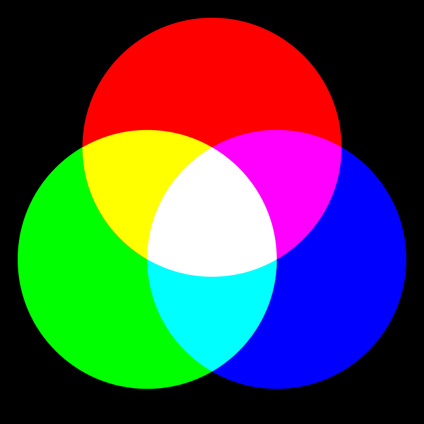
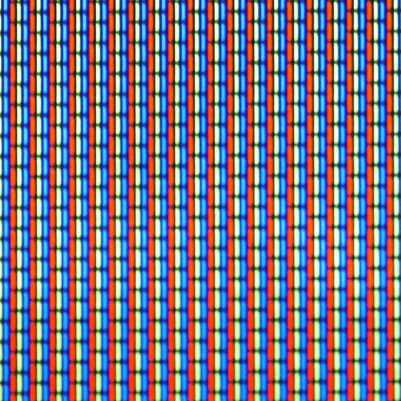
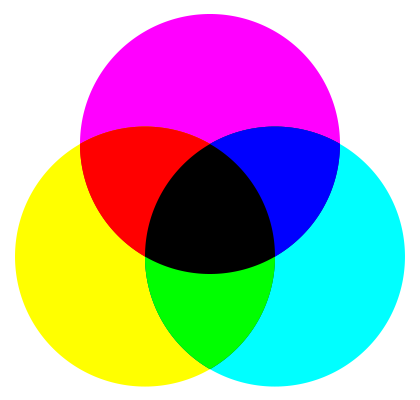

import RGB from "@site/src/components/VisualizationTools/ColorEncoding/RGB";
import RGBA from "@site/src/components/VisualizationTools/ColorEncoding/RGBA";
import CMYK from "@site/src/components/VisualizationTools/ColorEncoding/CMYK";

## Farbkanäle [^1]

Für die digitale Verarbeitung müssen Farben in Zahlen umgewandelt werden. Das geschieht, indem die Farben in verschiedene Komponenten, sogenannte **Farbkanäle** aufgeteilt werden. Pro Pixel kann so die Intensität je Farbkanal als Zahl bestimmt werden.

Die zwei wichtigsten Ansätze, wie diese Aufteilung in verschiedene Kanäle erfolgt, werden im folgenden vorgestellt.

## RGB-Farbmodell

Das **RGB-Farbmodell** basiert auf der Funktionsweise des menschlichen Auges. Dieses nimmt Farben mit Hilfe von drei Arten von sogenannten **Zäpfchen** wahr, die für Licht unterschiedlicher Wellenlängen empfindlich sind. So werden vom Menschen die Grundfarben Rot, Grün und Blau wahrgenommen.


Diese Eigenschaft des Auges wird bei der **additiven Farbdarstellung** ausgenutzt, indem sich überlagernde Lichtquellen in den drei Grundfarben Rot, Grün und Blau verwendet werden. Durch die Regulierung der Helligkeit der einzelnen Lichtquellen können sämtliche Farben erzeugt werden.

Dieses Farbmodell kommt überall dort zum Einsatz, wo Licht verwendet wird, um ein Bild zu erzeugen, insbesondere bei **Bildschirmen** und **Videoprojektoren** («Beamer»). Die Farben auf einem Bildschirm werden erzeugt, indem drei nahe beieinanderliegende Leuchtdioden in den Farben Rot, Grün und Blau in unterschiedlicher Helligkeit leuchten. Ein solches Trio von Leuchtdioden wird **Pixel** genannt.

:::cards

***

:::

Umgekehrt kann man bei einem Bild die Rot-, Grün- und Blauanteile jedes Bildpunkts bestimmen. Man sagt, dass man das Bild in Rot-, Grün- und Blaukanal aufteilt:


Im entsprechenden **RGB-Farbsystem** wird eine Farbe definiert, indem die Helligkeit der Rot-, Grün- und Blauanteils durch eine Zahl zwischen 0 und 255 ausgedrückt wird.

Um eine Farbe binär darzustellen, werden die binären Darstellungen der Zahlen für Rot, Grün und Blau nacheinander aufgeschrieben. So hat beispielsweise die Farbe mit den RGB-Werten `255, 220, 150` die binäre Darstellung `11111111 11011100 10010110`.

<RGB />


## RGBA-Farbmodell

Für das **RGBA-Farbmodell** wird das RBG-Farbmodell um einen Kanal erweitert. Dieser heisst **Alphakanal** und drückt aus, wie stark die **Deckkraft** der Farbe ist. Ein Wert von `0` bedeutet gar keine Deckkraft und somit volle Transparenz. Ein maximaler Wert bedeutet maximale Deckkraft und somit keine Transparenz.

<RGBA />

:::aufgabe Farben ausprobieren

Füllen Sie die drei Kreise mit unterschiedlichen Farben - Sie können direkt den `hex` Wert einsetzen, z.b. `color('#3ed92161')`.

```py live_py title=farben.py id=a7de7bbd-4e4b-455c-915c-417e830727a0
from turtle import *

def move(x, y):
  penup()
  goto(x, y)
  pendown()

move(0, 50)
circle(100)

move(50, -43)
circle(100)

move(-50, -43)
circle(100)
```

Können Sie in der Mitte **Weisse** oder **Schwarze** Farbe erzeugen?
:::

## CMYK-Farbmodell

Das **CMYK-Farbmodell** basiert auf der Weise, wie Gegenstände farbig erscheinen. Ein Gegenstand wird üblicherweise mit weissem Licht, also Licht verschiedener Wellenlängen (Rot, Grün und Blau) angestrahlt. Beispielsweise erscheint ein gelber Gegenstand deshalb in dieser Farbe, weil er blaues Licht **absorbiert** und rotes und grünes Licht **reflektiert**.



Bei der **subtraktiven Farbdarstellung** werden auf weissem Material die drei Grundfarben *Cyan*, *Magenta* (Fuchsia) und *Yellow* (Gelb) verwendet, welche rotes, grünes bzw. blaues Licht absorbieren. Zusätzlich wird *schwarze Farbe* (Key-Kanal) verwendet, welche alles Licht absorbiert.


Dieses Farbmodell kommt beim Drucken zum Einsatz.

<CMYK />

<details><summary> ⭐️ Umrechnung CMYK – RGB </summary>

Für die Umrechnung einer `CMYK`-Farbangabe nach `RGB` wird folgender Formelsatz verwendet:

$$
\begin{aligned}
  r &= (1 - c) \cdot (1 - k) \\
  g &= (1 - m) \cdot (1 - k) \\
  b &= (1 - y) \cdot (1 - k) \\
\end{aligned}
$$

Dabei wird vorausgesetzt, dass sämtliche Werte im Bereich 0 bis 1 liegen. Wenn beispielsweise die CMYK-Werte in Prozent angegeben werden und die RGB-Werte mit einem Byte codiert werden, ergeben sich folgende Formeln:

$$
\begin{aligned}
  r &= 255 \cdot (1 - c \cdot 0.01) \cdot (1 - k \cdot 0.01) \\
  g &= 255 \cdot (1 - m \cdot 0.01) \cdot (1 - k \cdot 0.01) \\
  b &= 255 \cdot (1 - y \cdot 0.01) \cdot (1 - k \cdot 0.01) \\
\end{aligned}
$$

```py live_py slim

def sanitize(wert):
    # Wandelt Prozent-Werte zu Zahlen zwischen 0 und 1 um
    if wert > 1:
        return wert / 100
    return wert

def cmyk2rgb(c, m, y, k):
    faktor = 1 - sanitize(k)
    r = (1 - sanitize(c)) * faktor
    g = (1 - sanitize(m)) * faktor
    b = (1 - sanitize(y)) * faktor
    return [r, g, b]

print('rgb: ', cmyk2rgb(80, 60, 40, 20))
```

</details>

## Farbtiefe

Die Anzahl Bits oder Bytes, welche **insgesamt** für die Speicherung einer Farbe verwendet werden, wird **Farbtiefe** genannt. Damit wird festgelegt, wie viele unterschiedliche Abstufungen pro Farbkanal dargestellt werden können. Beim RGB-Farbmodell wird üblicherweise eine Farbtiefe von 3 Byte oder 24 Bit verwendet. Dies ergibt pro Farbkanal acht Bit, also ein Byte. Somit können 256×256×256 = 16.7 Millionen unterschiedliche Farben dargestellt werden.

<div className="slim-table">

| Farbmodell        | Farbtiefe | Pixel → Bytes |
| :---------------- | --------: | ------------: |
| RGB (True Colour) |    3 Byte |            ×3 |
| CMYK              |    4 Byte |            ×4 |
| Graustufen        |    1 Byte |            ×1 |
| Schwarzweiss      |     1 Bit |            ÷8 |

</div>

[^1]: Quelle: [S. Rothe, T. Jampen, R. Meyer](https://informatik.mygymer.ch/base/?b=code&p=96474)
