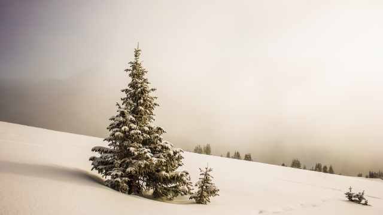
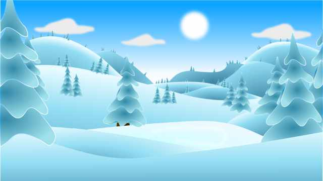
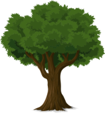
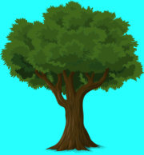

# 3. Rastergrafik

## Theoretische Speichergrösse

Die theoretische Speichergrösse einer Rastergrafik wird berechnet, indem die Anzahl Pixel $a$ mit der Farbtiefe $f$ multipliziert wird. Die Farbtiefe gibt an, welche Datenmenge für die Darstellung einer Farbe benötigt wird.

Die Anzahl Pixel wird aus der **Auflösung**, also der Breite $b$ und Höhe $h$ des Bildes in Pixel berechnet.

Für die Speichergrösse rechnen wird also wie folgt:

$$
b\cdot h\cdot f$$

:::info Beispiel
Ein Bild mit einer Auflösung von `1920×1080` Pixel und der Farbtiefe `3 Byte` benötigt einen Speicherplatz von:

$$
1920\cdot 1080\cdot 3 = 6220800 \,\text{B} = 6.2 \,\text{MB}$$
:::

## JPEG-Grafikformat

Das Grafikformat der _Joint Photographic Experts Group_ ist ein beliebtes Format zu Speicherung von Fotos. Es kann den benötigten Speicherplatz gegenüber der theoretischen Grösse von Rastergrafiken sehr stark reduzieren.

Dazu wird ein komplexer mathematischer Algorithmus verwendet, welcher bewirkt, dass das ursprüngliche Bild nicht mehr genau Pixel für Pixel rekonstruiert werden kann. Deshalb spricht man hier von einer **verlustbehafteten Kompression**.

Der Algorithmus kann durch die Angabe der **Qualität** in Prozent beeinflusst werden. Die folgenden Bildausschnitte illustrieren, wie die Qualität und die Speichergrösse zusammenhängen:

:::cards --columns=4

***

***

***

:::

An den Bildern wird sichtbar, dass die JPEG-Kompression besonders entlang von Rändern Störungen («Artefakte») verursacht. Bei Fotos fällt dies weniger auf. Die folgenden zwei Bilder sind beide mit mittlerer JPEG-Qualität gespeichert worden:

:::cards --columns=2

***

:::

Das JPEG-Datei eignet sich also besonders, um Fotografien platzsparend zu speichern.

## PNG-Grafikformat

Das _Portable Network Graphics_-Format wird für **verlustfreie** Speicherung von Rastergrafiken mit **Transparenz** verwendet. Es eignet sich beispielsweise für Bildschirmfotos und Grafiken für Webseiten oder Computerspiele.

Das folgende Beispiel zeigt links einen Baum als PNG-Grafik mit Transparenz gespeichert. Rechts ist das gleiche Bild als JPG-Grafik mit hoher Qualität gespeichert.

:::flex --align-items=center

***

:::

Durch die Speicherung als JPG-Grafik geht die Transparenz verloren, das Bild kann z.B. nicht mehr auf farbigen Folien verwendet werden. Ausserdem sind JPEG-Artefakte sichtbar.

## Grössenvergleich der Dateiformate

Die folgende Tabelle zeigt die Dateigrössen des gleichen Bildes (640×360) mit verschiedenen Dateiformaten:

| Format                | Dateigrösse | relativ |
| :-------------------- | ----------: | ------: |
| theoretische Grösse   |      691 kB |    100% |
| PNG                   |      146 kB |     21% |
| JPG höchste Qualität  |      162 kB |     23% |
| JPG hohe Qualität     |       42 kB |      6% |
| JPG mittlere Qualität |       18 kB |      3% |
| JPG tiefe Qualität    |        9 kB |      1% |

