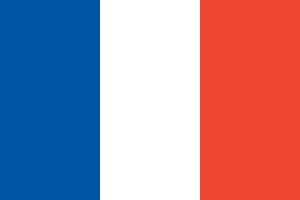
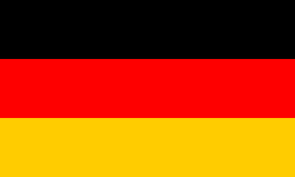

import Answer from '@site/src/components/Answer'

# 5. Vektorgrafik [^1]

Eine SVG-Datei ist eine Textdatei, welche «Befehle» enthält, wie Formen gezeichnet werden sollen.

## Grundstruktur

Eine SVG-Datei hat folgende Grundstruktur:

```html
<svg
  xmlns="http://www.w3.org/2000/svg"
  xmlns:xlink="http://www.w3.org/1999/xlink"
></svg>
```

:::aufgabe Vorbereitung

- Öffnen Sie in den Texteditor.
- Kopieren Sie die Grundstruktur in den Texteditor.
- Speichern Sie die Datei unter dem Namen **Aufgabe.svg**.
:::

## Rechtecke

Das folgende Beispiel stellt die französische Flagge dar:

```html
<svg width="300" height="200" xmlns="http://www.w3.org/2000/svg" xmlns:xlink="http://www.w3.org/1999/xlink">
  <desc>Flagge Frankreichs</desc>
  <rect x="0" y="0" width="100" height="200" fill="rgb(0, 85, 164)" />
  <rect x="100" y="0" width="100" height="200" fill="rgb(255, 255, 255)" />
  <rect x="200" y="0" width="100" height="200" fill="rgb(239, 69, 49)" />
</svg>
```



- `width="300"` legt die Breite des Bildes auf 300 Pixel fest.
- `height="200"` legt die Höhe des Bildes auf 200 Pixel fest.
- `<rect ...>` zeichnet ein Rechteck an den angegebenen Koordinaten mit der angegebenen Breite, Höhe und Farbe.

:::aufgabe Deutsche Flagge

Erstellen Sie eine SVG-Datei, welche die Deutsche Flagge darstellt. Die Flagge ist 500 Pixel breit, jeder Streifen ist 100 Pixel hoch. Das Rot ist rein (d.h. 255 Rot, 0 Grün und 0 Blau). Das Gelb hat einen Rotanteil von 255 und einen Grünanteil von 204.



<Answer type="text" webKey="c827cf8f-69f5-4a2f-adbf-db8f187380ca" />
:::

## Grundformen

Auf der folgenden Seite sind die Grundformen von SVG zusammengefasst:

- [SVG-Grundformen](https://wiki.selfhtml.org/wiki/SVG/Elemente/Grundformen)

:::aufgabe Grundformen

Erstellen Sie eine neue SVG-Datei und probieren Sie die Grundformen aus.

<Answer type="text" webKey="2aa43ec6-d61b-412f-b7b8-e98b227c1696" />
:::

:::aufgabe Eigene Zeichnung

Erstellen Sie mit SVG eine winterliche oder festliche Grafik.

<Answer type="text" webKey="f8f6dc01-5264-4115-a4df-4965e7912d95" />
:::

[^1]: Quelle: [S. Rothe, T. Jampen, R. Meyer](https://informatik.mygymer.ch/base/?b=code&p=860740)
