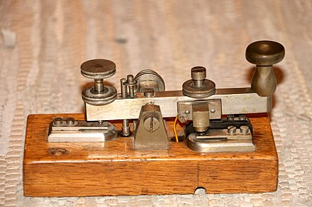

# 1. Morsecode


> Der Morsecode (auch Morsealphabet oder Morsezeichen genannt) ist ein gebräuchlicher Code zur telegrafischen Übermittlung von Buchstaben, Ziffern und weiterer Zeichen. Er bestimmt das Zeitschema, nach dem ein diskretes Signal ein- und ausgeschaltet wird.[^1]



## Tabelle zur Codierung

<div className="slim-table">

| Buchstabe | Code   | Buchstabe | Code   | Buchstabe | Code   |
| :-------: | :----- | :-------: | :----- | :-------: | :----- |
|     A     | `·−`   |     K     | `-·-`  |     U     | `··-`  |
|     B     | `-···` |     L     | `·-··` |     V     | `···-` |
|     C     | `-·-·` |     M     | `--`   |     W     | `·--`  |
|     D     | `-··`  |     N     | `-·`   |     X     | `-··-` |
|     E     | `·`    |     O     | `---`  |     Y     | `-·--` |
|     F     | `··-·` |     P     | `·--·` |     Z     | `--··` |
|     G     | `--·`  |     Q     | `--·-` |     Ä     | `·-·-` |
|     H     | `····` |     R     | `·-·`  |     Ö     | `---·` |
|     I     | `··`   |     S     | `···`  |     Ü     | `··--` |
|     J     | `·---` |     T     | `-`    |    CH     | `----` |
</div>

:::aufgabe Morse-Code
<Answer type="state" webKey="2e030af6-fe51-46cc-add6-ff1ea09ca034" />

Schreiben Sie ein Wort mit 6 Buchstaben in Morse-Code.
- Entziffern Sie die codierten Worte Ihrer Pultnachbar:innen.
- Wie viele Zeichen wurden verwendet?
- Was hat der Morsecode mit der Huffman-Codierung zu tun? Finden Sie Parallelen?
- Erstellen Sie eine praktischere Tabelle für die Decodierung von Nachrichten

<Answer type="text" webKey="5ff9bd7e-6bad-4728-8396-849167bba91a" />

<Solution webKey="3673feb3-e73e-4ebd-b152-024b8826c571">

Das Decodieren von Morse-Code ist bedeutend einfacher, wenn die Tabelle als binären Baum dargestellt wird. Es ist zu sehen, dass die häufigen Buchstaben weniger Zeichen benötigen, als die seltenen Buchstaben. Das Prinzip ist dasselbe wie bei den Huffman-Bäumen, wobei hier ein Punkt "nach Links" und ein Strich "nach Rechts" bedeutet. Zudem ist braucht es im Vergleich zur Huffman-Codierung **zwingend** Abstände zwischen den einzelnen Buchstaben - `······` könnte sonst `EEEEEE`, `EIEI` oder aber auch `EIS` heissen. Deshalb braucht es einen Takt, in welchem immer nur ein Zeichen übertragen wird: Bei `·` `··` `···` ist klar, dass es `EIS` heisst.  
 
```
                                ← ·                - →
                    E                                           T
                    ·                                           -
           ╱‾‾‾‾‾‾‾‾‾‾‾‾‾‾‾‾‾‾╲                        ╱‾‾‾‾‾‾‾‾‾‾‾‾‾‾‾‾‾‾╲
          I                    A                      N                    M
         ··                    ·-                    -·                    --
     ╱‾‾‾‾‾‾‾‾╲            ╱‾‾‾‾‾‾‾‾╲            ╱‾‾‾‾‾‾‾‾╲            ╱‾‾‾‾‾‾‾‾╲
    S          u          R          W          D          K          G          O   
   ···        ··-        ·-·        ·--        -··        -·-        --·        ---
   ╱ ╲        ╱ ╲        ╱ ╲        ╱ ╲        ╱ ╲        ╱ ╲        ╱ ╲        ╱ ╲  
  H   V      F   Ü      L   Ä      P   J      B   X      C   Y      Z   Q      Ö  CH 
···· ···-  ··-· ··--  ·-·· ·-·-  ·--· ·---  -··· -··-  -·-· -·--  --·· --·-  ---· ----
```
</Solution>

:::

:::aufgabe Verwendung
<Answer type="state" webKey="16a1d23a-cfd2-4472-a17d-cc2172892c46" />

Recherchieren Sie im Internet,
- über welche Medien Morsezeichen übertragen werden können (bspw. als elektrischer Puls über eine Leitung)
- wo Morsezeichen auch heute noch eingesetzt werden.

<Answer type="text" webKey="ae2462eb-94cf-48bb-9c8e-9f5c31a0c8da" />
:::

:::aufgabe ⭐ Akkustischer Morsecode
<Answer type="state" webKey="6d42df6f-93e9-4d17-95d0-f97d908d2cac" />

Gehen Sie in Vierergruppen zu einem Treppengeländer, jeweils zwei Personen an einem Ende des Geländers.

Können Sie sich ausschliesslich über akkustische Morsezeichen verständigen? Verschicken- und empfangen Sie jeweils ein Wort mit mindestens 6 Buchstaben.

<Answer type="text" webKey="b255835a-4c39-42a0-8a35-42d34595823f" placeholder="Notizen..." />
:::


[^1]: Quelle: [Wikipedia](https://de.wikipedia.org/wiki/Morsecode)
