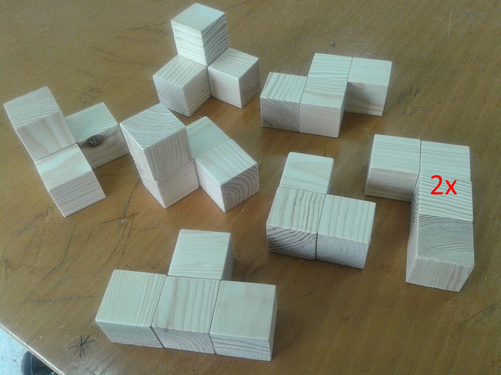

---
sidebar_custom_props:
  id: 4b3fea32-c56f-4c49-9a78-19318215c777
---
# OpenSCAD

[👉 OpenSCAD](https://www.openscad.org/) herunterladen und installieren.


## Einführung

::video[./images/intro.mp4]

:::details[__intro.scad__]
```scad
module baustein() {
    difference() {
        union() {
            cube([3, 1, 1]);
            translate([1, 1, 0])
                cube([1, 1, 1]);
        }
        translate([1.25,0.25,-0.01])
            cube([0.5, 0.5, 1.02]);
    }
}
translate([2, 2, 0])
    rotate([90, 0, 0])
        scale([0.5, 0.5, 1])
            baustein();
```
:::

:::aufgabe[Knobelwürfel]
<Answer type="state" webKey="be4201c1-2f76-47e4-ad8a-47f67ea67a57" />

Erstellen Sie ein 3D Modell mit den 8 Elementen (eigentlich sind es "nur" 6 Formen, 2 davon werden doppelt gedruckt) eines Knobel-Würfels. Die Elemente sollen sich nicht berühren und sollen sich auch nicht gegenseitig überlappen. Eine Würfelseite soll dabei nicht grösser als `10` Einheiten (entspricht dann `10 mm`) sein.

Vorgehen:
1. Eine Form mit mit Seitenlänge `1` bauen und schauen, dass diese stimmt.
    ```scad
    cube([1, 1, 1]);
    translate([1, 0, 0])
        cube([1, 1, 1]);
    translate([0, 1, 0])
        cube([1, 1, 1]);
    ```
2. Diese Form in ein Modul verschieben und dieses Modul aufrufen
    ```scad
    module kleines_L() {
        cube([1, 1, 1]);
        translate([1, 0, 0])
            cube([1, 1, 1]);
        translate([0, 1, 0])
            cube([1, 1, 1]);
    }

    kleines_L();
    ```
3. Wenn erste Form fertig, die zweite erstellen, indem zuerst das "kleine L" auskommentiert wird (dann wird es nicht mehr angezeigt und die nächste Form kann im Ursprung gezeichnet werden):
    ```scad
    ...
    // kleines_L();
    ```
4. Wenn Sie für jede Form ein Modul erzeugt haben, positioniert man die einzelnen Elemente auf der `XY`-Ebene, so dass sich keine Elemente berühren
    ```scad
    ...

    kleines_L();
    translate([2, 0, 0])
        grosses_L();

    translate([0, 2, 0])
        grosses_L();

    ```
5. Nun soll der ganze Würfel grösser gedruckt werden - wir skalieren deshalb unseren Würfel...
    ```scad
    ...
    // achtung: Das Umlaute wie "ü" sind nicht erlaubt
    module magischer_wuerfel() {
        kleines_L();
        translate([2, 0, 0])
            grosses_L();

        translate([0, 2, 0])
            grosses_L();
    }

    // den ganzen Würfel 8x grösser machen
    scale(8)
        magischer_wuerfel();
    ```



- Exportieren Sie ein Bild __Datei > Exportieren > Bild exportieren...__ und halten Sie unten sowohl das Bild wie auch den Programmier-Code fest.


<Answer type="text" webKey="4f1256ea-6cca-4238-a0be-0fa5087aa254" toolbar={{code: 1, image: 1}} />


<Solution webKey="2b2d319a-e9ac-4bda-a155-047e531d79c1">

```scad reference
https://github.com/lebalz/ofi-blog/blob/main/docs/EF-IOT-Workshop/03-printing/01-OpenScad/assets/magic-cube.scad
```

</Solution>

:::

## Parameter und Schrift

::video[./images/params-and-text.mp4]

:::details[__simple-box.scad__]
```scad

BOX_X = 40;
BOX_Y = 40;
BOX_Z = 30;
BOX_WALL = 1.2;

// Interne Parameter
BOX_INNER_X = BOX_X - 2*BOX_WALL;
BOX_INNER_Y = BOX_Y - 2*BOX_WALL;

module txt() {
    translate([BOX_X / 2, 0.25 * BOX_WALL, BOX_Z / 2])
    rotate([90, 0, 0])
        linear_extrude(1)
            text("EF INFO", size=3, halign="center", valign="center");
}

module box() {
    difference() {
        cube([BOX_X, BOX_Y, BOX_Z]);
        translate([BOX_WALL, BOX_WALL, BOX_WALL])
            cube([BOX_INNER_X , BOX_INNER_Y, BOX_Z]);
        txt();
    }
}

module deckel() {
    union() {
        cube([BOX_X, BOX_Y, BOX_WALL]);
        translate([BOX_WALL, BOX_WALL, BOX_WALL])
            cube([BOX_INNER_X, BOX_INNER_Y, BOX_WALL]);
    }
}


box();
translate([BOX_X + 10, 0, 0])
    deckel();
```
:::

:::aufgabe[Schlüsselanhänger]
<Answer type="state" webKey="91d57d0c-5280-48d1-968a-c16c4d586101" />

Erstellen Sie in OpenSCAD einen Schlüsselanhänger nach Ihren Vorstellungen. Halten Sie Ihren Code unten fest:

<Answer type="text" webKey="278a2163-b42c-4f0b-84ac-9977a120bd13" monospace toolbar={{code: 1}} />

:::