---
sidebar_custom_props:
  id: 6504bb27-b4a9-4534-a0a1-571fd6cc066e
---

import OsTabs from '@site/src/components/OsTabs'

# 3D Schlüsselanhänger

Mit einem 3D-Drucker lassen sich dreidimensionale Objekte erzeugen. Dabei arbeiten alle gängigen Druckverfahren schichtweise - das Objekt wird aus mehreren Schichten zusammengesetzt, wobei eine einzelne Schicht zweidimensional auf die darunterliegende Schicht aufgetragen wird.

:::cards --columns=2 --text-align=center --width=200px
*** --text-align=center

*** --text-align=center

***
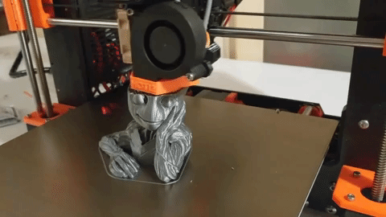
***
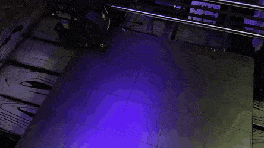
:::

Um ein Objekt zu drucken, muss in einem ersten Schritt ein **3D-Modell** erstellt werden und in einem zweiten Schritt muss dieses Modell in einen konkreten **Druck-Ablaufplan** erstellt werden, welcher Schicht-für-Schicht vorgibt, wo sich der Druck-Kopf durchbewegen soll. Dazu werden zwei Tools gebraucht:

- 3D Modell erstellen und bearbeiten mit [tinkercad.com](https://www.tinkercad.com/)
- Druck-Ablaufplan Plan für das Modell berechnen und die Farben auswählen mit dem [Slicer](https://www.prusa3d.com/de/page/prusaslicer_424/)

## QR Code 3D-Modell

Das Grundgerüst für den QR-Code kann direkt über die Webapplikation von https://printer.tools/qrcode2stl/ erzeugt werden.

<GTabs getLabel={(idx) => ['QR Code', '3D Modell', 'Speichern'][idx]} highlighted={[]}>

und das Modell generieren:

Die einzelnen Teile des Modells können als `.zip`-Ordner heruntergeladen werden. Dazu muss die Option **Separate Parts** aktiviert sein.

</GTabs>

Der heruntergeladene `.zip`-Ordner enthält die einzelnen Teile des 3D-Modells, so auch den QR-Code selbst: `qrcode-1645205191753.stl`:

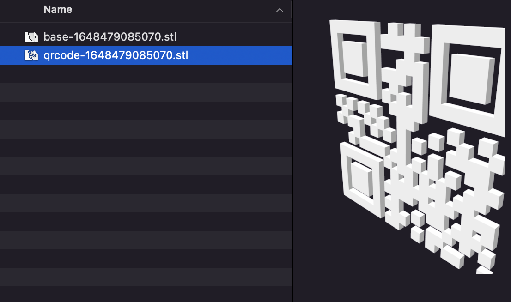

## Slicer installieren

Der [Prusa Slicer](https://www.prusa3d.com/de/page/prusaslicer_424/) wird für den 3D-Druck an der Schule verwendet. Laden Sie ihn herunter und installieren Sie ihn: https://www.prusa3d.com/de/page/prusaslicer_424/

<GTabs getLabel={(idx) => `${idx + 1}.`} highlighted={[2, 9, 10]}>

Original Prusa i3 MK3S & MK3S MMU2S mit der Düse `0.4mm` auswählen. Alle anderen Drucker können abgewählt werden.

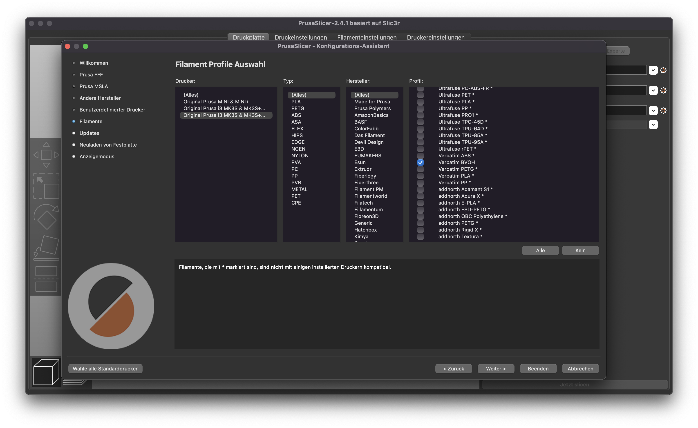

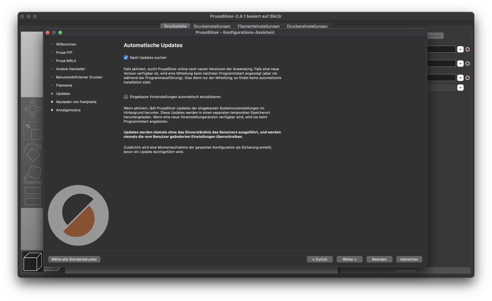

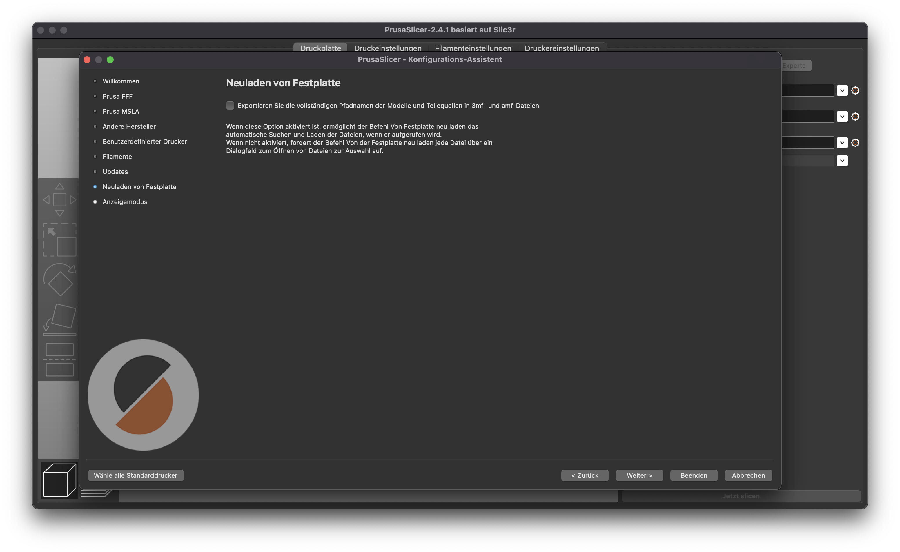

Experten-Modus auswählen, damit für jede Farbe ein anderes Filament gewählt werden kann. 
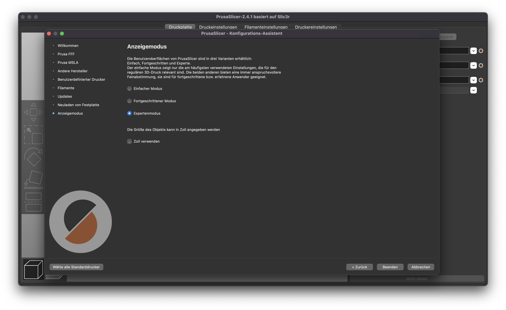

Den richtigen Drucker auswählen und die Option des Mehrfarbendrucks auswählen. Zudem soll immer im "Draft"-Modus gedruckt werden.
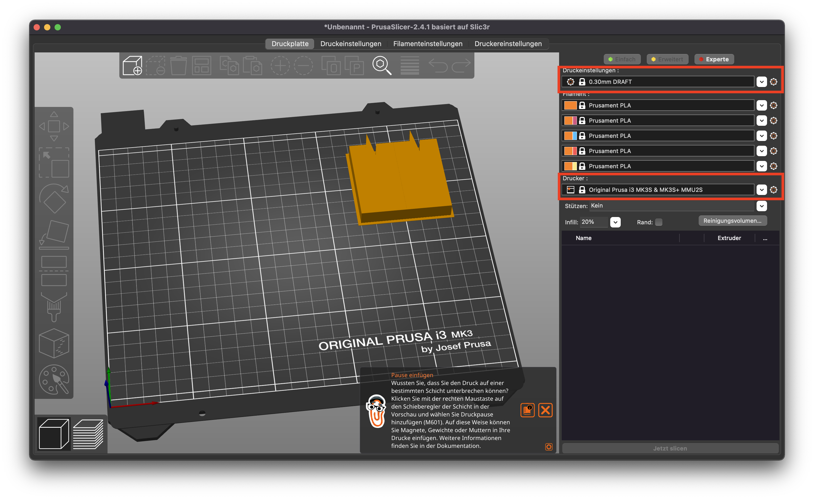

</GTabs>

:::danger Offene Kanten
Leider gibt es unterschiedliche Konventionen für die Erzeugung von 3D-Objektmodellen. Obwohl unser erzeugter QR-Code auf den ersten Blick gut aussieht, wurden bei der Erzeugung nicht alle Kanten miteinander verbunden, so dass einige Flächen im Modell nicht abgeschlossen sind. Dies kann automatisch behoben werden:

<OsTabs>
<TabItem value="win11">

Die heruntergeladene Datei im [slicer](https://www.prusa3d.com/de/page/prusaslicer_424/) öffnen.

Es wird ein Warn-Symbol angezeigt - durch **Doppelklicken** auf das Symbol können die Fehler korrigiert werden. 

</TabItem>
<TabItem value="win10">

Die heruntergeladene Datei im [slicer](https://www.prusa3d.com/de/page/prusaslicer_424/) öffnen.

Es wird ein Warn-Symbol angezeigt - durch **Doppelklicken** auf das Symbol können die Fehler korrigiert werden. 

</TabItem>
<TabItem value="mac">

Mac OSX bietet aktuell keine Möglichkeit, unvollständige 3D-Objekte zu flicken. Deshalb muss ein Web-Dienst verwendet werden:

https://tools3d.azurewebsites.net/

!! Es muss ein privates Microsoft-Konto verwendet werden, die geschäftliche Schul-Email Adresse funktioniert leider nicht.

Dort kann die `.stl` Datei hochgeladen, repariert und wieder heruntergeladen werden.

</TabItem>
</OsTabs>

Das Dateiformat ändert sich durch die Reparatur zu `.3mf`. Um im nächsten Schritt das 3D-Modell selber anzupassen, muss das Dateiformat aber wieder auf `.stl` geändert werden. Dies gelingt mit dem [slicer](https://www.prusa3d.com/de/page/prusaslicer_424/), welcher  `.3mf` in `.stl` Dateien konvertieren kann:

:::

## 3D-Modell erstellen: Tinkercad

Das geflickte Modell kann nun in Tinkercad weiter bearbeitet werden. Melden Sie sich bei Ihrer Klasse mit ihrem "Nickname" bestehend aus `vorname.nachname` an.

<Tabs
  defaultValue="k24f"
  values={[
    {label: '24f', value: 'k24f'},
    {label: '25h', value: 'k25h'},
  ]}>
<TabItem value="k24f">

https://www.tinkercad.com/joinclass/1W8JWGIB7DWG
</TabItem>
<TabItem value="k25h">

https://www.tinkercad.com/joinclass/A6REDIBCKQFB
</TabItem>
</Tabs>

<GTabs getLabel={(idx) => `${idx + 1}.`} highlighted={[2, 9, 10]}>

Das im Slicer geflickte und zu `.stl` exportierte Modell kann nun in Tinkercad weiter bearbeitet werden. Dazu muss es **importiert** werden. Die Standardeinstellungen beim Importieren passen.

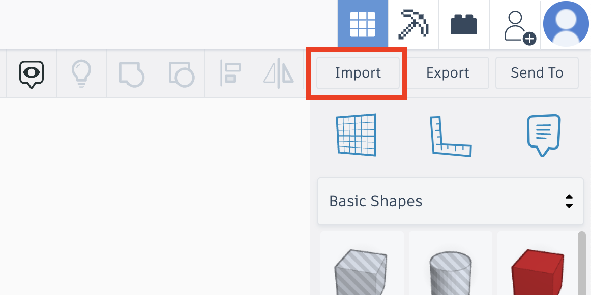

Durch Klicken auf einen weissen Ecken können die Dimensionen eingegeben werden. `21x21 mm` sind eine gute Referenz.

Auch die Höhe kann eingegeben werden. Der QR-Code soll minim höher sein als der umliegende Teil. Deshalb wird die Höhe auf `2.02` mm festgelegt.

Nun muss eine umgebende Form hinzugefügt werden. Dazu kann unter "Shape Generators" eine `Softbox` in die Arbeitsfläche gezogen werden.

`25x30 mm` sind eine angemessene grösse.

Die Höhe wird nun auf `2 mm` festgelegt, also `0.02 mm` weniger hoch als der QR-Code. Dadurch sollte der QR-Code von beiden Seiten her lesbar sein.

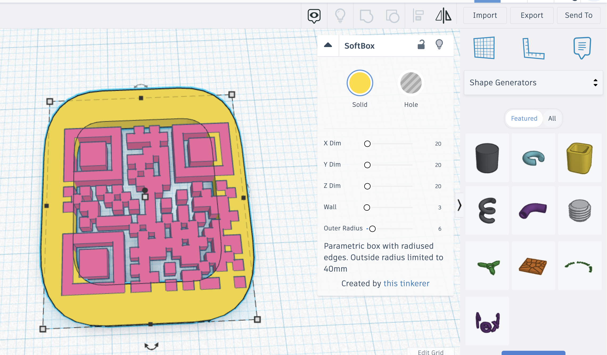

Nun wird noch der leere Teil grossflächig ausgefüllt mit einer soliden Box von `2 mm` Höhe ausgefüllt.

Die Box positionieren...

Der Schlüsselanhänger braucht ein Loch - das Einfügen eines "negativen" Zylinders im oberen Teil ist genau das, was wir suchen. Im Beispiel werden `3.3x5 mm` verwendet.

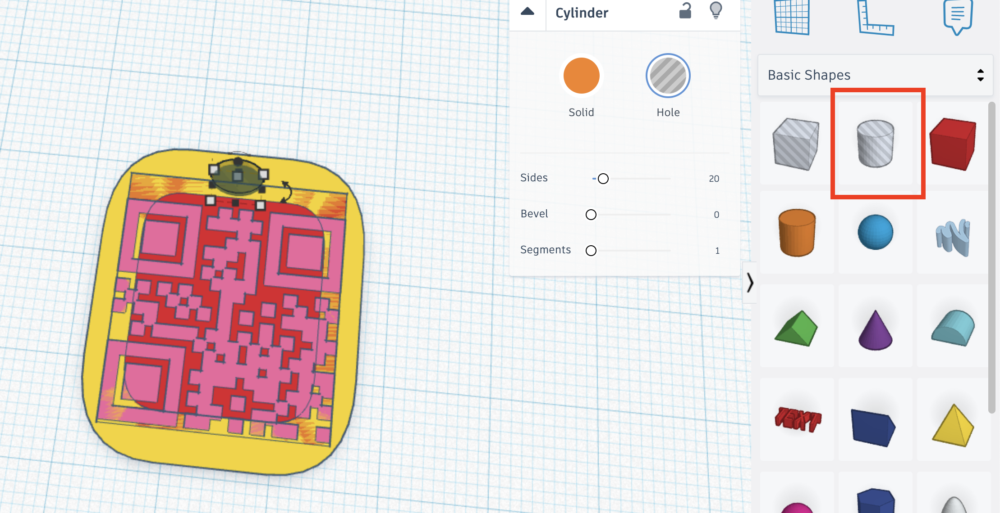

Alles exportieren. 

**Wichtig!!**: die Option `Include Eveything in the design` muss ausgewählt sein.

:::danger QR-Code prüfen
Überprüfen Sie mit einem QR-Codescanner, ob der QR-Code funktioniert. Evtl. müssen Sie Farben mit einem hohen Kontrast wählen.
:::

</GTabs>

## Druck vorbereiten im Slicer

Im letzten Schritt wird nun der Druck vorbereitet. Das exportierte `.stl` Modell wird mit dem Prusa Slicer geöffnet. Nun können die unterschiedlichen Flächen mit dem gewünschten Filament belegt werden:

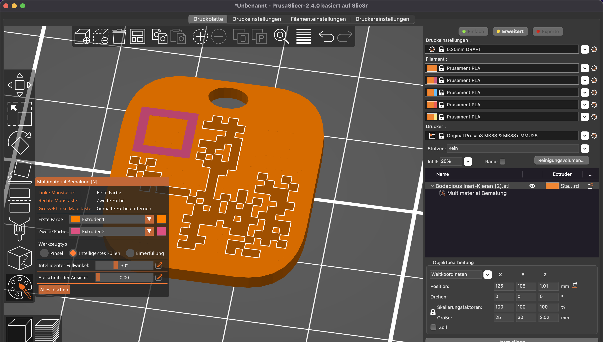

Schliesslich kann das Modell "geslicet" werden und als **G-Code** für den Drucker heruntergeladen werden.

---

:::aufgabe .3mf Dateien zusammenfügen

Damit mehrere Modelle in einem Umgang gedruckt werden können, müssen die entsprechenden Modelle zusammengefügt werden. Dazu muss das Projekt im `.3mf`-Format gespeichert werden.

Diejenige Person, welche alle Modelle zusammenfügt, importiert die entsprechenden `.3mf` Dateien der anderen Gruppen und positioniert die Objekte auf der Druckplatte ohne Überlagerung.
:::
