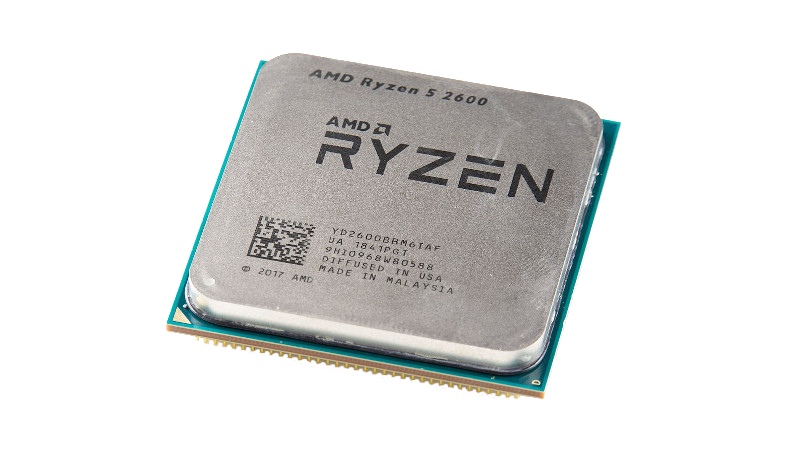
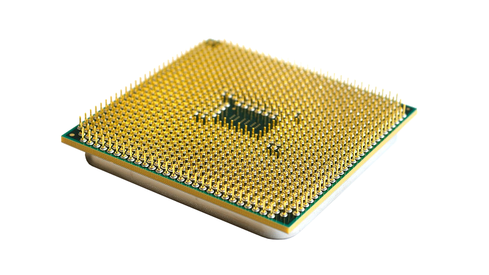

---
sidebar_custom_props:
  id: 5d818ab7-d01f-4cbb-906d-b8f474b7a42d
---

# 3. Prozessor (CPU)
---

Der Prozessor ist für die **Verarbeitung** von Daten im Computer zuständig. Ausserdem überwacht und steuert er den Ablauf von Programmen.

Moderne Prozessoren enthalten mehrere **Kerne**, welche unabhängig voneinander Programme ausführen und Berechnungen vornehmen können.

## Kenngrössen

Für den Prozessor gibt es folgende wichtige Kenngrössen:

- Die Anzahl **Kerne** gibt an, wie viele Berechnungen ein Prozessor gleichzeitig, also parallel, ausführen kann.
- Die **Taktfrequenz** gibt an, wie schnell der Prozessor Berechnungen durchführen kann. Sie wird in der Einheit **Hertz** angegeben, was «pro Sekunde» bedeutet. `2.1 GHz` sind "2.1 Gigahertz", also `2'100'000'000 Hz` und somit 2.1 Milliarden Operationen, die pro Sekunde berechnet werden können.

:::cards[--columns=3]

***

***

:::

### Kerne - wichtig für parallele Berechnungen

Jeder Kern einer CPU kann unabhängig von den anderen Kernen Berechnungen durchführen. Die Herausforderung dabei ist, dass die einzelnen Kerne nur mit grossen Hürden Zwischen- oder Endresultate austauschen können. Deshalb sind mehr Kerne nicht immer besser. Es kommt darauf an, wie die einzelnen Kerne genutzt werden.

[@video](images/03-sequential-vs-parallel.mp4)

## Aufgaben

Der Prozessor hat zwei Hauptaufgaben. Einerseits **kontrolliert** er die Ausführung der Programmanweisungen. Dabei **steuert** er alle anderen Komponenten des Computers.

Andererseits **verarbeitet** der Prozessor Daten. Das heisst, er führt mathematische oder logische Operationen mit binären Zahlen aus, beispielsweise:

- Vergleichen
- Addieren
- Multiplizieren
- Bits um eine Stelle nach links schieben

Im Kapitel Rechnerarchitektur wird die Funktionsweise des Prozessors genauer erklärt.

## Weitere Funktionen

In moderne Prozessor-Chips werden auch weitere Funktionen integriert, welche früher von separaten Bauteilen übernommen wurden.

Moderne Desktop-Prozessoren enthalten normalerweise eine Grafikeinheit, welche die Darstellung von Text, Bild und Video auf einem Bildschirm übernimmt.

Bei Prozessoren für Mobiltelefone werden üblicherweise spezialisierte Funktionen für GPS, W-LAN, Mobilfunk und Bluetooth auf dem Chip integriert. Dabei spricht man von einem Ein-Chip-System oder SoC (engl. *system on a chip*).

:::aufgabe[Meine CPU]
<Answer type="state" webKey="998cfc97-5fac-4a43-9358-b1b1c134521c" />

1. Welche Merkmale weist der Prozessor Ihres Laptops auf (Modell, Taktfrequenz)?
   
   <Answer type="text" webKey="087f885c-41b8-41d0-8ac9-d95d46f0c141" />

2. Vergleichen Sie Ihre Werte mit herkömmlichen Prozessoren für Desktop-Computer auf Digitec. Beschränken Sie sich dabei auf Prozessoren von den beiden grössten CPU-Herstellern **AMD** und **Intel**. [👉 Digitec Prozessoren](https://www.digitec.ch/de/s1/producttype/prozessor-83?filter=t_bra%3D38%7C9)
   1. Welche Taktrate hat die günstigste/teuerste CPU, wenn die CPU dieselbe Anzahl Kerne hat wie Ihr Gerät?
   2. Worin könnte der grosse Unterschied bei den Taktraten zwischen Laptop- und Desktop-Computer liegen?

  <Answer type="text" webKey="bd480f52-a373-40fc-8666-33b977b4bc1f" />
:::
