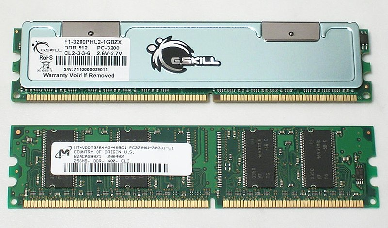

---
sidebar_custom_props:
  id: 65078055-6f40-46c7-bc39-2a33ab1fcbdb
---

# 4. Speicher

Datenspeicher speichern Daten üblicherweise in binärer Form. Ein Datenspeicher besteht aus einem Speichermedium, auf welchem die Bits physikalisch repräsentiert werden.

## Kenngrössen

Für Speicher gibt es drei wichtige Kenngrössen:

- Die **Speicherkapazität** ist die Datenmenge, welcher der Speicher maximal aufnehmen kann. Sie wird in Byte angegeben.
- Die **Zugriffszeit** ist die Zeit, die benötigt wird, um eine Dateneinheit (z.B. ein Byte) aus dem Speicher auszulesen. Die Zugriffszeit für das Speichern von Daten ist oft grösser als die Zugriffszeit für das Laden.
- Aus der Zugriffszeit kann die **Datenübertragungsrate** berechnet werden, also die Datenmenge, die innerhalb einer bestimmten Zeit geladen oder gespeichert werden kann. Die Datenübertragungsrate wird in Byte pro Sekunde angegeben.

## Arbeitsspeicher (RAM)

Der Arbeitsspeicher oder das RAM (engl. *random access memory*) enthält die Befehle und Daten der aktuell geöffneten Programme oder Apps. Der Prozessor muss möglichst schnell auf diese Daten zugreifen können. Der Arbeitsspeicher muss also eine möglichst kleine Zugriffszeit haben.

Dafür werden Nachteile in Kauf genommen. So ist die Speicherkapazität von Arbeitsspeicher eher klein. Ausserdem ist Arbeitsspeicher **flüchtig**. Dies bedeutet, dass die Daten verloren gehen, sobald der Speicher nicht mehr mit Strom versorgt wird.

Heute wird in Computern normalerweise sogenanntes DDR-SDRAM[^1] eingesetzt. Es zeichnet sich dadurch aus, dass die Daten alle paar Millisekunden wieder neu geschrieben werden müssen (*Refresh*).

:::aufgabe RAM in meinem Smartphone/Laptop
<Answer type="state" webKey="720a2b04-1642-4acf-ab29-e920416e3e2e" />

Wie viel Arbeitsspeicher besitzt Ihr Laptop / Ihr Smartphone?

<Answer type="text" webKey="98675ca4-1e32-4d92-99fc-2fef6b5faefc" />

<Hint>
Dies kann in den Systemeinstellungen oder im (unter Windows) im Taskmanager nachgeschaut werden. 
</Hint>
:::

## Festplatten

Der Festplatten- oder **Massenspeicher** erfüllt ganz andere Anforderungen als der Arbeitsspeicher. Wichtig ist hier, dass Daten in grossen Mengen **permanent** gespeichert können, ohne dass eine durchgehende Stromzufuhr nötig ist. Dass die Datenübertragungsrate deutlich langsamer als beim Arbeitsspeicher ist, spielt deshalb eine untergeordnete Rolle. Er wird – im Gegensatz zum Arbeitsspeicher – nicht direkt auf das Mainboard gesteckt, sondern mittels Strom- und Datenkabel angeschlossen.

Heute gibt des den Festplattenspeicher in zwei Ausführungen:
- herkömmliche Harddisks oder HDD (engl. *hard disk drive*)
- SSDs (engl. *solid state disk*)

### Harddisk (HDD)

Der Aufbau einer **herkömmlichen Harddisk** gleicht einem Plattenspieler. Im Innern der Harddisk drehen sich mehrere Platten, auf denen durch **Magnetisierung** einzelner Bereiche Daten gespeichert werden. Auf dem nachfolgenden Bild (rechts) sieht man den Arm zum Auslesen resp. Schreiben der Daten (er befindet sich momentan in der Parkposition neben den Scheiben). Dieser Speicher wird heute noch eingesetzt, um grosse Datenmengen **günstig zu speichern**. Er ist relativ langsam und anfällig auf Transportschäden, da es sich um einen mechanischen Speicher mit beweglichen Teilen handelt. Die Drehgeschwindigkeit der Platten ist beschränkt, sie bestimmt Lese-/Schreibgeschwindigkeit. Zudem muss vor dem effektiven Zugriff stets noch gewartet werden, bis sich der Arm an der richtigen Position befindet.

:::cards --columns=2

***

:::

### Solid State Disk (SSD)

Der Aufbau einer **SSD** gleicht in keiner Weise demjenigen einer HDD. Wie der Name schon sagt, enthält sie keine beweglichen Teile und ist daher robuster, schneller, leichter und verbraucht weniger Strom. Allerdings gibt es zwei gewichtige Nachteile:

- SSDs kosten ein Mehrfaches im Vergleich zu herkömmlichen HDDs.
- Auf dem Markt sind nicht so grosse (in Bezug auf die Speicherkapazität) SSDs erhältlich wie HDDs.

:::cards --columns=2

***

:::

:::aufgabe HDD/SSD in meinem Smartphone/Laptop
<Answer type="state" webKey="251e05ac-8100-4675-ba30-d546fec37c0b" />

- Wie viel Speicherplatz besitzt Ihr Smartphone, ihr Laptop?
- Wie viel davon ist noch frei?
- __Laptop__ Wie viel Speicherplatz wird von
  - Word, Excel, PowerPoint, ...
  - Teams,
  - Adobe Produkten

  verwendet?
- __Smartphone__ Wie viel Speicherplatz wird von Ihrem 
  - Musikplayer (Spotify, Apple Music, ...) 
  - Whatsapp
  - Instagram, Snapchat oder Tiktok
  
  belegt?

<Answer type="text" webKey="27d447fa-82af-4969-9564-edc896e5bdde" />

:::

### Anschlusskabel

Festplatten werden mit sogenannten SATA-Kabeln angeschlossen. Die Abkürzung SATA steht für *serial at attachment*. Das schmalere Kabel dient zur Datenübertragung, das breitere für die Stromzufuhr.

:::cards --columns=2

***

:::

## Speicherhierarchie

Aus technischen Gründen sind schnelle Speicher viel teurer als langsame Speicher. Ausserdem sind schnelle Speicher **flüchtig**, sie benötigen eine Stromzufuhr, um den Speicherinhalt bewahren zu können.

Das führt dazu, dass schneller Speicher in viel kleineren Mengen und nur wo unbedingt nötig eingesetzt wird. Es ergibt sich in Computersystemen eine Hierarchie von verschiedenen Speichern. Je näher der Speicher beim Prozessor ist, desto schneller muss er sein.

:::aufgabe Speicher
<Answer type="state" webKey="7bb0eeac-6b50-4950-ac44-f19ead4ad5a5" />

1. Wieso enthält ein Computer so viele verschiedene Speicherarten?
2. Überlegen Sie sich, welche Daten auf den einzelnen Ebenen der oben abgebildeten Speicherhierarchie gespeichert werden.
3. Wieso kann eine Datei auf einer Festplatte viel schneller gelöscht als gespeichert werden?

<Answer type="text" webKey="074b934c-5b70-45c6-8034-4e99e77d850b" />
:::

:::aufgabe Speicherkosten und Datendurchsatz
<Answer type="state" webKey="5308d378-a30d-4eb7-b98a-c08111cfd500" />

Führen Sie auf [👉 Digitec](https://digitec.ch) eine Recherche zu den Speicherpreisen und dem Datendurchsatz (wie schnell können Daten geschrieben/gelesen werden) durch. Bestimmen Sie jeweils
- den **Preis pro GB** (selber berechnen) und
- den **Datendurchsatz** fürs *Schreiben* und *Lesen*.
für ein Modell im mittleren Preissegment.

- SSD, 
- Mobile SSD, 
- HDD, 
- Externe HDD, 
- USB-Stick, 
- SD/microSD Karte

<Answer type="text" webKey="1e665ad1-531f-4d31-a9b5-a3a4c4dc80ff" />
:::

[^1]: DDR-SDRAM: engl. *Double Data Rate Synchronous Dynamic Random Access Memory*
