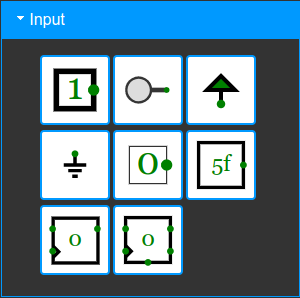
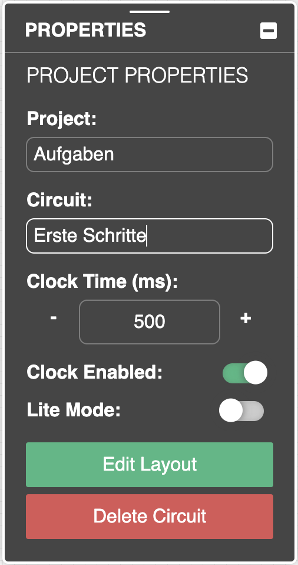
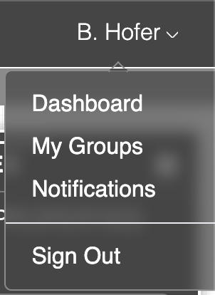

import Answer from '@site/src/components/Answer'

# 2. CircuitVerse

Wir arbeiten in diesem Kapitel zu den Logikgattern mit der Online-Plattform [CircuitVerse](https://circuitverse.org/). Dort können Schaltungen einfach geplant werden. Über diverse Eingabeelemente kann gesteuert werden, ob an den Eingängen eine 1️⃣ oder eine 0️⃣ anliegt. Mit verschiedenen Ausgabeelementen kann die gezeichnete Schaltung überprüft werden.

* [:link: CircuitVerse](https://circuitverse.org/)

## CircuitVerse-Konto erstellen

Um in CircuitVerse ein eigenes Benutzerkonto anzulegen, musst du zuerst im Menü oben rechts auf _Login_ klicken:

Anschliessend wählst du unterhalb des Login-Formulars den Link _Sign up_:

Schliesslich füllst du die Benutzerdaten aus (am besten die Schul-E-Mail-Adresse angeben) und klickst auf den grünen _Sign up_-Knopf:

:::aufgabe
Erstellen Sie ein eigenes Benutzerkonto bei [CircuitVerse](https://circuitverse.org/users/sign_up), damit Sie die eigenen Schaltungen abspeichern können (bitte den richtigen Namen und die Schul-E-Mail-Adresse verwenden).
:::

## Simulator starten

Nach dem Einloggen klicken Sie im Menü oben rechts auf _Simulator_, um in den Simulator zu wechseln:

## Eingabeelemente

Es stehen etliche Eingabeelemente zur Auswahl, wir verwenden allerdings nur die beiden ersten (_Input_ und _Button_). Die Elemente werden links in der Spalte der _Circuit Elements_ im Bereich _Input_ ausgewählt und anschliessend im Arbeitsbereich wie gewünscht platziert.

Beim Element _Input_ (oben links) kann durch Mausklick zwischen einer **1** und einer **0** hin- und hergewechselt werden.

Das Element _Button_ (oberste Zeile Mitte) ist stets ausgeschaltet (also 0️⃣), ausser während der Zeit, in der mit der Maus auf den Druckknopf gedrückt wird.

## Ausgabeelemente

Im Bereich _Output_ stehen wiederum etliche Elemente zur Verfügung. Wir verwenden ausschliesslich die beiden oben links (_Output_) und oben rechts (_DigitalLed_).

Das Element _Output_ zeigt als Ausgabe eine **1** oder eine **0** an, während die _DigitalLed_ im Zustand 1️⃣ leuchtet.

## Elemente verbinden

An sämtlichen Elementen ist mit grünen Punkten markiert, wo Verbindungen angeschlossen werden können. Um Komponenten zu verbinden, klicken Sie auf einen Punkt, halten die Maustaste gedrückt und ziehen die Leitung bis zum anderen Punkt.

Es ist erlaubt, mehrere Ausgabeelemente zu verbinden:

Das Verbinden mehrerer Eingänge führt allerdings zu Fehlern – schliesslich ist dann unklar, was gelten soll, wenn verschiedene Eingabewerte auf derselben Leitung anliegen:

## Elemente benennen

Ist ein Ein- oder Ausgabeelement auf dem Schaltplan aktiv (angeklickt), so können in der linken Spalte ganz unten unter _Properties_ gewisse Einstellungen des Elementes verändert werden. Für uns sind nur _Label_ und _Label Direction_ interessant. So können Ein- oder Ausgabeelemente angeschrieben und diese Beschriftungen sinnvoll platziert werden.

## Logikgatter

Im nächsten Bereich _Gates_ befinden sich alle benötigten Logikgatter. Diese werden in den folgenden Abschnitten vorgestellt.

## Projekt speichern

Sobald Sie auf das weisse Häuschenblatt klicken, werden rechts die _Project Properties_ angezeigt. Dort können Sie das Projekt _Project_ und die aktuelle Registerkarte _Circuit_ benennen:

Anschliessend können Sie das Projekt speichern (durch Klicken auf _Save Online_ in der Toolbar). Dabei wählen Sie am besten aus, dass es sich um ein privates Projekt handelt. Schliesslich klicken Sie auf _Update Project_.
Nun sehen Sie das Projekt in der Übersicht. Es ist gespeichert und Sie können es jederzeit wieder durch einen Klick auf _Launch simulator_ öffnen.

:::aufgabe
1. Nach dem Login wechseln Sie zum [Simulator](https://circuitverse.org/simulator).
2. Benennen Sie das Projekt «Aufgaben» und die aktuelle Registerkarte «Erste Schritte».
3. Platzieren Sie die beiden ersten Eingabeelemente **Input** und **Button** in der Registerkarte **Erste Schritte** untereinander und legen Sie rechts davon die beiden Ausgabeelemente **Output** und **DigitalLed** ab. Verbinden Sie jeweils ein Eingabeelement mit einem Ausgabeelement und testen Sie die Ein- und Ausgabe durch umschalten der Eingabewerte.
4. Speichern Sie das Projekt und öffnen Sie es wieder.
5. Beschriften Sie sämtliche Ein- und Ausgabeelemente und wählen Sie einen sinnvollen Platz für die Beschriftungen.
6. Speichern Sie die Aufgabe ab (dies wird in Zukunft nicht mehr erwähnt, sondern versteht sich von selbst).
7. Der Link zur Aufgabe können Sie bei Bedarf direkt im Antwort-Feld hier auf der Webseite festhalten.

<Answer type="text" webKey="74397b5a-3ab0-453e-8551-b11475199871" />
:::

Am besten legen Sie für jede Aufgabe oder zumindest für jedes Kapitel eine neue Registerkarte an, indem Sie oben im Menü auf _Circuit_ und dann _New Circuit +_ klickst:

:::aufgabe
1. Erstellen Sie eine neue Registerkarte für die Inverter-Aufgaben im nächsten Kapitel.
2. Vergessen Sie nicht, die Aufgaben immer wieder zu speichern – insbesondere am Lektionsende!

<Answer type="text" webKey="6603f801-28c5-47b1-95ba-9d3f361789c0" />
:::

Im Dashboard – zugänglich oben rechts im Menü beim eigenen Namen – kannst du stets eine Übersicht deiner gespeicherten Projekte erhalten:

