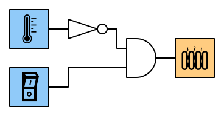
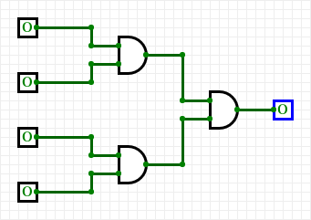

---
sidebar_custom_props:
  id: e8e661f2-5c6a-453d-8410-0a5478abe1cd
---

# 4. AND-Gatter

Ein AND-Gatter ist eine digitale Schaltung, welche zwei Eingänge und einen Ausgang hat. Der Ausgang Y hat nur dann den Wert 1️⃣, wenn Eingange A **und** Eingang B den Wert 1️⃣ haben.

## Wahrheitstabelle

|   A   |   B   |   Y   |
| :---: | :---: | :---: |
|   0   |   0   |   0   |
|   0   |   1   |   0   |
|   1   |   0   |   0   |
|   1   |   1   |   1   |

In Schaltplänen wird ein AND-Gatter mit folgendem Symbol dargestellt:

## Interaktive Schaltung

::circuitverse[https://circuitverse.org/simulator/embed/rothe-and-gate]

## Beispiele

### Kaffeemühle

Aus Sicherheitsgründen mahlt die Kaffeemühle nur, wenn gleichzeitig der Deckel geschlossen ist und der Stromschalter eingeschaltet ist.

### Heizung mit Hauptschalter

Natürlich können auch mehrere Gatter zu einer Schaltung kombiniert werden. Im folgenden Beispiel soll eine Heizung nur eingeschaltet werden, wenn es kalt ist und der Hauptschalter eingeschaltet ist:

:::aufgabe[Aufgaben]
<Answer type="state" webKey="2838e16e-c02f-4a15-a8d0-f08f14b0f8a2" />

Entwerfen Sie je eine Schaltung für die folgenden Szenarien. Sie können __Inverter__ und __AND-Gatter__ verwenden. Gehen Sie für jedes Szenario so vor:

- Erstellen Sie eine Wahrheitstabelle für das Szenario.
- Entwerfen Sie die Schaltung in CircuitVerse inklusive Beschriftung.
- Überprüfen Sie, ob die Schaltung mit der Wahrheitstabelle übereinstimmt.

Lesen Sie die Symbole für die Eingaben/Ausgaben [👉 hier](./01-Schaltung.md#eingabe) nach.

1. **Heizung:** Eine Heizung soll nur tagsüber eingeschaltet werden, wenn es kalt ist.

    

    <Answer type="text" webKey="aeb19fdb-cce6-4bfd-99b9-a7fa5004501e" />

<Solution webKey="918932d5-3574-4329-8d54-9097d12d62dd">

</Solution>

2. **Automatische Tür:** Die Tür wird durch einen Motor betrieben. Sie soll nur aufgehen, wenn eine Bewegung entdeckt wird und der Hauptschalter eingeschaltet ist.

    

    <Answer type="text" webKey="fd529132-f8aa-491d-a67c-461913169d75" />

<Solution webKey="918932d5-3574-4329-8d54-9097d12d62dd">

</Solution>

3. **Dachfenster:** Ein Dachfenster soll durch einen Motor automatisch geschlossen werden, sobald es regnet. Wenn das Fenster zu ist, drückt es einen Knopf, der bewirkt, dass der Motor ausschaltet wird.

    

    <Answer type="text" webKey="47bfba00-65fe-466a-a859-036d8b572cad" />

<Solution webKey="918932d5-3574-4329-8d54-9097d12d62dd">

</Solution>

:::

:::aufgabe
<Answer type="state" webKey="0d9e1b87-f1ae-4a07-b100-24508d56e94e" />

Analysieren Sie die folgende Schaltung, indem Sie eine Wahrheitstabelle erstellen. Was macht die Schaltung eigentlich?

<Answer type="text" webKey="494fb9e1-8dcf-4652-96a5-16355cffdb7e" />
:::

:::aufgabe
<Answer type="state" webKey="c1b9c6db-e6e8-42af-ad86-67a672f57524" />

#### ⭐️ Zusatzaufgabe

Wie viele unterschiedliche digitale Schaltungen mit zwei Eingängen und einem Ausgang sind möglich?

<Answer type="text" webKey="08e83c65-07b0-47a3-95b5-cddde78b21a2" />
:::
