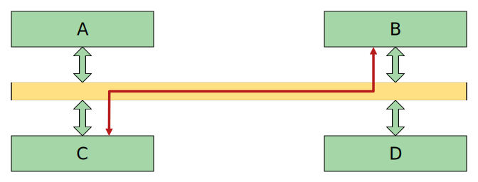

import Answer from '@site/src/components/Answer';

# 2. Bussystem

In der Informatik ist ein *Bus* ein System zur Datenübertragung zwischen mehreren Komponenten über einen gemeinsamen Übertragungsweg. Findet eine Datenübertragung zwischen zwei Komponenten statt, so müssen die übrigen Komponenten schweigen, da sie sich sonst gegenseitig stören würden.[^1]

:::cards

***

:::

Busse werden verwendet, um die Komplexität der Hardware zu reduzieren.

Wenn alle Komponenten direkt miteinander kommunizieren, muss zwischen allen Komponenten eine Datenleitung vorhanden sein. Wenn im Bild oben rechts eine fünfte Komponente hinzukommt, müssen fünf neue Datenleitungen gezogen werden. Wenn ein Bus verwendet wird, muss eine neue Komponente nur am Bus angeschlossen werden.

## Beispiele

- Systembus in einem Computer
- Serial AT Attachment (SATA, für Computerfestplatten)
- Universal Serial Bus (USB)

:::success Take-Home Message aus CPU-Rollenspiel

<Answer type="text" webKey="2ac55d18-cd29-4ad2-b378-36a5210e19a2" />

:::

[^1]: Quelle: [Wikipedia: Bus (Datenverarbeitung)](https://de.wikipedia.org/wiki/Bus_(Datenverarbeitung))
