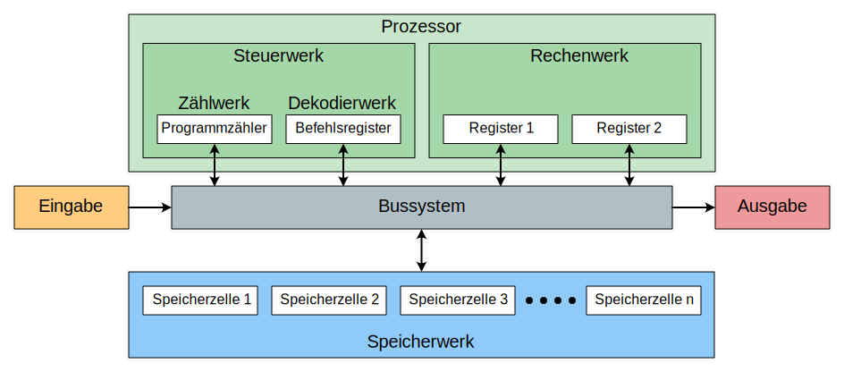

---
sidebar_custom_props:
  id: 49811256-1cd8-4f28-b732-db05ae46f306
  source:
    name: T. Jampen
    ref: https://informatik.mygymer.ch/base/?b=computer&p=459193
---

- [Sendung mit der Maus - Wie funktioniert ein Computer (Nanoo.tv)](https://nanoo.tv/link/v/1015540)

## Von Neumann CPU Rollenspiel

Es ist empfehlenswert, zuerst die Von-Neumann-Architektur zu behandeln.

## Rollen

Vorgesehen sind 5-8 Rollen pro Rollenspiel-Gruppe, d.h. 2 bis 4 Rollenspiel-Gruppen pro Klasse. Die Rollen sind im Einzelnen:

- Steuerwerk
- Rechenwerk
- Zählwerk
- Speicherwerk
- Dekodierwerk
- Stoppuhr (auch nachträglich umsetzbar – es wird dann nach dem Rollenspiel abgeschätzt, wie lange eine Runde gebraucht hat)
- Benutzer:in\* (falls zu wenig Personen: Die Lehrperson spielt den/die Benutzer:in)
- Bildschirm\* (falls zu wenig Personen: Die Lehrperson spielt auch den Bildschirm)

### Vorbereitung / Materialien
Die Rollenanleitungen, Speicher-Karten und Befehlsstreifen sind im Dokument Neumann-Rollenspiel-Druckvorlage zum Drucken und Ausschneiden vorbereitet und können laminiert werden.

Die Blätter, die stets neu verwendet werden müssen, sind im Dokument Speicherstellen zu finden.

Stifte für die meisten Rollen

### Programme
Für das Rollenspiel stehen vier Programme zur Verfügung:

Programm 1
: (wohl nicht nötig): Es werden zwei Zahlen aus dem Speicher addiert und auf dem Bildschirm angezeigt.

Programm 2
: Es werden zwei vom Benutzer eingegebene Zahlen addiert und auf dem Bildschirm angezeigt.

Programm 3
: Der Benutzer muss solange eine Zahl eingeben (erraten), bis sie stimmt, d.h. bis die Ausgabe 1 am Bildschirm erfolgt.
: Hinweis
: Um das Programm zu beschleunigen (resp. abzuschliessen), muss der Benutzer die Zahl 32 eingeben!

Programm 4
:  (nur wenn zu viel Zeit) Es werden die Zahlen 02, 04, 06, 08, 10 nacheinander auf dem Bildschirm angezeigt.
: Hinweis
: Um das Programm zu beschleunigen (resp. abzuschliessen), kann die LP während des Spiels die Zahl 8 in Speicherstelle A schreiben. Anschliessend wird nochmals 2 addiert, mit dem Ziel 10 verglichen und abgeschlossen.

## Vorschlag Rollenspiel-Ablauf (1 Lektion)
Einführung in Computeraufbau, EVAS-Prinzip und von Neumann-Architektur.

### Phase 1: Programm 2 starten (ohne Kenntnis, was das Programm tut)

Die anwesenden Schüler:innen werden geeignet in Gruppen eingeteilt und das Spiel nur mit einer Gruppe durchgeführt.

Das Spiel muss zwingend durch die Lehrperson betreut und überwacht werden, damit bei Problemen das Programm «gerettet» werden kann.

Die Rollen werden verteilt. Alle lesen nur die eigenen Anweisungen.

Benutzer:in startet das Programm 2 (das ist interessanter und kaum länger aus Programm 1).

### Phase 2: Erkenntnis diskutieren

Was ist alles passiert? Was hat das Programm gemacht?

Was man bis hier verstehen sollte

Fetch-Decode-Execute Prinzip

Speicher unterteilt in Programmspeicher und Datenspeicher

### Phase 3: Programm 3

Die Schüler:innen tauschen die Plätze und lesen die Anweisungen der neuen Rolle.

Benutzer:in startet Programm 3.

### Phase 4: Abschliessende Diskussion (zentrale Punkte siehe unten)

Abschliessende Diskussion
Hier sollte der Vergleich zu einer richtigen CPU gemacht werden. Die Stoppuhr hat für jede Runde notiert, wie lange diese gedauert hat (oder die Zeit wird nachträglich abgeschätzt). Eine richtige CPU arbeitet mit ca. 3 Milliarden Taktzyklen pro Sekunde.

#### Zentrale Punkte:

- Ein Computer kann nur wenige, ganz simple Dinge, dafür in horrendem Tempo.
- Unser Mikrocode hat 8 Befehle, eine akutelle CPU kennt einige Hundert Instruktionen.
- Ein Programm besteht also aus unzähligen, sehr simplen Anweisungen (= lauter Zahlen).
- Eine Anweisung aus dem Speicher enthält bei uns jeweils einen Befehl und eine (betroffene) Speicherstelle. In einer richtigen CPU können Instruktionen auch 2 Operanden haben (z.B. von Speicherstelle A nach B verschieben).
- Der Bus ist das zentrale Kommunikationsmittel, alle lesen davon oder/und schreiben darauf.
- Fetch-Decode-Execute-Prinzip.
