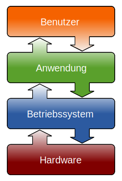

---
sidebar_custom_props:
  id: 4e636e5b-b698-4ce4-b467-0ee0e8872c3a
---

# 1. Aufgaben eines Betriebssystems

# 1. Aufgaben eines Betriebssystems

## Was ist ein Betriebssystem?

Ein **Betriebssystem** (engl. *operating system*, kurz *OS*) ist eine Sammlung von Softwarekomponenten, die das Nutzen von Anwenderprogrammen erst möglich macht.

[@youtube](https://www.youtube-nocookie.com/embed/GjNp0bBrjmU)

## Aufgaben eines Betriebssystems

Ein Betriebssystem

- ermöglicht **Benutzerinteraktion** und übernimmt die **Benutzerverwaltung**,
- verwaltet die **Ressourcen** (also die Hardware) und den Zugriff darauf,
  - Arbeits- und Festplatten**speicher**
  - **Prozessorzeit** (welches Programm zu welchem Zeitpunkt wie lange ausgeführt wird)
  - **angeschlossene Geräte**
- **startet** und **unterbricht** Anwendungsprogramme und
- stellt **Dienstprogramme** zur Verfügung (z.B. zur Benutzer- oder Dateiverwaltung).

Dies ist auch nötig, denn damit mehrere Programme gleichzeitig verwendet werden können, muss jedes Programm immer wieder an die Reihe kommen und ein Stückchen weiterarbeiten dürfen. Das Betriebssystem sorgt dafür, dass dies fair geschieht.

## Aufstarten des Computers [^2]

Wenn der Computer eingeschaltet wird, so müssen zuerst die Treiberprogramme und das Betriebssystem von der Harddisk oder der SSD in den Arbeitsspeicher geladen werden. Das heisst, die Programmcodes werden von der Harddisk in den Arbeitsspeicher kopiert. Erst dann können diese vom Prozessor ausgeführt werden und der Computer ist bereit, um weitere Applikationen zu starten. Dazu dient das **BIOS** (Basic Input Output System) oder **UEFI** (Universal Extendable Firmware Interface). Beides sind auch wieder Programme. Sie gehören aber nicht zum Betriebssystem, sondern sind selber ein eigenes, vom Hersteller des Computers auf die Hardware abgestimmtes Betriebssystem. Den Vorgang des Aufstartens wird im Fachjargon als **booten** bezeichnet.

Der Begriff kommt von der englischen Redewendung *«sich an den eigenen Stiefelriemen (bootstraps) über den Zaun ziehen»* und meint einfach, dass man sich selbst auf (scheinbar) unmögliche Art aus einer Zwickmühle heraushilft.
Die Zwickmühle beim Start des Computers besteht darin «wie bringe ich die Programme in den Arbeitsspeicher, wenn ich dazu ein Programm brauche, dass bereits im Arbeitsspeicher sein muss?» Beim Computer hilft man sich so, dass ein Teil des Arbeitsspeichers aus speziellen Speicherzellen besteht, welche Ihren Inhalt auch nach dem Ausschalten des Computers nicht verlieren. In diesem Teil des Arbeitsspeichers liegt dann das Programm, welches der Computer nach dem Einschalten als erstes ausführt. Dieses Programm lädt das BIOS / UEFI in den Arbeitsspeicher, welches seinerseits das Betriebssystem lädt und startet.

[^2]: Quelle: A. Scheidegger

## Betriebssysteme, Puzzle

:::aufgabe Puzzle

Jede Expertin und jeder Experte ist nach der Expertenrunde bereit, das zugeteilte Thema selbständig in der Unterrichtsrunde einer Gruppe von vier bis fünf Mitschüler:innen während 10 Minuten zu vermitteln.

### Auftrag
1. **Lesen und Bearbeiten** Sie die Texte und Inhalte gemäss den Angaben zu Ihrem Thema.
2. Diskutieren Sie in der Gruppe, welches Lernziel später in der Unterrichtsrunde erreicht werden soll. Was sollen Ihre Kolleginnen/Kollegen wissen, können, verstehen?
3. Erstellen Sie in der Expertenrunde eine **kleine Präsentation** (2 bis 3 Folien maximal), welche Sie dann in der Unterrichtsrunde benutzen, um Ihren Kolleginnen und Kollegen Ihr Thema zu vermitteln.
4. Formulieren Sie eine **Testfrage**, um in der Unterrichtsrunde zu überprüfen, ob das Lernziel erreicht wurde.
5. Bereiten Sie sich darauf vor, in der Unterrichtsrunde Ihren Kolleg:innen direkt auf dem Notebook das **Verwaltungsprogramm**, welches zu Ihrem Thema gehört, zu demonstrieren. Im Idealfall werden Ihre Kolleg:innen unter Ihrer Anleitung das Programm auf den eigenen Notebooks öffnen.

<Tabs
    defaultValue="p-1"
    values={[
        {label: 'Gruppe 1', value: 'p-1'},
        {label: 'Gruppe 2', value: 'p-2'},
        {label: 'Gruppe 3', value: 'p-3'},
        {label: 'Gruppe 4', value: 'p-4'},
        {label: 'Gruppe 5', value: 'p-5'},
    ]}
>
<TabItem value="p-1">

### Aufgabe
Erstellen Sie eine kurze Präsentation (zwei bis drei Folien) zum Thema **Dateisystem**.

Verwenden Sie dazu folgende Ressourcen:
- [Dateisystem.pdf](assets/aufgaben/Dateisystem.pdf), Abschnitte 5.1 und 5.3 (bis und mit erster Absatz nach Abbildung)
- [HDD oder SSD](https://www.heise.de/tipps-tricks/HDD-oder-SSD-Was-ist-besser-4121739.html), Abschnitte *HDD* und *SSD*
- [Computerverwaltung Windows](https://www.heise.de/tipps-tricks/Computerverwaltung-in-Windows-10-oeffnen-so-geht-s-4243814.html)
- [Computerverwaltung Mac](https://support.apple.com/de-ch/guide/disk-utility/dskutl1029/mac)

Gehen Sie auf folgende Punkte ein:
- Was versteht man unter einem Laufwerk?
- Was versteht man unter einem Block in Zusammenhang mit Laufwerken?
- Welche Unterschiede gibt es zwischen Harddisks und Solid-State-Disks?
- Was ist schliesslich die Aufgabe des Dateisystems?

Machen Sie sich schlau über die folgenden Dienstprogramme (siehe auch Links unten):
- Windows: Computerverwaltung, Datenträgerverwaltung
- Mac: Festplattendienstprogramm

Wozu dienen diese Programme? Was sollte man über sie wissen?

Bereiten Sie sich vor, diese Programme mit Ihren Kolleginnen und Kollegen anzuschauen.

<Answer type="text" webKey="eacf059b-8b7f-4e89-9f47-2a8ff8772104" />

</TabItem>

<TabItem value="p-2">

### Aufgabe
Erstellen Sie eine kurze Präsentation (zwei bis drei Folien) zum Thema **Prozess- und Speicherverwaltung**.

Verwenden Sie dazu folgende Ressourcen:
- [Grundbegriffe.pdf](assets/aufgaben/Grundbegriffe.pdf)
- [Multizser-Multitasking.pdf](assets/aufgaben/Multiuser-Multitasking.pdf) Abschnitt 1.4.3
- [Multitasking](https://www.sachsen.schule/~gdb/daten_verarbeiten/BS/Multitasking.html)
- [Taskmanager - Windows](https://www.ionos.de/digitalguide/server/konfiguration/task-manager-aufrufen/)
- [Aktivitätsanzeige - Mac](https://support.apple.com/de-de/guide/activity-monitor/actmntr1001/mac)
- [Metapher: Kooperatives vs. Preemptives Multitasking @audio](assets/aufgaben/record-scheidegger.m4a)

Gehen Sie auf folgende Punkte ein:

- Was versteht man unter einem Prozess?
- Welche Ressourcen braucht ein Prozess zu seiner Ausführung?
- Was versteht man unter Singletasking und unter Multitasking?
- Was ist der Unterschied zwischen kooperativem und präemptivem Multitasking? Vielleicht suchen Sie nach einer eigenen Metapher?
- Was ist schliesslich die Aufgabe der Prozess- und Speicherverwaltung auf einen Punkt gebracht?

Machen Sie sich schlau über die folgenden Dienstprogramme:
- Windows: Taskmanager
- Mac: Aktivitätsanzeige

Wozu dienen diese Programme? Was sollte man über sie wissen?

Bereiten Sie sich vor, diese Programme mit Ihren Kolleginnen und Kollegen anzuschauen.

<Answer type="text" webKey="02c5ed5b-fd34-45ba-9232-7315bbdbf757" />
</TabItem>
<TabItem value="p-3">

### Aufgabe

Erstellen Sie eine kurze Präsentation (zwei bis drei Folien) zum Thema **Benutzerverwaltung**.

Verwenden Sie dazu folgende Ressourcen:

- [Multiuser.pdf](assets/aufgaben/Multiuser.pdf) 1.4.1
- [Benutzerverwaltung](./Material/benutzerverwaltung)
- [Windows: Computerverwaltung](https://www.heise.de/tipps-tricks/Computerverwaltung-in-Windows-10-oeffnen-so-geht-s-4243814.html)
- [Windows: Benutzer:in Anlegen](https://www.heise.de/tipps-tricks/Windows-10-Neuen-Benutzer-anlegen-4058638.html#benutzer_anlegen_passwort)
- [Mac: Benutzerverwaltung](https://www.maclife.de/ratgeber/benutzer-gruppen-unter-macos-sierra-einrichten-konfigurieren-gehts-10088133.html)

Gehen Sie auf folgende Punkte ein:
- Was versteht man unter einem Multiuser-System?
- Was versteht man unter einem Benutzerkonto auf einem Computer?
- Wie hängen Benutzerkonten und Dateisystem zusammen?
- Was ist der Unterschied zwischen einem Adminstratorkonto und einem normalen Benutzerkonto?

Erklären Sie dann möglichst anschaulich die Aufgabe der Benutzerverwaltung.

Machen Sie sich schlau über die folgenden Dienstprogramme:

- Windows: Computerverwaltung, Lokale Benutzer und Gruppen, Benutzer einrichten
- Mac: Benutzerverwaltung

Wozu dienen diese Programme? Was sollte man über sie wissen?

Bereiten Sie sich vor, diese Programme mit Ihren Kolleginnen und Kollegen anzuschauen.

<Answer type="text" webKey="0e0f3b69-29e6-4519-8f7f-d2ba1a86515c" />
</TabItem>
<TabItem value="p-4">

### Aufgabe
Erstellen Sie eine kurze Präsentation (zwei bis drei Folien) zum Thema Geräteverwaltung und Treiber.

Verwenden Sie dazu folgende Ressourcen (Jeweils nur die Erklärungen und Diagramme ohne die Aufgaben):
- [Rolle der Geräteverwaltung](https://vfhcab.eduloop.de/loop/Rolle_der_Ger%C3%A4teverwaltung)
- [Aufteilung der Geräteverwaltung](https://vfhcab.eduloop.de/loop/Abh%C3%A4ngig_und_gleichzeitig_unabh%C3%A4ngig)
- [Gerätetreiber](https://vfhcab.eduloop.de/loop/Ger%C3%A4tetreiber)
- [Geräteklasse und Geräte](https://vfhcab.eduloop.de/loop/Ger%C3%A4teklassen)
- [Windows: Gerätemanager](https://www.heise.de/tipps-tricks/Geraetemanager-in-Windows-10-starten-4567818.html)
- [Mac: Systeminformationen](https://support.apple.com/de-de/HT203001)

Gehen Sie auf folgende Punkte ein:
- Was versteht man unter einem Gerät in Zusammenhang mit Betriebssystemen?
- Was versteht man unter einem Treiber?
- Was muss ich tun, wenn ich eine neue Grafikkarte in meinen Computer einbauen, damit diese auch gebraucht werden kann?
- Was ist also die Aufgabe der Geräteverwaltung und der Treiber auf den Punkt gebracht?

Machen Sie sich schlau über die folgenden Dienstprogramme (siehe auch Links unten):
- Windows: Gerätemanager
- Mac: Systeminformationen

Wozu dienen diese Programme? Was sollte man über sie wissen? 

Bereiten Sie sich vor, diese Programme mit Ihren Kolleginnen und Kollegen anzuschauen.

<Answer type="text" webKey="f6dffe1e-3365-4df5-b89b-8df26e1b482f" />
</TabItem>
<TabItem value="p-5">

### Aufgabe

Erstellen Sie eine kurze Präsentation (zwei bis drei Folien) zum Thema Benutzeroberfläche.

Verwenden Sie dazu folgende Ressourcen:

- [Arten der Benutzeroberfläche](https://www.ionos.de/digitalguide/websites/webdesign/grafische-benutzeroberflaeche-alles-fuer-ein-gutes-ui/)
- [Terminal, Konsole](https://de.wikipedia.org/wiki/Terminal_(Computer))
- [Shell](https://de.wikipedia.org/wiki/Shell_(Betriebssystem))
- [Was ist ein GUI?](https://www.ionos.de/digitalguide/websites/web-entwicklung/was-ist-ein-gui/)
- [GUI Entwicklung](https://de.wikipedia.org/wiki/Grafische_Benutzeroberfl%C3%A4che)
- [Supported Linux-Commands](https://dev.to/timapplecodes/linux-commands-that-work-in-powershell-by-default-17gd)

Gehen Sie auf folgende Punkte ein:
- Was versteht man unter einem Command Line Interface (CLI), einer Konsole, einem Terminal, einer Shell?
- Wie kommuniziert man mit einem Computer über eine Konsole oder ein Terminal?
- Wann, wo und vom wem wurden die ersten grafischen Benutzeroberflächen entwickelt?
- Wie haben frühere grafischen Benutzeroberflächen ausgesehen?

Machen Sie sich schlau über die folgenden Dienstprogramme:

- Windows: Powershell und Explorer
- Mac: Terminal und Finder

Probieren Sie die Befehle `pwd`, `ls`, `cd <Ordnername>`, `tree` aus (siehe auch letzer Link oben).

Zeigen Sie, wie man den Inhalt eines Ordners sowohl in der grafischen Benutzeroberfläche, als auch via Shell anzeigen kann.

Bereiten Sie sich vor, diese Programme mit Ihren Kolleginnen und Kollegen anzuschauen.

<Answer type="text" webKey="e043e6ef-09c3-42ac-911b-47061c72c993" />
</TabItem>

</Tabs>
:::
