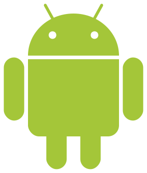

---
sidebar_custom_props:
  id: 7c96539f-6c3b-4cb6-94f8-42eb678a9257
---

# 2. Betriebssysteme

# 2. Betriebssysteme

## Bekannte Betriebssysteme
Die Liste sämtlicher Betriebssysteme ist zu lange und zu unüberschaubar, um sie hier alle einzeln aufzuführen. Wir beschränken uns auf einige wichtige Betriebssysteme, die wir im Alltag häufig antreffen.

Hier die wichtigsten Betriebssysteme für Desktopcomputer oder Notebooks:

:::cards --columns=3
### Microsoft Windows
Microsoft Windows gibt es seit 1985 in fast 30 verschiedenen Versionen (z.B. Windows 3.1, Windows 95, Windows 2000, Windows XP). Windows läuft momentan auf drei verschiedenen Prozessor-Architekturen: x86, amd64 und ARM.

***
### macOS von Apple
macOS ist ein Betriebssystem, das seit 1982 von Apple für Desktop- und Notebookcomputer entwickelt wird. Es läuft allerdings ausschliesslich auf der Mac-Hardware, die von Apple produziert wird. Zuerst erschien es als **Mac OS** (Classic) als komplett eigenständiges System, seit **Mac OS X** ist es UNIX-basiert.

***
### Linux
Über das **freie** Betriebssystem Linux findest du viele weitere Informationen in einem eigenen [Kapitel](?page=%2Fcomputer%2F5-os%2F4-linux%2FREADME). Linux gibt es seit 1991, es läuft inzwischen auf über 20 verschiedenen Prozessor-Architekturen.

:::

Nachfolgend wichtige mobile Betriebssysteme, d.h. Betriebssysteme, die auf mobilen Geräten (wie z.B. Smartphones und Tablets) zum Einsatz kommen.

:::cards --columns=3
### Windows Mobile
Microsoft Windows Mobile oder Windows Phone waren zwei Betriebssysteme für Smartphones und Tablets. Für Windows 10 Mobile gibt es seit Januar 2020 keine Updates mehr, für Windows Phone ist der Support bereits Mitte 2017 abgelaufen.

Somit entwickelt Microsoft zurzeit kein eigenes Betriebssystem für mobile Geräte mehr. Allerdings entwickelt Microsoft eine für Windows-Dienste optimierte Android-Version, welche auf ihren eigenen Smartphones der Surface Reihe eingesetzt werden.

Mit dem [Microsoft Launcher](https://play.google.com/store/apps/details?id=com.microsoft.launcher&hl=de_CH&gl=US) gibt es zudem die Möglichkeit für Android-Benutzer:innen, die Microsoft-Dienste stärker ins Android-System einzu
gliedern.
***
### iOS von Apple
iOS ist ein Betriebssystem für die iPhone-Smartphones und iPad-Tablets von Apple. Es läuft ausschliesslich auf den Geräten, die von Apple produziert werden.
***
### Android
Android ist ein freies Betriebssystem auf Basis des Linux-Kernels. Entwickelt wird Android von der Open Handset Alliance unter der Leitung von Google. Android läuft auf Smartphones und Tablets etlicher Hersteller und kommt daneben auch auf vielen weiteren Geräten (z.B. Fernsehern) zum Einsatz.

:::

## Betriebssysteme in meiner Umgebung

Neben den offensichtlichen Geräten wie Desktopcomputer oder Smarthones resp. Tablets setzen aber viele weitere Geräte ein Betriebssystem ein.

:::aufgabe Aufgabe Betriebssysteme in meiner Umgebung

1. Überlegen Sie sich, welche Geräte bei Ihnen zu Hause ein Betriebssystem brauchen/haben.
2. Wieso gibt es überhaupt verschiedene Betriebssysteme?

<Answer type="text" webKey="9baf3813-eba5-453f-bd08-90ac8e54855f" />

<Solution webKey="5cb1df26-cf3e-427b-ac68-f1303c74ef2a">

1. Hier eine sicher nicht vollständige Liste:
   - in Smartwatches und Smartglasses
   - in Fernsehern
   - in Set-Top-Boxen
   - in Mediaplayern und Smartspeakern
   - in Spielkonsolen
   - in Digitalkameras
   - in Access Points und WLAN-Routern
   - in Autos
   - und natürlich in Smarthome-Geräten (d.h. in mit dem Netzwerk verbundenen Kühlschränken, Heizungen etc.)
   - ...

   Besonders prominent ist da das freie Betriebssystem Android zu nennen.

2. Es gibt so viele, unterschiedliche Geräte (von Kleinst- bis Supercomputern), welche jeweils eigene Anforderungen haben. Es gibt kein Betriebssystem, das alle Bedürfnisse perfekt abdeckt. Hier nur einige, sich z.T. widersprechende Anforderungen:
   - flüssig bedienbar auf langsamer Hardware
   - nutzt die neusten Hardware-Features
   - zielgerichtet für einige wenige Spezialaufgaben (z.B. Digitalkameras, Set-Top-Boxen)
   - Betriebssystem für PCs und Notebooks
   - Lizenzbedingungen des Herstellers
   - freie Software
   - ...

</Solution>

:::
