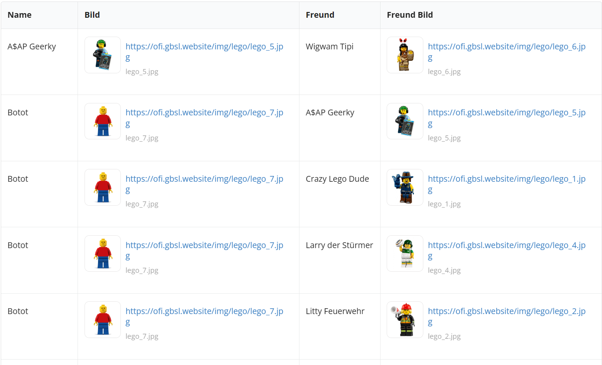

---
sidebar_custom_props:
  id: 3d253f37-8bf2-4ada-9059-564c667ba6df
---
# Mehrtabellenabfragen (Joins)

Datenbanken können nicht nur zum effizienten aufbewahren von Daten verwendet werden, sondern auch um die gespeicherten Tabellen miteinander zu verknüpfen. Die Verknüpfung basiert auf dem **kartesischen Produkt**, daher "Jede Zeile einer Tabelle wird mit jeder Zeile der anderen Tabelle verknüpft".


### Definition
Das **kartesische Produkt** `AxB` (lies „A kreuz B“) zweier Mengen `A` und `B` ist definiert als die Menge aller geordneten Paare `(a,b)`, wobei `a` ein Element aus `A` und `b` ein Element aus `B` ist. Dabei wird jedes Element aus `A` mit jedem Element aus `B` kombiniert. Formal ist das kartesische Produkt durch

$$
A\times B=\{(a,b)|a\in A\land b\in B\}
$$

definiert.

::::success[Umgangssprachlich]
Umgangssprachlich ist das kartesische Produkt bekannt als **Jedes mit Jedem**

:::cards[--cols=3]

$$
A=\{a,b,c\}
$$

***
<div style={{display: 'flex', justifyContent: 'center'}}>

:mdi-close--xl:
</div>
***
$$
B=\{1,2\}
$$

***

$$
A\times B=\{(a,1),(a,2),(b,1),(b,2),(c,1),(c,2)\}
$$
:::

::::

## Beispiele


__Personen__

<div className="slim compact left border">

| Name   | Vorname   | Augenfarbe |
|:-------|:----------|:-----------|
| Mäder  | Elisabeth | grün       |
| Holzer | Reto      | braun      |
</div>

__Augenfarben__

<div className="slim compact left border">

| Farbe | Auftreten [%] |
|:------|:--------------|
| blau  | 2             |
| grün  | 7             |
| braun | 90            |

</div>

Das kartesische Produkt der Tabellen `Personen` und `Augenfarbe` sieht wie folgt aus:

<div className="slim compact left border">

| Name   | Vorname   | Augenfarbe | Farbe | Auftreten  [%] |
|:-------|:----------|:-----------|:------|:---------------|
| Mäder  | Elisabeth | grün       | blau  | 2              |
| Holzer | Reto      | braun      | blau  | 2              |
| Mäder  | Elisabeth | grün       | grün  | 7              |
| Holzer | Reto      | braun      | grün  | 7              |
| Mäder  | Elisabeth | grün       | braun | 90             |
| Holzer | Reto      | braun      | braun | 90             |

</div>

## SQL

### Verschiedene Tabellen

Die Abfrage

```sql
SELECT * FROM legodudes, haustiere;
```
erzeugt das kartesische Produkt der Tabellen `legodudes` und `haustiere`. Allerdings ist das Resultat nicht wie erwartet - so gibt es bspw. nur eine Spalte mit einem Bild:


:::danger[Gleiche Attributnamen in verschiedenen Tabellen]
Werden mehrere Tabellen mit denselben Attributnamen verknüpft, so werden die Spalten zusammengefasst und der zuletzt hinzugefügte Wert wird verwendet.
:::

### Alias
Es müssen Aliase verwendet werden, damit dieselbe Tabelle miteinander verknüpft werden können:
```sql
SELECT 
    legodudes.name AS "Name", legodudes.bild AS "Bild", 
    haustiere.name AS "Haustier", haustiere.bild AS "Vorschau" 
FROM legodudes, haustiere
```


:::tip[Weniger Schreiben: Tabellennamen abkürzen]
Da bei jeder Spalte der Tabellenname angegeben werden muss, lassen sich die Tabellennamen mit einem Alias abzukürzen:

```sql
SELECT 
    a.name AS "Name", a.bild AS "Bild", b.name AS "Haustier", b.bild AS "Vorschau" 
FROM legodudes a, haustiere b
```
:::


Oft interessiert aber nicht das kartesische Produkt, sondern eine Verknüpfung zwischen einzelnen Zeilen. Dies kann mit einer `WHERE` Bedingung erfüllt werden.
### Beispiel: LegoDudes und Haustiere

```sql
SELECT 
    a.name AS "Name", a.bild AS "Bild", b.name AS "Haustier", b.bild AS "Vorschau" 
FROM legodudes a, haustiere b
WHERE a.id = b.legodude_id
```

:::info[Geordnete Ausgabe]
Die Tabellennamen müssen bei jeder Attributverwendung angegeben werden (ausnahme: die Spalten haben unterschiedliche Namen). Dies also auch bspw. beim Filtern:

```sql
SELECT 
    a.name AS "Name", a.bild AS "Bild", b.name AS "Haustier", b.bild AS "Vorschau" 
FROM legodudes a, haustiere b
WHERE a.id = b.legodude_id
ORDER BY a.name
```
:::


## Joins

Da sehr oft Tabellen miteinander verknüpft werden müssen und die Abfragen mit dem kartesischen Produkt sehr unübersichtlich werden, gibt es die Möglichkeit, die Tabellen mit einem `JOIN` zu verknüpfen.

Obiges Beispiel sähe mit einem `JOIN` so aus:

<GTabs getLabel={(idx) => ['Explizit', 'Kurz'][idx]}>

```sql
SELECT 
    legodudes.name AS "Name", legodudes.bild AS "Bild", haustiere.name AS "Haustier", haustiere.bild AS "Vorschau" 
FROM legodudes
  JOIN haustiere ON legodudes.id = haustiere.legodude_id
ORDER BY legodudes.name
```

```sql
SELECT 
    a.name AS "Name", a.bild AS "Bild", b.name AS "Haustier", b.bild AS "Vorschau" 
FROM legodudes a
  JOIN haustiere b ON a.id = b.legodude_id
ORDER BY a.name
```

</GTabs>

::::aufgabe[Legodudes Freunde]
<Answer type="state" webKey="0408cad3-a23a-42d0-861a-c4ed127eab7a" />

Datenbank
: __legomania__
: 👉 https://db-sql.ch/connections/9e5bd382-6110-4f04-adf7-2b46fcdadfd5/legomania

Erzeugen Sie eine Abfrage, die alle Legodudes mit ihren Freunden anzeigt, wobei nach dem Namen und dann nach Freundenamen sortiert wird.




:::tip
Es können mehrere `JOINS` nacheinander verwendet werden:

```sql
SELECT *
FROM tab_a
  JOIN tab_b ON tab_a.id = tab_b.a_id
  JOIN tab_c ON tab_b.id = tab_c.b_id
```
:::

<Answer type="text" webKey="18c78d4f-3658-4155-a2a9-310457938048" monospace />

<Solution webKey="c046c3cb-bd5e-48e2-b0e9-fbe9487a3980">

```sql
SELECT
    a.name AS "Name", a.bild AS "Bild", b.name AS "Freund", b.bild as "Freund Bild"
FROM
    legodudes a
    JOIN
        legodudes_freunde ON legodudes_freunde.legodude_id = a.id
    JOIN
        legodudes b ON b.id = legodudes_freunde.freund_id
ORDER BY a.name, b.name
```
</Solution>

Was ist mit "Larry" und "Wigwam" passiert? Warum werden diese nicht angezeigt? Vermutung?

<Answer type="text" webKey="95f370c5-8cbb-408a-996f-dbd7e98a4f25" />
::::

:::aufgabe[IMDb]
<Answer type="state" webKey="72bc2c78-c0a2-4648-9c32-4a868bf86279" />

Bei welchen Filmen wirkt
- [Balthasar Glättli](https://de.wikipedia.org/wiki/Balthasar_Gl%C3%A4ttli) mit?
- Ihre Lieblingsschauspieler:in mit?

Geben Sie die Personen zusammen mit den Filmen aus, in welchen sie mitwirken.

<Solution webKey="adf6fe79-7d87-4b5c-874d-edfbfb172add">

```sql
SELECT *
FROM humans
    JOIN humans_movies ON humans.id = humans_movies.human_id
    JOIN movies ON humans_movies.movie_id = movies.id
WHERE
    humans.name='Balthasar Glättli';
```
</Solution>

:::


:::aufgabe[Lieblingsfilme]
<Answer type="state" webKey="9de46f19-da36-4c0a-a2ae-3c7c037b1544" />

Wer wirkt alles bei Ihrem Lieblingsfilm (alternativ: vom Film mit der ID `tt0478087`) mit?
Geben Sie den Film zusammen mit allen Personen aus, die beim Film mitgewirkt haben.


<Solution webKey="adf6fe79-7d87-4b5c-874d-edfbfb172add">

```sql
SELECT 'https://www.imdb.com/title/' || movies.id || '/' as film, 'https://www.imdb.com/name/' || humans.id || '/' as human, *
FROM movies
    JOIN humans_movies ON movies.id = humans_movies.movie_id
    JOIN humans ON humans_movies.human_id = humans.id
WHERE
    movies.id='tt0478087'
```
</Solution>

:::