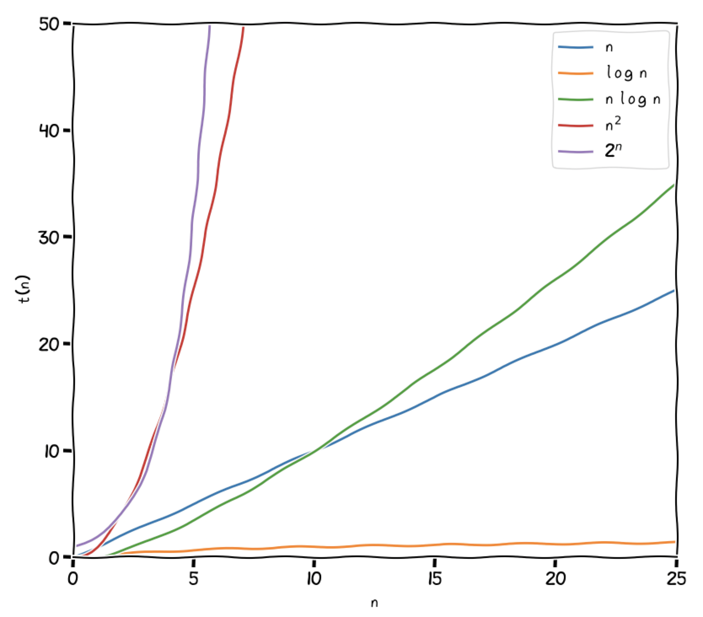

---
sidebar_custom_props:
  id: 209c76dd-1bdd-44d9-b5ca-7eb3ce7384c0
  source:
    name: S. Forster, M Lehmann
    ref: https://informatik.mygymer.ch/ef2024/10-komplexitaet/07-pnp.html
---
# P-NP

Algorithmen mit einer polynomialen Laufzeit von $n^2$ oder allgemein $n^k$ skalieren bereits schlecht. Das bedeutet, dass sie bei einem grösseren Input kaum brauchbar sind weil sie das Resultat nicht mehr in nützlicher Zeit liefern können. Sie gelten aber immer noch als effizient. Man muss die Input-Länge kontrollieren.

Algorithmen mit exponentieller Laufzeit, also $2^n$ oder $k^n$, werden nicht mehr als effizient bezeichnet. Ihre Komplexität wächst so stark mit steigendem Input, dass sehr bald schon keine Resultate mit vernünftigem Aufwand möglich sind.



Für viele Probleme der Informatik hat man noch keine effiziente Algorithmen gefunden, also solche mit polynomialer Laufzeit oder besser.

## Komplexitätsklasse P

:::def
### Definition

Die Komplexitätsklasse $P$ enthält die Probleme, für die eine deterministische Turingmaschine (etwa ein konventioneller Computer) existiert, die das Problem in polynomialer Laufzeit löst.
:::

## Komplexitätsklasse NP

:::def
### Definition

Definition

Die Komplexitätsklasse $NP$ enthält die Probleme, von denen sich in polynomialer Laufzeit mit einer deterministischen Turingmaschine entscheiden lässt, ob eine vorgeschlagene Lösung zutrifft.
:::

## P-NP-Problem
Unbekannt ist, ob die beiden Klassen $P$ und $NP$ identisch sind, ob also auch die schwersten Probleme der Klasse $NP$ deterministischen Maschinen effizient lösbar sind.


## Beispiele

### Faktorisierung
Ein solches Beispiel ist die Faktorisierung einer Zahl in ihre Primfaktoren.

$$
\text{z.B.} 91 = 7 \cdot 13 \qquad \text{oder} \qquad 12 = 2 \cdot 2 \cdot 3
$$

Diese Aufgabe scheint einfach, wird aber für sehr grosse Zahlen sehr aufwändig!

Es ist kein polynomiales Faktorisierungsverfahren bekannt – es kann aber auch nicht ausgeschlossen werden, dass es ein solches gibt! Dieses sogenannte **P-NP-Problem** ist eines der grossen ungelösten Probleme der theoretischen Informatik.

### SAT – Erfüllbarkeitsproblem der Aussagenlogik
Das **Erfüllbarkeitsproblem der Aussagenlogik** (SAT, von englisch satisfiability) ist ein Entscheidungsproblem der theoretischen Informatik. Es beschäftigt sich mit der Frage, ob eine gegebene aussagenlogische Formel $F$ erfüllbar ist. Mit anderen Worten: Existiert eine Belegung der Variablen von $F$ mit den Werten wahr oder falsch, so dass $F$ zu wahr ausgewertet wird?

Beispiel einer solchen aussagelogsichen Formel:

$$
F = (A \vee C) \wedge (\neg A \vee D \vee \neg E) \wedge (B \vee \neg D \vee E)
$$

Notation wie wir es von Python kennen:

```py
F = (A or C) and (not A or D or not E) and (B or not D or E)
```

:::aufgabe
<Answer type="state" webKey="5526de5c-c9ed-4664-97c6-85e9a93aac86" />

Finden Sie eine Belegung der boolean Variablen `A` - `E`, womit `F` `True` ergibt.

<Answer type="text" webKey="ea55152f-feae-43eb-b01f-23eec1ae935a" />
:::

SAT gehört zur Komplexitätsklasse NP. Jedes Problem aus NP kann in polynomieller Zeit auf SAT zurückgeführt werden (Polynomialzeitreduktion).

Eine deterministische Turingmaschine (im allgemeinen also ein sequenziell abgearbeitetes Programm, das endet) kann SAT in exponentieller Zeit entscheiden, zum Beispiel durch das Aufstellen einer Wahrheitstabelle. Es ist kein effizienter Algorithmus für SAT bekannt und es wird allgemein vermutet, dass ein solcher Polynomialzeitalgorithmus nicht existiert. Die Frage, ob SAT in polynomieller Zeit gelöst werden kann, ist äquivalent zum P-NP-Problem.