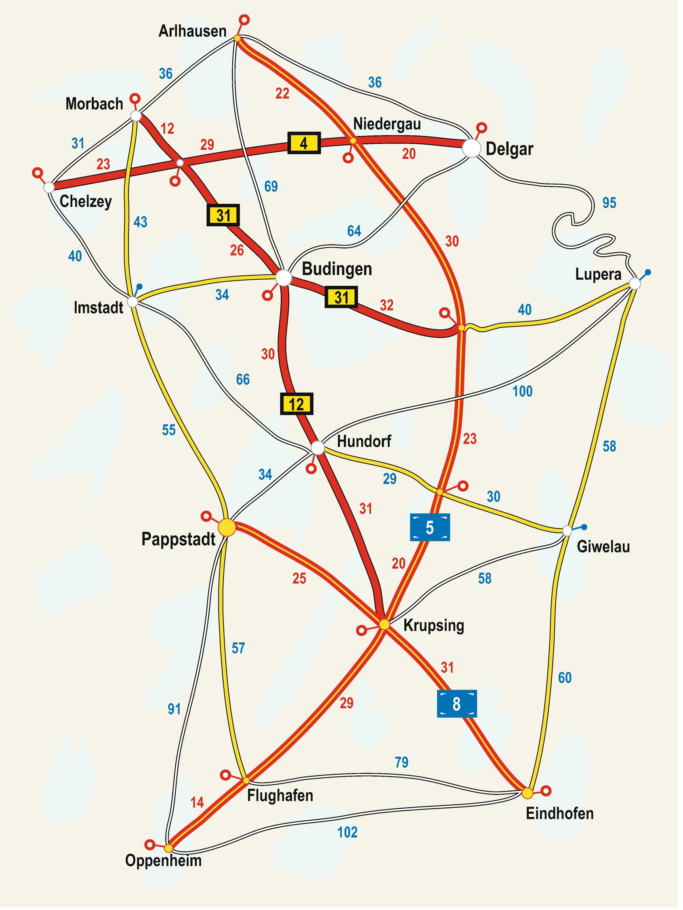
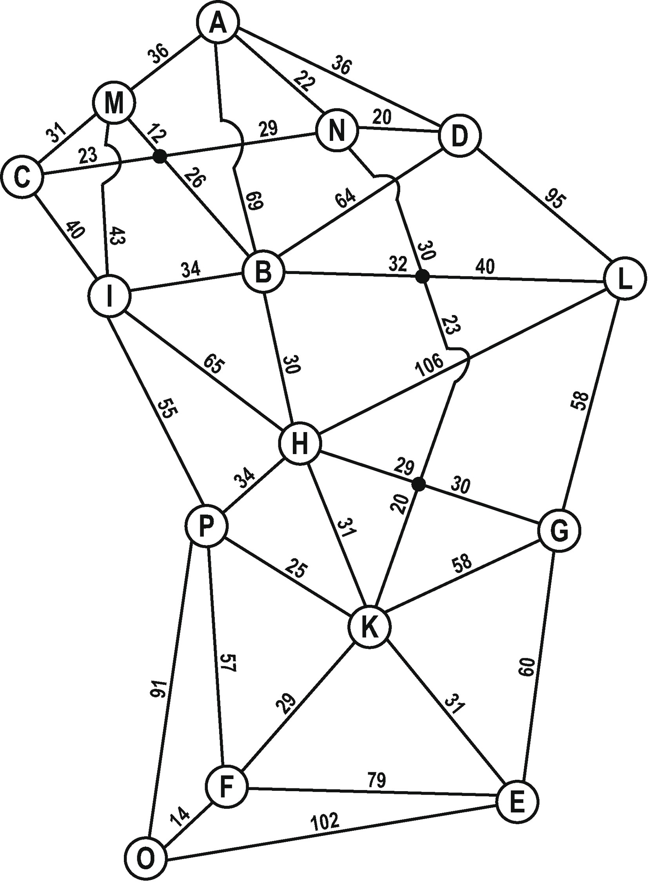
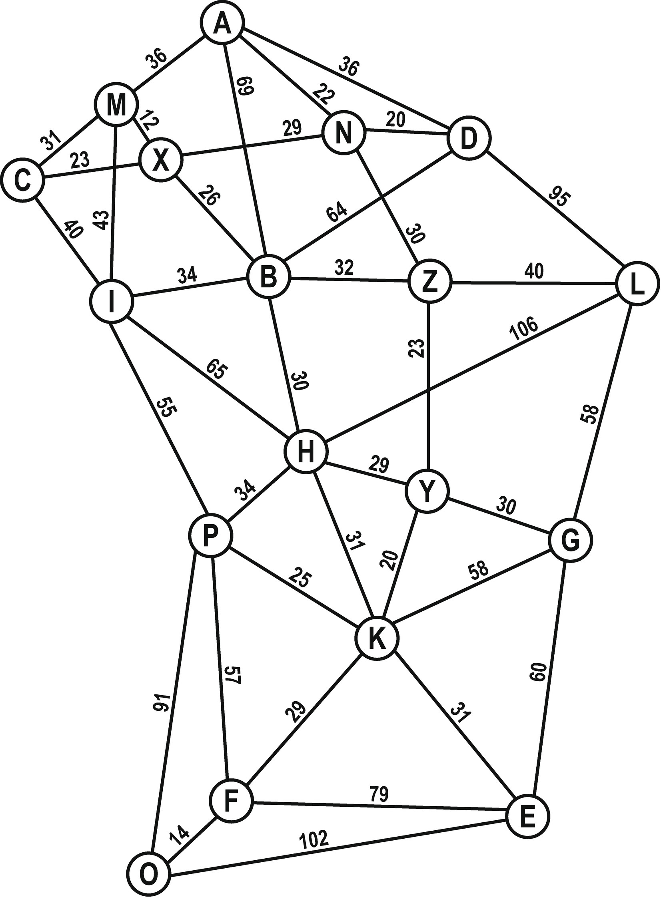

---
sidebar_custom_props:
  id: bbaaa9c1-ea5b-4827-a684-17f0775348f5
  source:
    name: S. Forster, M Lehmann
    ref: https://informatik.mygymer.ch/ef2024/08-ki-klassisch/02-graphen.html
---

# Bäume und Graphen

Wenn man ein Problem – z.B. der schnellste Weg von A nach B – mit dem Computer lösen will, so muss man zuerst die Daten so aufbereiten, dass der Computer diese verstehen kann: wir müssen abstrahieren. Dabei muss das was für die Lösung des Problems wichtig ist in einer Datenstruktur festgehalten werden. Häufig werden dabei sogenannte Graphen verwendet:

:::def
### Definition: Graph

Ein Graph ist eine abstrakte Struktur, die eine Menge von Objekten zusammen mit den zwischen diesen Objekten bestehenden Verbindungen repräsentiert.
Die mathematischen Abstraktionen der Objekte werden dabei **Knoten** des Graphen genannt.
Die paarweisen Verbindungen zwischen Knoten heissen **Kanten**. Die Kanten können **gerichtet** oder **ungerichtet** sein.
:::

Z.B. kann das U-Bahnnetz einer Stadt als Graph angesehen werden.

:::def
### Definition: Baum

Ein Baum ist ein spezieller Typ von Graph, der zusammenhängend ist und keine geschlossenen Pfade, also Zyklen der Länge grösser oder gleich 3, enthält. Bei allen Bäumen ist die Anzahl der Knoten offensichtlich um 1 grösser als die Anzahl der Kanten.
:::

Als Beispiel schauen wir uns einen Routenplaner an (Teile übernommen aus dem Buch «Abenteuer Informatik» von Jens Gallenbacher[^1])

## Abstraktion
Als Vorbereitung abstrahieren wir die Karte und behalten nur, was für den Computer, resp. den Algorithmus benötigt wird.

### Ausgangskarte
Als Beispiel wollen wir einen Weg auf einer Karte finden: Es geht von Imstadt nach Lupera.

<Tabs>
<TabItem value="Schritt 1">

#### Schritt 1
Zuerst einmal überlegen wir uns, was denn für die Aufgabe überhaupt wichtig ist. Dabei vereinfachen wir die Karte:

- Aus den Städten werden «Knoten» mit einem einzelnen, aber eindeutigen Buchstaben
- Kreuzungen werden zu «Knoten»
- Strassen werden zu einheitlichen «Kanten» (wir vernachlässigen den Strassentyp)
- Die Distanzen bleiben erhalten und werden den Kanten zugewiesen

</TabItem>
<TabItem value="Schritt 2">

#### Schritt 2
Wir können weiter vereinfachen:
- Kreuzungs-Knoten werden gleich behandelt wie Städte: Sie erhalten einen Buchstaben der noch nicht vergeben ist.
- Kanten können gerade dargestellt werden: Dort wo sich zwei Kanten kreuzen gibt es keine Kreuzung!

</TabItem>
<TabItem value="Endergebnis">

#### Endergebnis

Was wir nun erhalten ist ein **Gewichteter Graph**: Ein **Graph** besteht aus Kanten und Knoten. Bei einem gewichteten Graphen hat zusätzlich jede Kante ein Gewicht – bei uns die Länge der Strasse welcher durch die Kante dargestellt wird. Im Gegensatz zur Baumstruktur, darf ein Graph auch Loops beinhalten. («Rundfahrten» sind erlaubt.)

</TabItem>
</Tabs>

Diesen Graphen können wir nun verwenden, um automatisiert einen Weg – oder sogar den kürzesten Weg zwischen zwei Ortschaften zu finden.

:::note[Hinweis: Prinzip der Informatik: «Abstraktion»]
Wir vereinfachen, lassen alles nicht wichtige Weg – damit wir das Problem mit dem Computer darstellen und lösen können.
:::

[^1]: [Abenteuer Informatik 2020](https://www.abenteuer-informatik.de/PDF/ai2020_oa_leseversion.pdf)