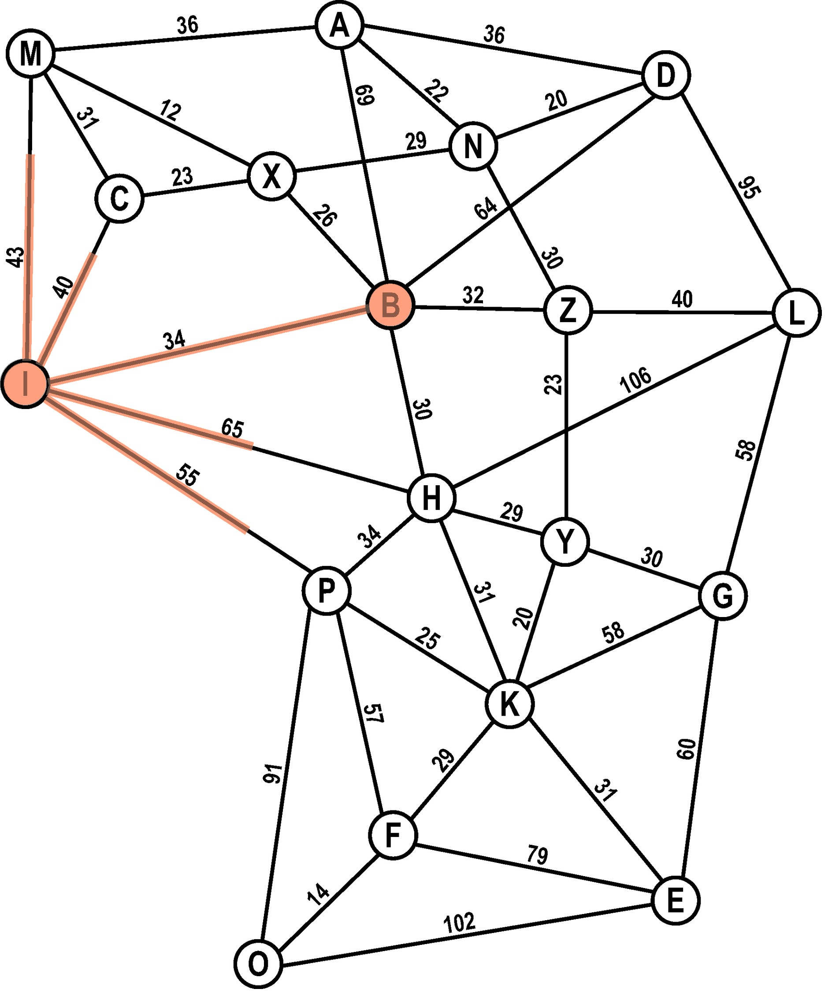
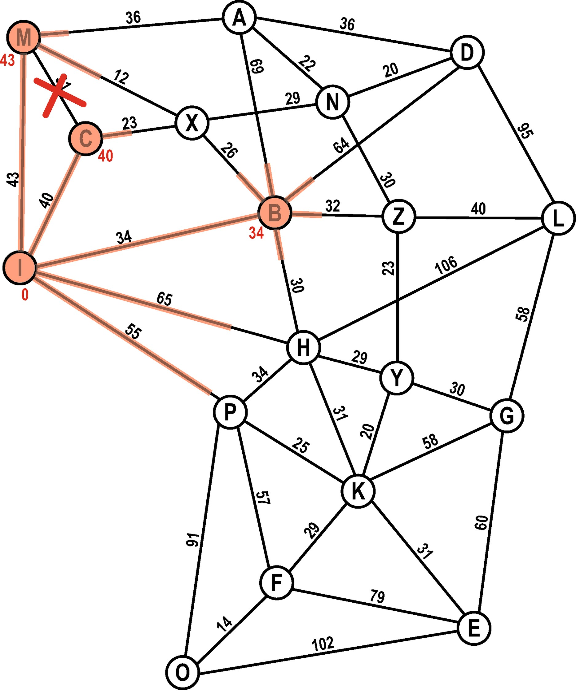
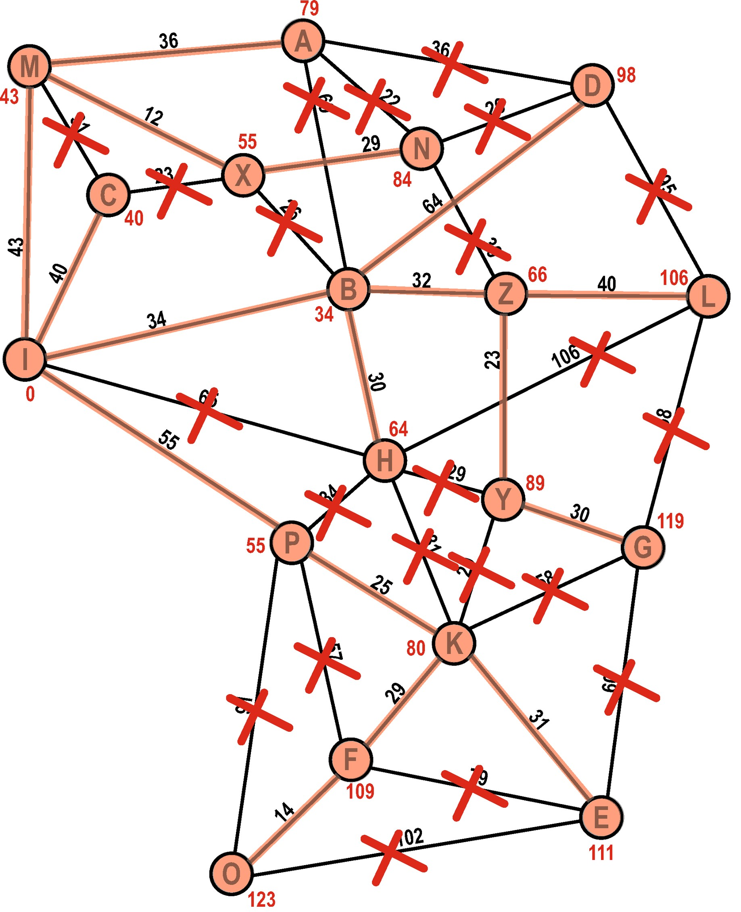
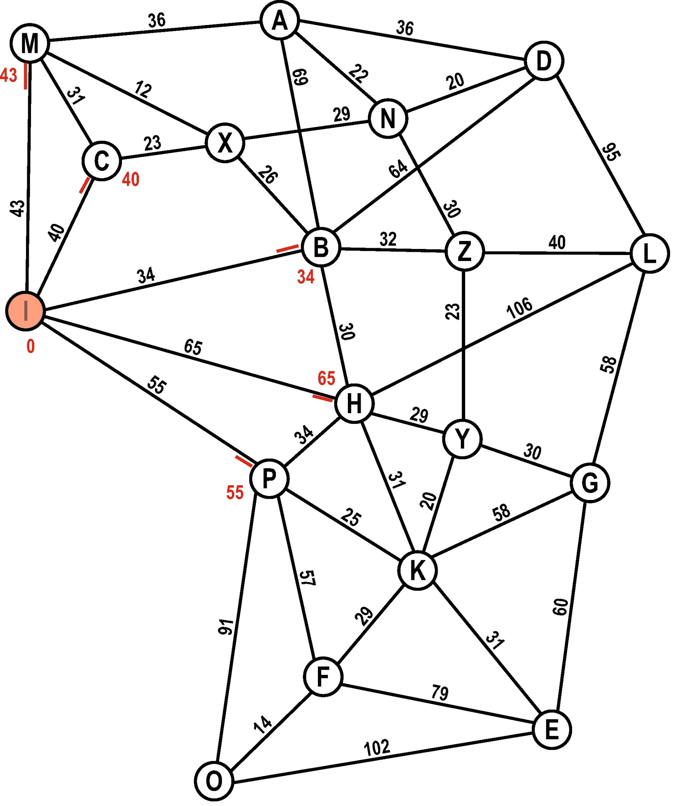
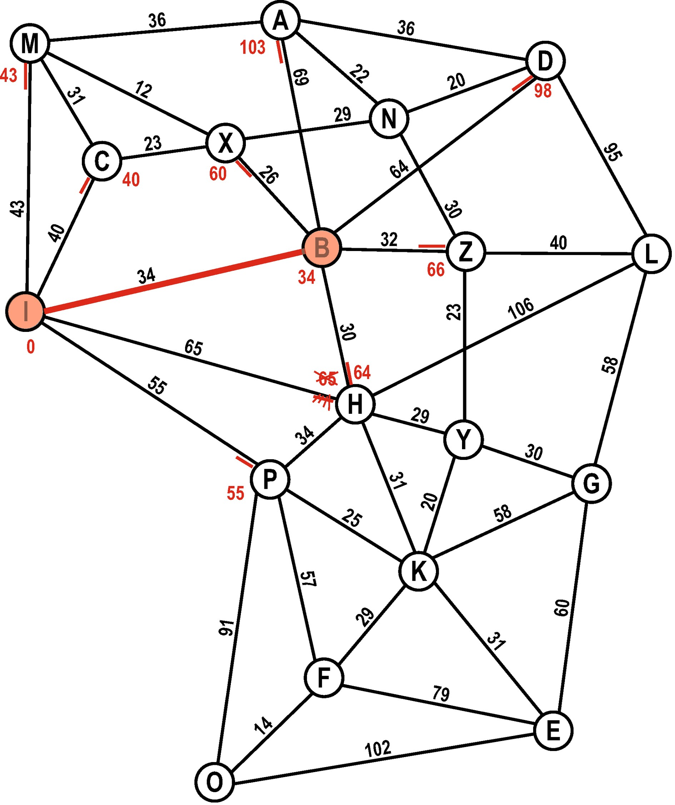
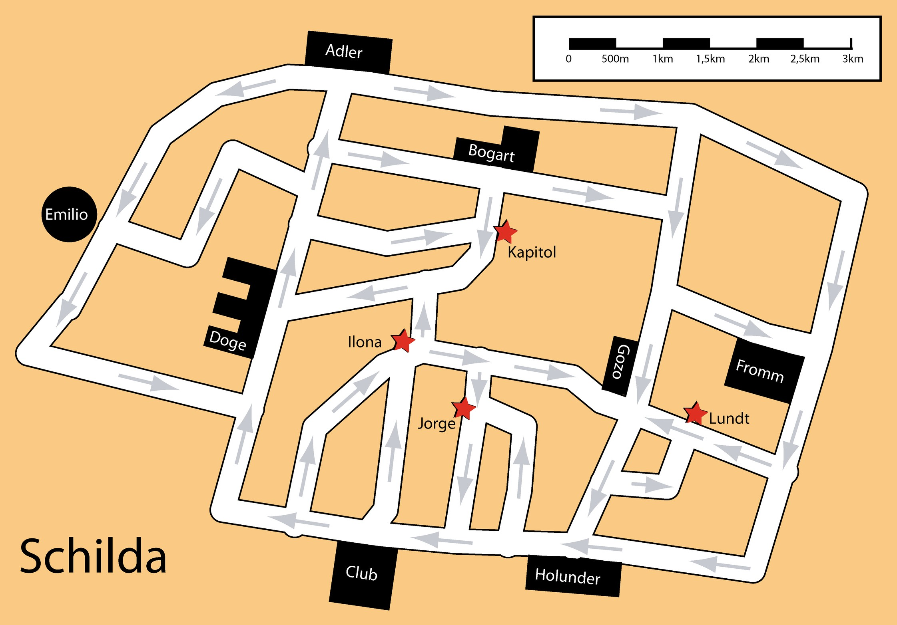
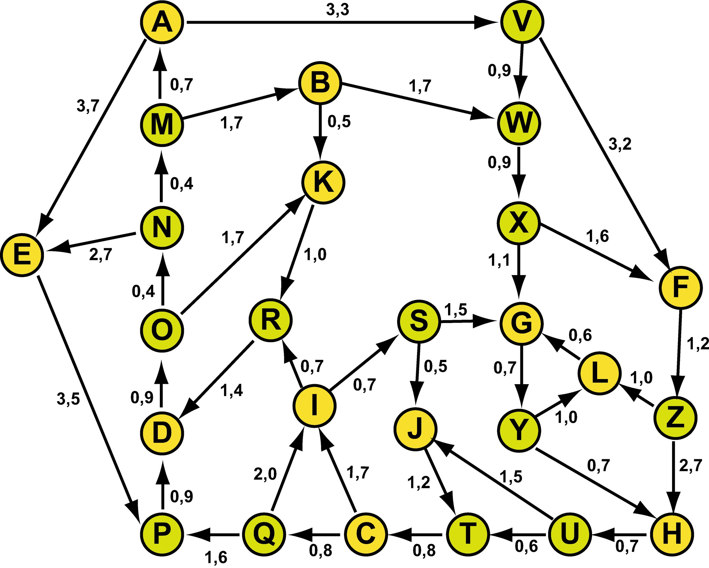
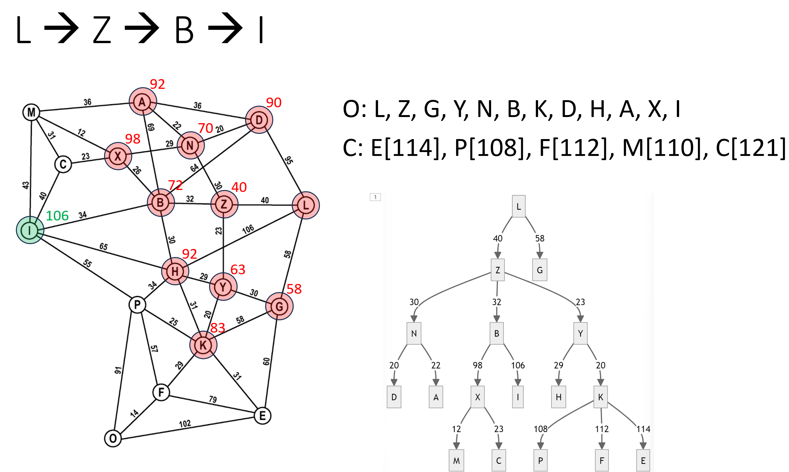

---
sidebar_custom_props:
  id: 02f2e2cf-9c32-4536-9e33-78fe23d1596b
  source:
    name: S. Forster, M Lehmann
    ref: https://informatik.mygymer.ch/ef2024/08-ki-klassisch/04-dijkstra.html
---

# Dijkstra 

Mit der Breitensuche haben wir einen Weg gefunden, aber nicht zwingenderweise den schnellsten. Wie können wir nun aber die Gewichte der Kanten berücksichtigen und den schnellsten Weg finden? Dafür führt Jens Gallenbacher die Idee mit den Ameisen ein:

## Ameisen

<Tabs>
<TabItem value="Start">

### Start
Die Ameisen starten gleichzeitig beim Startknoten. In alle Richtungen schwärmen sie gleich schnell aus:



</TabItem>
<TabItem value="Verzweigung">

### Verzweigung

Erreichen Ameisen einen ersten Nachbarknoten, so teilen sie sich sogleich und folgen allen weiteren Verzweigungen, immer noch im genau gleichen Tempo.


</TabItem>
<TabItem value="Aufeinander Zu">

### Aufeinander Zu
Dasselbe passiert nun bei verschiednen Knoten. Teilweise marschieren Ameisen auf der selben Kante aufeinander zu.


</TabItem>
<TabItem value="Kollision">

### Kollision

Treffen sich aus unterschiedlicher Richtung kommende Ameisen auf einer Kante, so wird diese Kante entfernt: Man weiss dass die beiden Knoten, von wo die Ameisen aus auf diese Kante gekommen sind, bereits entdeckt sind.



</TabItem>
<TabItem value="weiter...">

### weiter...
So geht das Entdecken weiter: Bei neuen Knoten teilen sich die Ameisen, bei Kanten begegnen sie sich.


</TabItem>
<TabItem value="Gefunden">

### Gefunden
Schlussendlich ist jeder Knoten von Ameisen entdeckt worden. Und zwar immer auf dem schnellsten Weg vom Startknoten aus. Wenn wir die nicht-durchgestrichenen Kanten zurück zum Start verfolgen, haben wir also den schnellsten Weg gefunden.



</TabItem>
</Tabs>

## Dijkstra
Wir wollen versuchen den «Ameisen»-Algorithmus für den Computer umzusetzen. Es macht nämlich wenig Sinn, sich gleichmässig auf den Kanten fortzubewegen. Wir kennen ja die Distanzen zwischen den Knoten. Statt zu schauen, welche Ameisen zuerst beim nächsten Knoten sind, wählen wir den «besten» Knoten von unserer Open-List und gehen dort weiter! Dazu notieren wir auf unser Open-List immer die bereits zurückgelegte Distanz vom Startknoten.

### Vorbereitung
Der Startknoten kommt auf die Open-List. Die zurückgelegte Distanz (von Startknoten zu Startknoten) ist natürlich 0.

```
Closed-List: –
  Open-List: I (0)
```

<Tabs>
<TabItem value="Schritt 1">

### Schritt 1
Wir fügen alle Nachbarn des Startknotens auf die Open-List. Dabei berechnen wir wie weit es vom Startknoten zum jeweiligen Knoten ist.
`I` kommt auf die Closed-List.



```
Closed-List: I
  Open-List: M (43), C (40), B (34), H (65), P (55)
```


</TabItem>
<TabItem value="Vorbereitung Schritt 2">

### Vorbereitung Schritt 2
Wir suchen den besten Kandidaten aus unserer Open-List heraus. Der Knoten B hat die kleinste Distanz, also machen wir dort weiter!


```
Closed-List: I
  Open-List: M (43), C (40), B (34), H (65), P (55)
```


</TabItem>
<TabItem value="Schritt 2">

### Schritt 2
Wir berechnen für alle Nachbarn des Knotens `B` ihre Distanz vom Startknoten über `B`. Ist der Knoten noch nicht auf der Open-List, wird dieser hinzugefügt. Ist ein Knoten – wie hier der Knoten `H` – bereits auf der Open-List, schauen wir, ob wir einen kürzeren Weg gefunden haben. Wenn ja, aktualisieren wir den Knoten auf der Open-List.
`B` kommt auf die Closed-List.



```
Closed-List: I, B
  Open-List: M (43), C (40), H (64), P (55), X (60), A (103), D (98), Z (66)
```


</TabItem>
<TabItem value="Schritt 3">

### Schritt 3
Der nächste «beste» Kandidat auf unserer Open-List ist `C`. Die Nachbarn von `C` sind aber bereits auf der Open-List – und zwar mit kürzerer Distanz als über `C`.
`C` kommt auf die Closed-List.


```
Closed-List: I, B, C
  Open-List: M (43), H (64), P (55), X (60), A (103), D (98), Z (66)
```

</TabItem>
</Tabs>

## Der Algorithmus
Der Algorithmus kann wie folgt schematisch dargestellt werden:


## Endzustand
Wenn wir nur den besten Weg finden wollen, können wir den Algorithmus abbrechen, sobald der Zielknoten der «beste» Kandidat auf der Open-List ist. Dann wissen wir: Es gibt keinen kürzeren Weg!

:::warning Warnung
Wenn der Zielknoten nur auf der Open-List ist, könnte es immer noch einen besseren Weg geben!
Wir haben ja erst einen Weg gefunden, ev. gibt es über einen anderen Knoten auf der Open-List einen schnelleren. Wenn aber der Zielknoten der «beste» Kandidat ist, dann kann es keinen schnelleren Weg mehr geben!
:::

Wir können den Algorithmus auch weiterlaufen lassen. Am Schluss erhalten wir dann einen «Baum» (alle roten Kanten). Dieser Baum stellt die schnellsten Wege von `I` zu jedem anderen Knoten des Graphen dar.


:::aufgabe
<Answer type="state" webKey="abec0e1d-00d1-45fc-950e-b947ce90d197" />

Führen Sie den Dijkstra-Algorithmus durch: Finden Sie den kürzesten Weg in umgekehrter Richtung, also vom Knoten `L` zum Knoten `I`.

- Zeichnen Sie ihren Fortschritt analog zum Beispiel im Graphen auf
- Führen Sie daneben eine Open- und eine Closed-List

<Answer type="text" webKey="0a3c4d33-752e-4242-8206-b52a303a5cc5" />
:::

## gerichtete Graphen
Das Ganze funktioniert auch für sogenannt «gerichtete Graphen», also z.B. Karten mit Einbahnstrassen:

<Tabs>
<TabItem value="Schilda">


</TabItem>
<TabItem value="Knoten">


</TabItem>
<TabItem value="Gerichteter Graph">


</TabItem>
</Tabs>

:::aufgabe
<Answer type="state" webKey="2cb452d5-a87e-4fa9-9357-621d84f66d3d" />

Führen Sie den Dijkstra-Algorithmus aus: erstellen Sie eine Entfernungstabelle für das Hotel Adler. Finden Sie die kürzesten Wege vom Knoten `A` zu allen anderen Knoten.

- Zeichnen Sie ihr Fortschritt analog zum Beispiel im Graphen auf
- Führen Sie daneben eine Open- und eine Closed-List

<Answer type="text" webKey="64ab3765-f068-448b-aa1c-efaf8ea46728" />

<Solution webKey="b58c2854-3227-43d7-a66a-9f0f5d3f5cd3">



</Solution>
:::

## Besprechung der Aufgaben

<iframe src="https://erzbe-my.sharepoint.com/personal/balthasar_hofer_gbsl_ch/_layouts/15/Doc.aspx?sourcedoc={94b15380-9d43-4d09-8e2c-00037eca2df5}&amp;action=embedview&amp;wdAr=1.7777777777777777" width="100%" height="450px" frameborder="0">Dies ist ein eingebettetes <a target="_blank" href="https://office.com">Microsoft Office</a>-Dokument, unterstützt von <a target="_blank" href="https://office.com/webapps">Office</a>.</iframe>

## Zusammenfassung

[@youtube](https://www.youtube-nocookie.com/embed/EFg3u_E6eHU?si=FtRqtOsopcTPZ2F7)