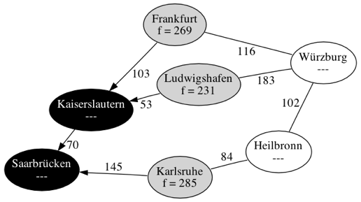
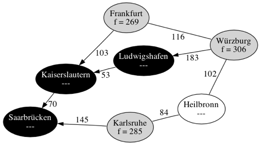
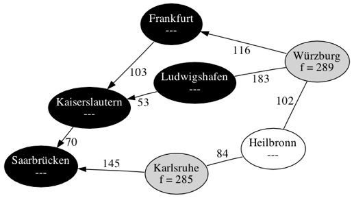
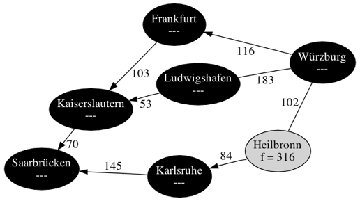

---
sidebar_custom_props:
  id: 8b24cc06-1537-4699-958b-3401b6dea5ab
---

# A-Stern

Der $A^\star$-Algorithmus[1] (im folgenden $A^\star$ genannt) wird verwendet, um in einem Baum oder allgemein in einem Graphen den kürzesten Pfad zwischen zwei Knoten zu finden. Um  $A^\star$ anwenden zu können, müssen die Kanten mit **Kosten** versehen sein. Gesucht ist nun der kürzeste (bzw. billigste) Pfad zwischen zwei Knoten.

[@youtube](https://www.youtube-nocookie.com/embed/A60q6dcoCjw?si=lhZQt6CCow0eK0Zr)

Bei der Breitensuche wird keine «intelligente» Auswahl der Knoten in der Open-List getroffen, die Knoten werden in willkürlicher Reihenfolge verarbeitet. Der  $A^\star$ ist eine Verfeinerung dieser Verfahren, wobei folgendermassen immer der vielversprechendste Knoten weiterverarbeitet wird. Es wird abgeschätzt, wie «gut» ein Knoten ist, indem eine Bewertungsfunktion berechnet wird. Die Kosten eines Knotens $N$ beinhalten zwei Beiträge: einerseits die Kosten vom Startknoten bis zu $N$ (wie bei Dijkstra) und andererseits die geschätzten Kosten von $N$ bis zum Zielknoten. Diese Bewertungsfunktion $f(N)$ für einen Knoten $N$ wird also folgendermassen definiert:

:::def Definition
### A-Stern
$$
f(N) = g(N) + h(N)
$$

wobei $g(N)$ die Kosten des Pfades vom Startknoten zu $N$ darstellt und $h(N)$ die geschätzten Kosten eines optimalen Pfades von $N$ zum Zielknoten darstellt.

Bei der Schätzung muss gelten:

$$
h(N) \geq h^*(N)
$$

wobei $h^\star(N)$ die wirklichen Kosten des optimalen Pfades von $N$ zum Zielknoten sind.
:::

Die geschätzte Kostenfunktion $h(N)$ ist normalerweise unbekannt und kann nur abgeschätzt werden. Damit obige Ungleichung gilt, darf die Funktion $h$ die Kosten eines Knotens nie überschätzen! Oft wird z.B. die euklidische Distanz zum Ziel verwendet.

Die Funktion $h$ ist eine sog. Heuristik, also eine Abschätzung des wahren Werts. So kann die Suche nach dem optimalen Pfad oft wesentlich beschleunigt werden, was beim $A^\star$ ausgenutzt wird. Man kann zeigen, dass der  immer den kürzesten Weg findet, wenn es einen gibt.

## Beispiel
Gesucht ist der schnellste Weg von __Würzburg__ nach __Saarbrücken__. Durch Abstraktion der Karte wurde der folgende gewichtete Graphen erzeugt. Zusätzlich kennt man für jeden Knoten eine Heuristik, nämlich die Distanz der Luftlinie nach Würzburg:


<Tabs>
<TabItem value="Schritt 1">

### Saarbrücken


Start beim Ziel. Für alle anliegenden Knoten $f(Knoten) = g(Knoten) + h(Knoten)$ berechnet, also "Distanz vom Ziel bis zum Knoten" + "Luftlinie vom Knoten bis zum Start".

Kaiserlautern
: $f = 70 + 158 = 228$
Karlsruhe
: $f = 145 + 140 = 285$

- Orientiere die Kanten in Richtung des Verbindungspfades
- Markiere Saarbrucken als besucht
- Besuche den Knoten mit dem kleinsten $f$-Wert: __Kaiserslautern__

</TabItem>
<TabItem value="Schritt 2">

### Kaiserlautern



Frankfurt
: $f = 70 + 103 + 96 = 269$
Ludwigshafen
: $f = 70 + 53 + 108 = 231$

- Orientiere die Kanten in Richtung des Verbindungsknotens
- Markiere Kaiserslauten als besucht
- Besuche den Knoten mit dem kleinsten $f$-Wert: __Ludwigshafen__

</TabItem>
<TabItem value="Schritt 3">

### Ludwigshafen



Würzberg
: $f = 70 + 53 + 183 + 0 = 306$

- Orientiere die Kanten in Richtung des Verbindungsknotens
- Markiere Kaiserslauten als besucht
- Besuche den Knoten mit dem kleinsten $f$-Wert: __Frankfurt__

</TabItem>
<TabItem value="Schritt 4">

### Frankfurt


Würzbeburg
: $f = 70 + 103 + 116 + 0 = 289$

- Da $f=289$ kleiner als $f=306$ ist, wird der Pfad über Frankfurt gewählt.
- Orientiere die Kanten in Richtung des Verbindungsknotens
- Markiere Frankfurt als besucht
- Besuche den Knoten mit dem kleinsten $f$-Wert: __Karlsruhe__

</TabItem>
<TabItem value="Schritt 5">

### Karlsruhe


Heilbronn
: $f = 145 + 84 + 87 = 316$

- Orientiere die Kanten in Richtung des Verbindungsknotens
- Markiere Karlsruhe als besucht
- Besuche den Knoten mit dem kleinsten $f$-Wert: __Würzburg__

</TabItem>
<TabItem value="Schritt 6">

### Würzburg


- Fertig 🥳
- Der kürzeste Weg von Würzburg nach Saarbrücken ist über Frankfurt und Kaiserslauten gefunden.

</TabItem>

</Tabs>

:::aufgabe Aufgabe 1: Vergleich Dijkstra und A\*-Algorithmus
<Answer type="state" webKey="3d2faa9b-0ce4-4cfe-b573-bce807439c0f" />

Berechnen	Sie	für	das	Folgende Strassennetz	den	kürzesten	Weg	von	Frankfurt	nach München mit dem A\*-Algorithmus. Die	Entfernungen	zwischen	den	Städten	sind	in	der	Abbildung	angegeben.

```mermaid
flowchart LR
    a((Frankfurt))---|85 km| b((Mannheim))
    b ---|80 km| c((Karlsruhe))
    c---|250 km| d((Augsburg))
    d ---|84 km| e((München))
    h((Stuttgart))---|167 km| e
    a---|217 km| i((Würzburg))
    i---|186 km| j((Erfurt))
    j---|137 km| k((Kassel))
    k---|502 km| e
    a---|173 km| k
    i---|103 km| h
```

Als	Heuristik	sollen	folgende	Luftlinien-Entfernungen	verwendet	werden:
```
Augsburg <--> München: 43 km
Erfurt <--> München: 342 km
Frankfurt <--> München: 353 km
Karlsruhe <--> München: 260 km
Kassel <--> München: 446 km
Mannheim <--> München: 311 km
München <--> München: 0 km
Nürnberg <--> München: 151 km
Stuttgart <--> München: 199 km
Würzburg <--> München: 229 km
```

<Answer type="text" webKey="3570f1df-aed9-4280-a4d9-44238d05e2c1" />

:::

## Vergleich der Algorithmen

Die drei Algorithmen Breitensuche, Dijkstra und A-Stern-Algorithmus unterscheiden sich in ihrer Vorgehensweise und in ihrer Effizienz. Die folgende Tabelle gibt einen Überblick:


:::aufgabe Aufgabe
<Answer type="state" webKey="ad80e5de-48f8-41a9-a995-cd274f4b88fa" />

Auf der verlinkten Seite können Breitensuche, Dijkstra und A-Stern miteinander vergleichen werden. Testen Sie die Seite aus und beantworten Sie folgende Fragen:

- Was ist «Breadth First»?
- Was ist «Depth First»?
- Wofür stehen die Farben wenn man bei Terrain den Eintrag Simplex Terrain wählt. Welchen Einfluss haben diese auf den A-Stern-Algorithmus?

👉 pathfindout.com

<Answer type="text" webKey="d31de321-739e-47de-9102-076e3ce010f0" />
:::

:::aufgabe ⭐ Zusatzaufgabe
<Answer type="state" webKey="ae5a5f36-ca6b-4fd5-a521-6ffc2a47ad7a" />

Der A-Stern-Algorithmus kommt auch in Computer-Spielen zu Einsatz:
Lesen Sie den folgenden Beitrag durch und testen Sie die tollen (und teilweise interaktiven) Visualisierungen:

👉 www.redblobgames.com

<Answer type="text" webKey="b83ec884-1a4d-4a02-91fe-444d5b981ffb" />

:::
