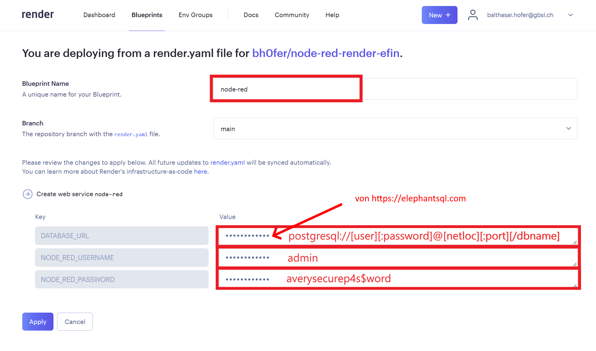

---
sidebar_custom_props:
  id: 17985a5c-152e-4d27-ae98-1da79fa518ef
---

# Installation

## Verwendete Dienste

Datenbank
: PostgreSQL von [ElephantSQL.com](https://www.elephantsql.com/)

Hosting Server
: Plattform as a Service (PaaS) von [Render.com](https://render.com/)

Wir verwenden kostenlose Dienste, um Node-RED zu installieren. Diese Dienste bieten eine gewisse Anzahl von Ressourcen (z.B. Speicherplatz, Datenbanken, ...) kostenlos an. Sobald diese Ressourcen aufgebraucht sind, müssen Sie entweder auf eine kostenpflichtige Version upgraden oder auf einen anderen Anbieter ausweichen. Damit Node-RED durchgehend laufen kann, konfigurieren wir die Datenbank nicht bei render.com (dort wird sie nach 3 Monaten automatisch wieder abgeschalten), sondern bei ElephantSQL.com, wo eine Datenbank kostenlos zur Verfügung steht.

## Datenbank erstellen

1. Erstellen Sie sich einen kostenlosen Account bei [ElephantSQL.com](https://www.elephantsql.com/)
2. Über __:mdi-plus: Create New Instance__ eine neue Datenbank erstellen:

Name
: node-red
Plan
: Tiny Turtle (Free)
Region
: Region:EU-West-1 (Ireland)
Tags
: (optional), bspw. `render`

3. Die Datenbank URL __postgres://...@lucky.db.elephantsql.com...__ kopieren - wir brauchen sie später beim erstellen von Node RED.

  

## Node-RED auf Render.com installieren
1. Erstellen Sie sich einen kostenlosen Account bei [Render.com](https://render.com/)
3. Eine Node-RED Instanz mit einem kostenlosen Server von [Render](https://render.com) erzeugen, indem Sie auf den folgenden Link klicken:

  

  (falls der Link nicht funktioniert: 👉 https://render.com/deploy?repo=https://github.com/lebalz/node-red-render-no-db)

  :::caution Achtung
  Setzen Sie den Benutzernamen auf **admin** und wählen Sie ein sicheres Passwort (Sie brauchen es jedesmal, wenn Sie auf Node-RED zugreifen wollen.)

  
  :::

2. Nachdem Sie auf __Apply__ geklickt haben, dauert es ungefähr 5 Minuten, bis die Seite online gestellt ist. Auf Ihrem __Dashboard__ sehen Sie den aktuellen Fortschritt:
   
   
3. Unter dem Web Service __node-red__ kann die URL, unter welcher Ihr persönlicher Node-RED Dienst verfügbar ist, nachgeschaut werden:
   
   

   Hat alles geklappt, können Sie sich mit den selbst gewählten Login-Daten aus dem *ersten Schritt* einloggen:

   

   **Hinweis**: Nach dem ersten `Deploy succeeded` dauert es beim ersten Zugriff auf die Webseite bis zu 2 Minuten, bis die Webseite angezeigt wird. Den Grund dafür erfahren Sie weiter unten.

## Installation Überprüfen
:::aufgabe Erster Flow erzeugen
<Answer type="state" webKey="5e83c82b-90cc-4cdf-819d-ad9bdffd3b99" />

Erstellen Sie Ihren ersten Flow und Überprüfen Sie, das alles genau so funktioniert wie im Video:

[@video](images/flow-1.mp4)
:::

## Immer Online
Um Rechenzeit und somit auch Kosten zu sparen, werden inaktive Server in einen Ruhezustand versetzt. Ein Server gilt als inaktiv, wenn er länger als 15 Minuten keine Webseite mehr anzeigen musste. Um einen inaktiven Server zu aktivieren, dauert es bis zu 2 Minuten (dies ist der Grund, weshalb Sie im letzten Installationsschritt so lange auf das erste Anzeigen warten mussten). Damit unsere Flows ständig aktiv bleiben, erzeugen wir einen Flow, welcher alle 5 Minuten die Startseite aufruft und somit verhindert, dass Node-RED in den Ruhezustand versetzt wird.

[@video](images/node-red-keep-running.mp4)

:::aufgabe KeepAlive umsetzen
<Answer type="state" webKey="7364675c-08f5-4653-9d9b-c256e7c8240b" />

Erzeugen Sie den `KeepAlive` Flow und markieren Sie diese Aufgabe als erledigt.
:::
