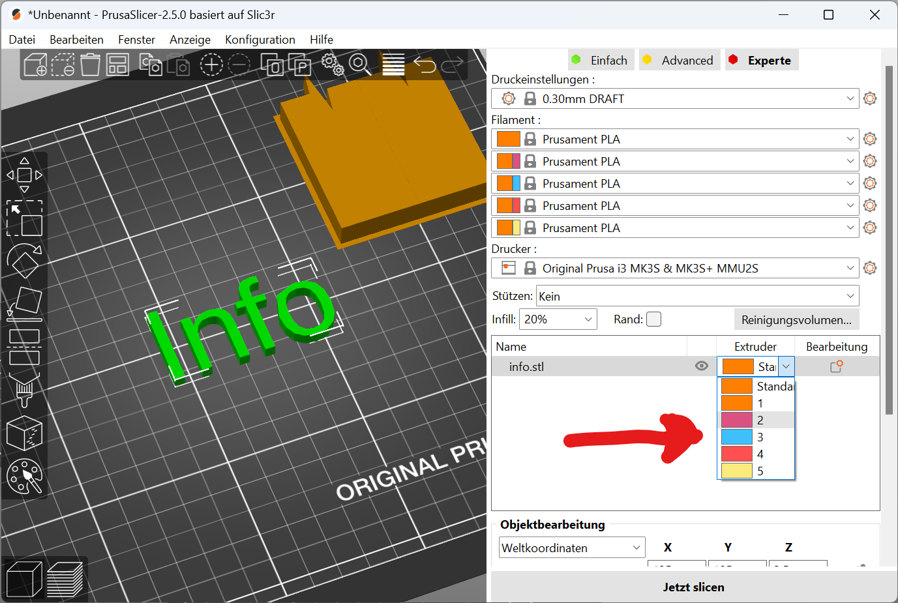

---
sidebar_custom_props:
  id: 877f8d0c-cc46-4cdd-9b49-81969386097a
---

import BrowserWindow from '@site/src/components/BrowserWindow';

# Slicen

Aus dem STL-Modell soll nun ein konkreter **Druck-Ablaufplan** erzeugt werden, welcher Schicht-für-Schicht vorgibt, wo sich der Druck-Kopf durchbewegen soll.

[👉 Prusa Slicer](https://www.prusa3d.com/page/prusaslicer_424/) herunterladen und installieren.

- Die Standard-Einstellungen sind grundsätzlich gut - für die Drucker wählen Sie **folgende Modelle** aus:
  - __Original Prusa i3 MK3S & MK3S+__ (0.4mm nozzle)
  - __Original Prusa i3 MK3S & MK3S+ MMU2S__ (0.4mm nozzle)

Mit dem Slicer kann nun das heruntergeladene STL-File für den Druck vorbereitet werden.

:::aufgabe Grundlagen

Lesen Sie die kurze Einführung zum Prusa Slicer [👉 hier](https://help.prusa3d.com/article/first-print-with-prusaslicer_1753)

:::

## Einstellungen

Druckeinstellungen
: __0.30mm DRAFT__
Filament
: __Prusament PLA__
: __Prusament PETG__
Drucker
: __Original Prusa i3 MK3S & MK3S+__ (0.4mm nozzle)
: __Original Prusa i3 MK3S & MK3S+ MMU2S__ (0.4mm nozzle)
Stützen
: __Keine__
Infill
: __20%__

Je nach Farb-Wunsch (schauen Sie bei den 3 Druckern, was es für Farben gibt - beim __MMU2S__ zudem, welchen Kanal) wählen Sie oben die korrekten Einstellungen. Insbesondere muss beim Mehrfarben-Drucker beim Modell die korrekte Farbe gewählt werden.

Enthält das Modell überhängende Konstruktionen, so müssen für diese Stützen generiert werden (diese können später leicht abgelöst werden). Die Option __Stützen nur auf dem Druckbett__ sollte für die meisten Modelle ausreichen.

:::warn Keine Modelle mit mehreren Farben
Aus Zeitgünden und weil es oft komplikationen gibt, verzichten wir heute auf mehrfarbige Drucke. Entscheiden Sie sich also für eine Farbe und drucke Sie damit das ganze Modell.
:::

## Drucken

Klicken Sie unten links auf __Jetzt Slicen__ und speichern Sie die erzeugte `.gcode`-Datei auf der SD-Karte. Mit dieser Karte gehen Sie zum entsprechenden Drucker und starten den Druck. 