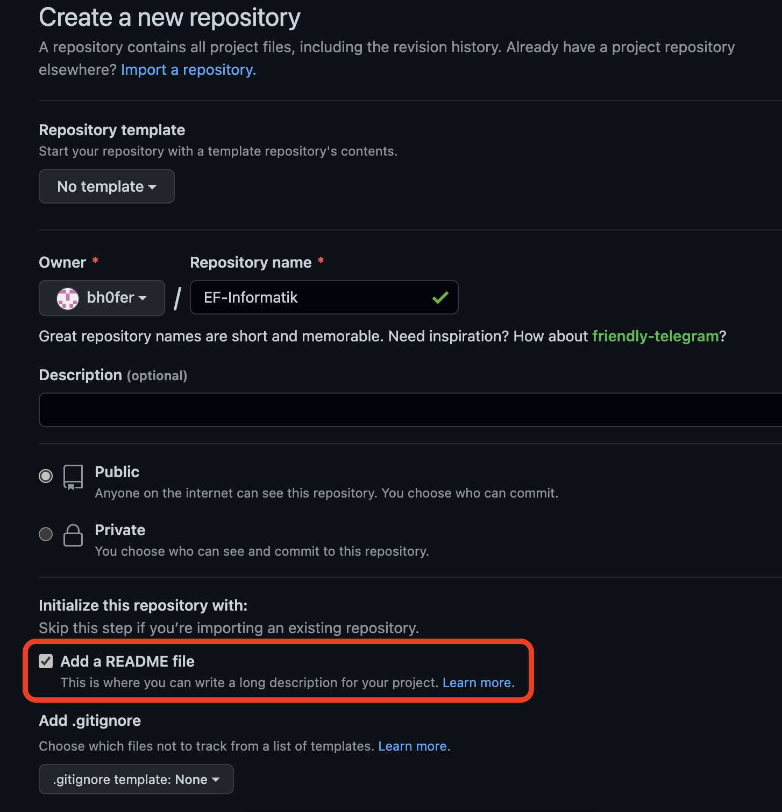

---
sidebar_custom_props:
  id: 4175c6b8-74d4-4a7f-9677-6712b24b705e
---

# GitHub

👉 https://github.com

Um unsere Repositories zu synchronisieren, verwenden wir GitHub. Github ist aktuell der Quasi-Standard für Opensource Software und bietet Entwicklern kostenlos die Möglichkeit Repositories zu erstellen. Zudem können wir später unser Repository auch als Webseite - ähnlich dieser Lernwebseite hier - erzeugen lassen. Dazu aber sp$ter mehr.

:::aufgabe[Github Konto erstellen]
Erstellen Sie auf https://github.com ein Konto. Sie dürfen einen beliebigen Namen auswählen - Ihre Projekte sind dann unter diesem Namen zu finden.

Halten Sie Ihren Github-Namen hier fest, damit ich ([@bh0fer](https://github.com/bh0fer)) darauf zugreifen kann.

<Answer type="text" webKey="8d7a1e33-7f71-42e9-b42c-69aebe130113" />
:::

:::aufgabe[Github Repository erstellen]
<Answer type="state" webKey="a4503b33-2b39-4cb5-a8ee-a07f2a8c4b1c" />

Erstellen Sie auf Github ein neues Repository (z.B. mit dem Namen `EF-Informatik`).
- :mdi-flash-triangle--orange: achten Sie darauf, dass der Namen keine Leerschläge enthält\*
- Wählen Sie die Option **Add a README file** aus.



\* Da wir das Repository später als Webseite veröffentlichen, wird die Url das Format `https://username.github.io/EF-Informatik` haben. Da bei URL's Leerschläge zu `%20` umgewandelt werden, wäre die Adresse für den Repo-Namen `EF Informatik` dann `https://username.github.io/EF%20Informatik`, was mühsam zu tippen ist.
:::


:::aufgabe[Github Repository klonen]
<Answer type="state" webKey="bb6f5877-16b8-43d0-9b1b-81f970c4f87f"/>

Klonen Sie das Repository auf Ihren Laptop.
1. Erstellen Sie auf Ihrem Laptop zuerst einen neuen Ordner (bspw. unter `Dokumente/git_code`), in welchem Sie alle git Repositories abspeichern.
  
  :::danger[git repositories nicht auf OneDrive/Dropbox]
  Git-Repositories haben ein grundlegend anderen Ansatz zur Synchronisierung von Daten. Wird ein git-Repo über bspw. Dropbox synchronisiert, werden laufend die Änderungen (von einem anderen Computer) synchronisiert, auch wenn die Änderungen per Git noch gar nicht veröffentlicht wurden. Die Folge sind viele Änderungen (und Probleme)...
  :::
2. Klonen Sie das Repository (wie unten im (stummen) Video gezeigt:
   1. Klonen
   2. README.md bearbeiten: Fügen Sie einen Code-Block hinzu, schreiben Sie eine Commit-Nachricht und pushen Sie die Änderungen.
   ````md
   ```py
   print('Hello World')
   ```
   ````
   3. Kontrollieren Sie, ob die Änderungen online sichtbar sind.
3. Markieren Sie die Aufgabe als erledigt.

[@video](./images/gh-clone-hd.mp4)
:::

::::aufgabe[Repository Struktur]

Unser Repository `EF-Informatik` sollte in etwa die folgende Struktur haben:

```txt
git_code/
    ├── ...
    └── EF-Informaik/
        ├── docs/
        │     ├── git.md
        │     └── programmieren.md
        ├── exercises/
        │     └── 01-hello-world.py
        ├── NumTrip
        │     └── main.py
        └── README.md
```

- Alle Dokumente mit Notizen etc. werden in den Ordner `docs` als `*.md` abgelegt.
- Übungen können Sie im Ordner `exercises` ablegen
- für das Spiel `NumTrip` werden wir die Programme im Ordner `NumTrip` abspeichern.

:::info[Leere Ordner]
Leere Ordner werden von Git ignoriert, weshalb leere Ordner nicht als Änderung angezeigt werden.
:::
::::
