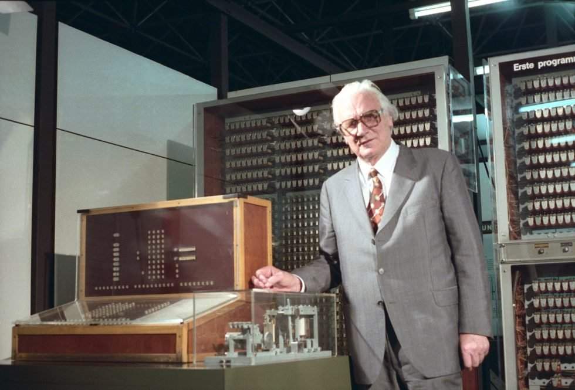
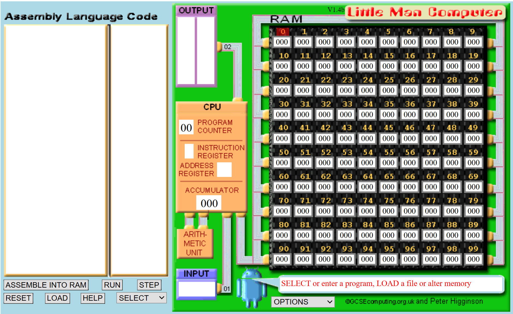
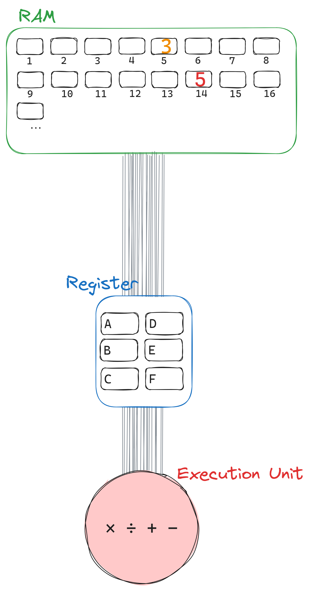

---
sidebar_custom_props:
  id: 04281962-a654-4b89-8ac8-b998f1518a16
  source:
    name: hir
tags:
    - Assembler
    - LMC
---

import StripComments from '@site/src/components/StripComments'

# Maschinennahe Programmierung

Offensichtlich ist die Turingmaschine nicht für eine konkrete Realisierung geeignet. In den Dreissigerjahren des 20. Jahrhunderts begannen aber sowohl in Deutschland wie auch in den USA verschiedene Forscher mit dem Bau eines funktionierenden Computers.

:::cards


Highlight: **4 Dezimalstellen genaue Ergebnisse**, Programme: In Form eines **Lochstreifens**
::br

Highlight: **5000 Additionen pro Sekunde**, Programme: In Form von **Steckbrettern**

:::

Prinzipiell enthalten alle diese (und auch die heutigen) Computer die gleichen Bestandteile:
Speicher
: Eine Reihe von "Speicherzellen", die nummeriert sind und sowohl die Instruktionen als auch Daten enthalten können. Der Inhalt dieser Speicherzellen musste mit Kabeln gesetzt werden!
IO
:   Eine Ein- und Ausgabeeinheit (Input/Output)
Recheneinheit
: Die Recheneinheit erlaubt, mit Hilfe von Registern einfache Berechnungen auszuführen. Das erste Register wird in der Regel "Akkumulator" genannt.
Steuereinheit
: Die Steuereinheit arbeitet im wesentlichen mit einem Speicher, in dem die Nummer der aktuellen Speicherzelle (Programmzähler, "Program counter") steht.
Taktgeber
: Ein Taktgeber, der die Ausführung steuert.

Um einen Schritt in einem Programm auszuführen muss der Computer mehrere Schritte nacheinander durchführen:

Fetch
: 1. Hole den Inhalt der Speicherzelle, deren Nummer im Programmzähler steht
: 2. Erhöhe den Programmzähler um 1 (damit er auf der nächsten Instruktion steht, wenn die Aktion fertig ist)
Decode
: 3. Decodiere die Instruktion: Was ist mit welchen Daten zu tun?
Execute
: 4. Führe die Instruktion aus
: 5. Speichere das Resultat der Instruktion an geeigneter Stelle
: 6. Wiederhole oder fertig

## Der Little Man Computer



Damit wir diese Aspekte genauer anschauen können, simulieren wir einen einfachen Rechner. Der "Little Man Computer" LMC eignet sich dazu sehr gut. Es gibt mehrere Online-Versionen des LMC's, die alle ähnlich funktionieren.

- [👉 LMC Simulator by Peter Higginson (enthält Animationen)](https://www.peterhigginson.co.uk/lmc/)
- [👉 LMS Simulator by 101 Computing (ohne Animation, etwas moderner)](https://www.101computing.net/LMC/)
 

Die Benutzeroberfläche enthält jeweils drei Teile:

Editor
: Im LMC Editor werden die Befehle in Form von *Mnemonics* eingegeben
Assembler
: Der Assembler übersetzt diese *Mnemonics* in die Zahlen (Opcodes und Operanden) schreibt diese in die Speicherzellen
Simulator
: Der Simulator führt die Instruktionen dann aus.

### Instruction Set

Der LMC kennt **11** verschiedene Instruktionen und hat einen Speicher von 100 Zellen, welche von 00 bis 99 nummeriert werden. Mit diesen Instruktionen lassen sich alle Aktionen des Fetch-Decode-Execute Zyklus ausführen. 

<div className="small-table">

| Instruktion                        | Mnemonic | Opcode | Erklärung                                                          |
|:-----------------------------------|:---------|:-------|:-------------------------------------------------------------------|
| HALT                               | `HLT`    | `000`  | Programm beenden                                                   |
| Addieren                           | `ADD`    | `1xx`  | Addiere den Inhalt von Speicherzelle xx zum Akkumulator            |
| Subtrahieren                       | `SUB`    | `2xx`  | Subtrahiere den Inhalt von Speicherzelle xx vom Akkumulator        |
| Speichern                          | `STA`    | `3xx`  | Speichere den Inhalt des Akkumulators in Speicherzelle xx          |
| Lade                               | `LDA`    | `5xx`  | Lade den Inhalt von Speicherzelle xx in den Akkumulator            |
| Gehe zu (Branch Always)            | `BRA`    | `6xx`  | Setze den Programmzähler auf xx (also spring als nächstes dorthin) |
| Gehe wenn 0 (Branch if Zero)       | `BRZ`    | `7xx`  | Wenn der Akkumulator 0 enthält spring als nächstes nach xx         |
| Gehe wenn >=0 (Branch if Positive) | `BRP`    | `8xx`  | Wenn der Akkumulator positiv ist spring als nächstes nach xx       |
| Eingabe                            | `INP`    | `901`  | Hol vom Operateur einen Eingabe und schreib sie in den Akkumulator |
| Ausgabe                            | `OUT`    | `902`  | Gib den Inhalt des Akkumulators aus                                |

</div>

Editor und Assembler kennen *symbolische Links*; Speichezellen können Namen haben und mit diesem angesprochen werden. Kommentare werden mit einem `#` gekennzeichnet.

Ein erstes Programm soll das veranschaulichen. Es fragt nach einer Eingabe, zählt dann 5 dazu und gibt das Resultat aus.

```armasm
;
; Programm Ein- und Ausgabe
;
      INP            ; Eingabe holen und in akk speichern
      ADD    five     ; fünf dazu
      OUT            ; ausgeben
      HLT            ; fertig

five  DAT   5        ; 5 zum Addieren
```

Im Speicher stehen jetzt folgende Zahlen:

```armasm
00    901    (INP; Eingabe holen und in Akk laden)
01    104    (ADD 04; addiere den Inhalt von Speicherzelle 04 zum Akk)
02    902    (OUT; gib Akk aus)
03    000    (HLT; Programm beenden)
04    005    (Zahl 5; Datenzelle)
```

Mit "Run" kann das Programm nun ausgeführt werden.

:::danger[Kommentare]
Leider können die Online-Simulatoren keine Kommentare verarbeiten. Sie müssen die Kommentare vor dem Ausführen entfernen 😓

<StripComments />
:::

::::aufgabe[Aufgabe IO]
<Answer type="state" webKey="22a87570-777f-4899-8567-438821bf09d1" />

Simulator
: 👉 https://www.peterhigginson.co.uk/lmc/

Geben sie das obige Programm im Editor ein, speichern Sie es und lassen Sie es dann vom Assembler übersetzen. Mit "Load" können Sie es dann in den Simulator holen und dort ausführen.
::::

:::aufgabe[Aufgabe I]
<Answer type="state" webKey="e0bfd52e-38dd-41d1-becf-098110d44393" />

1. Schreiben Sie ein Programm, das **zwei** Zahlen eingeben lässt und dann zusammenzählt
2. Schreiben Sie ein Programm, das **drei** Zahlen eingeben lässt und dann zusammenzählt

```armasm live_py id=01b62022-20b0-4b08-a871-d82881d02e0f title=Aufgabe1

```


```armasm live_py id=1318b3db-c844-4744-8282-73bd9fef0c7f title=Aufgabe2 

```
:::

### Verzweigungen
Etwas komplizierter wird es mit Verzweigungen: Ein Programm, das eine Zahl holt und dann bis 0 herunterzählt:


Betrachten Sie dieses Programm genau, führen Sie es aus und wenn Sie es verstanden haben, versuchen Sie die weiteren Übungen zu lösen.

```armasm
        INP
        OUT         ; Zahl selber mal ausgeben
anfang  SUB one
        BRP ausgabe ; springe nach ausgabe wenn akk grösser/gleich 0
        HLT         ; fertig
ausgabe OUT
        BRA anfang  ; springe nach anfang
one     DAT 1       ; Zahl 1
```

:::aufgabe[Aufgabe II]
1.    Schreiben Sie ein Programm, das eine Zahl holt und dann bis 1 herunterzählt  
    ```asm live_py id=ad7b14c8-ba30-46ec-8f02-ff81d0f7e8cc title=toOne.asm
    ```

<Solution webKey="9c944c95-4576-4761-aeca-23eea71bb3f4">

```armasm
;
; Program toOne.asm
;
; This is a program that
;    inputs a number n
;    counts down to 1
;    and outputs the numbers
;
; This version uses symbolic labels.
;
; Variable  Purpose
; --------+------------------
; i         Wert, um den heruntergezaehlt wird
;
    INP
    OUT          ; output the entered number

loop SUB    i
     BRZ    end   ; branch to end if n = 0
     BR    body   ; branch to loop body if n > 0

body OUT
     BR    loop  ; go back to the top of the loop

end HLT         ; then terminate the program

i   DAT    1    ; i initialized to 1
```

</Solution>

2.    Schreiben Sie ein Programm, das eine Zahl holt und dann bis 10 hochzählt  
    ```asm live_py id=723e3e85-97ed-49a5-9738-68d38fe3b1a0 title=toTen.asm
    ```

<Solution webKey="9c944c95-4576-4761-aeca-23eea71bb3f4">

```armasm
;
; Program toTen.asm
;
; This is a program that
;    inputs a number
;    counts up to max
;    outputs the number
;
; This version uses symbolic labels.
;
; Variable  Purpose
; --------+------------------
; i         Number, that is added
; n         Zahl
; max       maximum

     INP
     OUT           ; output akk
     STA    n      ; store akk to n

loop ADD    i      ; increase akk
     STA    n      ; store akk to n
     SUB    max    ; subtract max from akk for BRZ test
     BRZ    end    ; branch to end if n = 0
     BRA    body    ; branch to loop body if n > 0

body LDA   n       ; load number back to akk
     OUT           ; print akk
     BRA   loop    ; go back to the top of the loop

end  LDA    n       ; load number back to akk
     OUT            ; print akk
     HLT            ; then terminate the program

i    DAT    1     ; i initialized to 1
max  DAT     5    ; max initialized to 5
n    DAT    0     ; n initialized to 0
```

</Solution>

3.    Zahlenraten. Der Computer merkt sich eine Zahl und die Benutzer\:in muss sie erraten. Der Computer sagt "zu hoch" = 100, "zu tief" = -100; "richtig" = 200
    ```asm live_py id=f71c6420-c9b6-4133-b77d-8a2aa42340fa title=guess.asm
    ```
4.    Ergänzen Sie (3) um einen Zähler für die Anzahl Versuche.

<Solution webKey="9c944c95-4576-4761-aeca-23eea71bb3f4">

```armasm

; Program Zahlenraten
;
; This is a program that
;    inputs a number
;    checks wheter the input equals the stored number
;    outputs if too high or too low
;
; Variable  Purpose
; --------+------------------
; n         Zahl
; rate      Zu erratende Zahl
; anzahl    Anzahl Versuche
; one        Zahl 1
; -100      zutief
;  100      zuhoch
;  200      fertig


begin INP
      STA    n         ; akk in n speichern
      LDA    anzahl    ; anzahl nach akk
      ADD    one       ; eins dazu
      STA    anzahl    ; anzahl speichern
      LDA    n         ; n in akk laden
    
loop  SUB    rate      ; rate von akk abziehen fuer test
      BRZ    end       ; branch to end if n = 0
      BRP    hoch      ; branch to hoch if akk - rate bigger than 0
      LDA    zutief    ; meldung zutief
      OUT

rethoch BRA    begin   ; branch to begin

hoch  LDA    zuhoch    ; Meldung zuhoch laden
      OUT              ; und ausgeben
      BRA    rethoch    

end   LDA    anzahl    ; anzahl in akk laden
      OUT              ; ausgeben
      LDA    fertig    ; fertig in akk laden
      OUT              ; ausgeben
      HLT              ; terminate the program

rate    DAT      5   ; max initialized to 5
n       DAT      0   ; n initialized to 0
anzahl  DAT      0   ; Anzahl Versuche
zuhoch  DAT    100   ; Meldung "zu hoch"
zutief  DAT   -100   ; Meldung "zu tief"
fertig  DAT    200   ; Meldung "fertig"
one     DAT      1   ; Zahl 1
```

</Solution>

:::
:::aufgabe[Zusatz ⭐]
Weitere Ideen:
- Fibonacci-Zahlen 0,1,1,2,3,5,8...
- Pascalsches Dreieck

```asm live_py id=566e25f7-65df-4715-9ca2-bc5bc2687055 title=zusatz.asm
```
:::


### RISC vs CISC
In heutigen Computern wird grundsätzliche zwischen **RISC** und **CISC** Prozessoren unterschieden. **RISC** Prozessoren (für *Reduced Instruction Set Computer*) haben ein eher einfaches Instruktionenset das nur wenige Instruktionen kennt (*RISC I* hat nur 32 Instruktionen). Dies führt dazu, dass für eine Simple Aufgabe mehrere Instruktionen notwendig sind. **CISC** (für *Complex Instruction Set Computer*) Prozessoren haben im Gegensatz dazu ein sehr umfangreiches Instruktionenset, das viele spezialisierte Instruktionen kennt, so dass Programme mit weniger Instruktionen möglich sind.

#### Zwei Zahlen multiplizieren [^1]

```py live_py slim
a = 5
b = 3
# wir betrachten folgende Operation
a = a * b # => in a steht jetzt 15
```

Für diese Betrachtung nehmen wir folgende (vereinfachte) Architektur an:



Die Register stellen Speicherzellen im Prozessor dar, auf welche die Instruktionen direkt zugreifen können. Im LMC gibt es nur ein einziges Register, den Akkumulator. In modernen Prozessoren gibt es mehrere Register, die für verschiedene Zwecke verwendet werden können.

:::cards
### RISC

Es gibt direkt einen Befehl, welcher die Multiplikation zweier Zahlen aus dem RAM durchführt und das Resultat zurück in den RAM schreibt:

```armasm
MULT 5, 14 
```
Nach der Ausführung dieser Instruktion steht das Resultat in Speicherzelle 5.

::br
### CISC
Hier gibt es nur primitive Instruktionen - Zahlen aus dem RAM in ein Register laden, Zahlen von einem Register in den RAM schreiben, Zahlen in einem Register multiplizieren, etc. Dies führt zu 4 Zeilen Code:

```armasm
LOAD A, 5
LOAD B, 14
MUL A, A, B  ; multipliziere A und B 
             ; und speichere das Resultat in A
STORE A, 5
```
:::

:::aufgabe[RISC oder CISC?]
<Answer type="state" webKey="05e197e3-fa09-4905-b2eb-ce058b9b4ac1" />

Halten Sie fest, was die Vor- und Nachteile von RISC und CISC Prozessoren sind. Welche technologie wird heute in modernen Prozessoren verwendet?

<Answer type="text" webKey="26b64a4f-9ee4-4b60-9b75-a94815a915c0" />
:::

[^1]: Inspiriert von [diesem Artikel](https://cs.stanford.edu/people/eroberts/courses/soco/projects/risc/risccisc/) 


