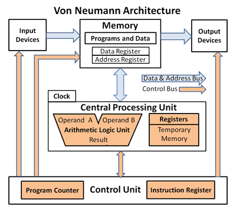
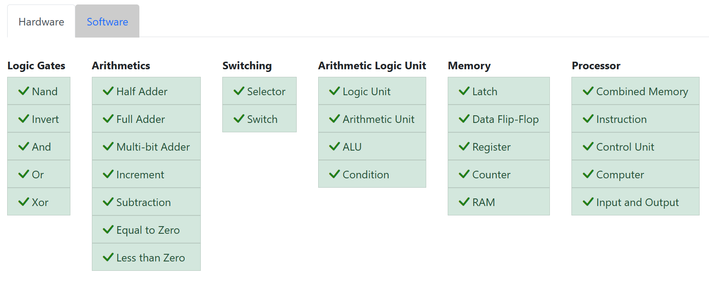

---
sidebar_custom_props:
  id: 1edcdb07-64ef-4767-ab0a-9605a9b0e603
---
# Rechnen mit Strom

:::info[Buchempfehlung: *Code* by Charles Petzold]
Ein wirklich cooles Buch: [👉 *Code: The hidden language of computer hardware and software* von C. Petzold](https://www.exlibris.ch/de/buecher-buch/english-books/charles-petzold/code-the-hidden-language-of-computer-hardware-and-software/id/9780137909100/)
:::

Nand-Game
: [👉 nandgame.com](https://www.nandgame.com/)

Ziel: mit logischen Bausteinen einen Mikroprozessor bauen. Als Übersicht: Mit der Von-Neumann Architektur hat man den klassischen "Fetch-Decode-Execute"-Zyklus, der programmierbares Rechnen ermöglicht.

Im Nand-Game wird all dies mit einem einzelnen Gatter, dem Nand-Gatter, gebaut.

:::
:::aufgabe[1 Logic Gates]

<Answer type="state" webKey="5f797f76-9d55-4ee1-b154-32032c27d467" />

### 1.0 Nand

<Solution>

</Solution>

### 1.1 Invert

<Answer type="text" webKey="9c310ca9-632a-4b10-853b-29f4d83a59ab" />

<Solution webKey="51e2c376-13c8-4dd2-9782-d039fa21f4c8">

</Solution>

### 1.2 And

<Answer type="text" webKey="99d70299-a06f-4c2a-b709-017e8999e643" />

<Solution webKey="51e2c376-13c8-4dd2-9782-d039fa21f4c8">

</Solution>

### 1.3 Or

<Answer type="text" webKey="6bc5b548-2d7f-40eb-9888-18dc2ce0dcbb" />

<Solution webKey="51e2c376-13c8-4dd2-9782-d039fa21f4c8">

</Solution>

### 1.4 Xor

<Answer type="text" webKey="9d0863c3-35f9-48ed-9179-f06ee744b617" />

<Solution webKey="51e2c376-13c8-4dd2-9782-d039fa21f4c8">

</Solution>

:::
:::aufgabe[2 Arithmetics]

<Answer type="state" webKey="287a6164-b9b1-43b5-b4b4-a8f086c1e084" />

### 2.1 Half Adder
<Answer type="text" webKey="efc3b10c-2439-4a59-8fa6-3a32604fa99c" />

<Solution webKey="a1e97b4b-9179-42ff-9228-425c574f21b2">

</Solution>

### 2.2 Full Adder
<Answer type="text" webKey="5684a487-a237-4060-986d-c9beaf042de8" />

<Solution webKey="a1e97b4b-9179-42ff-9228-425c574f21b2">

</Solution>

### 2.3 Multi-bit Adder
<Answer type="text" webKey="f01c76f3-ea72-492b-b537-65f3c39e53c8" />

<Solution webKey="a1e97b4b-9179-42ff-9228-425c574f21b2">

</Solution>

### 2.4 Increment
<Answer type="text" webKey="994712f1-5a01-4307-919b-83c280805473" />

<Solution webKey="a1e97b4b-9179-42ff-9228-425c574f21b2">

</Solution>

### 2.5 Subtraction
<Answer type="text" webKey="afd02191-f7e1-4d79-a924-f0f2c4ae259e" />

<Solution webKey="a1e97b4b-9179-42ff-9228-425c574f21b2">

</Solution>

### 2.6 Equal to Zero
<Answer type="text" webKey="6ce3fda3-4971-4cba-bd26-4db78788e5c3" />

<Solution webKey="a1e97b4b-9179-42ff-9228-425c574f21b2">

</Solution>

### 2.7 Less than Zero
<Answer type="text" webKey="419c3252-1bca-418b-96ef-afa7ec9edace" />

<Solution webKey="a1e97b4b-9179-42ff-9228-425c574f21b2">

</Solution>

:::
:::aufgabe[3 Switching]

<Answer type="state" webKey="e0804e9c-eaa4-4d13-b3d7-5c1910c07c41" />

### 3.1 Selector
<Answer type="text" webKey="a2526743-5574-41f5-86d5-28cf650bf16a" />

<Solution webKey="1b44948f-f02c-46cf-a9db-2b8d512710db">

</Solution>

### 3.2 Switch
<Answer type="text" webKey="d8605790-a356-4298-95ed-20cde3e52c97" />

<Solution webKey="1b44948f-f02c-46cf-a9db-2b8d512710db">

</Solution>

:::
:::aufgabe[4 Arithmetic Logic Unit]

<Answer type="state" webKey="e307d5de-d086-4ad4-828a-99bcf5f444b7" />

### 4.1 Logic Unit
<Answer type="text" webKey="349b6808-6773-4de8-af02-f5a3bb593f4c" />

<Solution webKey="a38d5d82-fc57-47ec-ad6b-7f302e943674">

</Solution>

### 4.2 Arithmetic Unit
<Answer type="text" webKey="9de48ed6-77f5-4b5a-92cb-58e108649cc1" />

<Solution webKey="a38d5d82-fc57-47ec-ad6b-7f302e943674">

</Solution>

### 4.3 ALU
<Answer type="text" webKey="c0d1a742-ffee-44f0-b0a3-e617d1032bce" />

<Solution webKey="a38d5d82-fc57-47ec-ad6b-7f302e943674">

</Solution>

### 4.4 Condition
<Answer type="text" webKey="905ec9a2-64fc-40b8-92d3-885f3fca7790" />

<Solution webKey="a38d5d82-fc57-47ec-ad6b-7f302e943674">

</Solution> 

:::
:::aufgabe[5 Memory]

<Answer type="state" webKey="6fc07f03-5a80-4870-a182-45d2d0927185" />

### 5.1 Latch
<Answer type="text" webKey="5f4ddffa-87c0-4c1d-a96a-cbef6049f237" />

<Solution webKey="ea6cefba-dc06-4620-8fb5-e3538ebcf21b">

</Solution>

### 5.2 Data Flip-Flop
<Answer type="text" webKey="5262b9f9-a1a2-4016-8df5-a0f2b20b35c9" />

<Solution webKey="ea6cefba-dc06-4620-8fb5-e3538ebcf21b">

</Solution>

### 5.3 Register
<Answer type="text" webKey="6f14a0ff-b5cb-4d11-8904-411afd2c8f34" />

<Solution webKey="ea6cefba-dc06-4620-8fb5-e3538ebcf21b">

An optimal register implementation can be found here: [#2](https://github.com/timlg07/TheNandGame-solutions/issues/2)

</Solution>

### 5.4 Counter
<Answer type="text" webKey="09943db1-f440-4b61-b0de-aae57cdc993f" />

<Solution webKey="ea6cefba-dc06-4620-8fb5-e3538ebcf21b">

</Solution>

### 5.5 RAM
<Answer type="text" webKey="452084f3-2b63-44d7-852d-5b9ac4ad9112" />

<Solution webKey="ea6cefba-dc06-4620-8fb5-e3538ebcf21b">

</Solution>

:::
:::aufgabe[6 Processor]

<Answer type="state" webKey="d0327130-badc-4b8f-a098-453b83b381e9" />

### 6.1 Combined Memory
<Answer type="text" webKey="d56be1e4-8266-440a-95ea-a39d3b4093ef" />

<Solution webKey="88e62276-4a68-44b0-a50c-04106b18af14">

</Solution>

### 6.2 Instruction
<Answer type="text" webKey="c9811640-9992-431d-8873-5091d2f40bcf" />

<Solution webKey="88e62276-4a68-44b0-a50c-04106b18af14">

</Solution>

### 6.3 Control Unit
<Answer type="text" webKey="f005c0e8-7051-4a98-a263-6984761c1134" />

<Solution webKey="88e62276-4a68-44b0-a50c-04106b18af14">

</Solution>

### 6.4 Program Engine
<Answer type="text" webKey="8654c8f6-6f0b-4198-b64e-eea27458e3d7" />

<Solution webKey="88e62276-4a68-44b0-a50c-04106b18af14">

</Solution>

### 6.5 Computer
<Answer type="text" webKey="8b2e7d24-155c-454e-b0dc-ac99d6010492" />

<Solution webKey="88e62276-4a68-44b0-a50c-04106b18af14">

</Solution>

### 6.6 Input and Output
<Answer type="text" webKey="ad6acdd3-6f71-4f64-815e-a783f505cd49" />

<Solution webKey="88e62276-4a68-44b0-a50c-04106b18af14">

</Solution>

:::
:::aufgabe[7 Completed]

<Answer type="state" webKey="3d896f93-c995-4a49-bb1d-6f3cc70da163" />
<Answer type="text" webKey="0fce7287-4616-4641-bb2e-bb63259184a4" />

<Solution webKey="88e62276-4a68-44b0-a50c-04106b18af14">

</Solution>

:::
