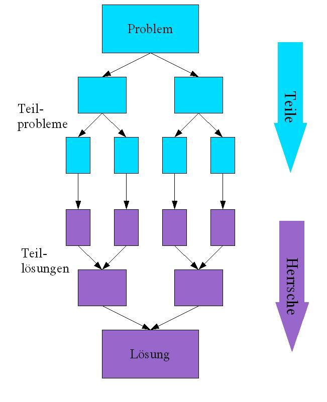

---
sidebar_custom_props:
  id: 45bceb63-ab37-459a-a818-48bee67b2c3c
  source:
    name: sdg
    ref: https://gitlab.gbsl.website/gymbefin23/material/-/wikis/Techniken-im-Software-Engineering
---

# Techniken im Software Engineering
Es gibt einige Techniken bei der Entwicklung von Software, welche sich immer wieder bewährt haben. Ein paar davon sollen hier vorgestellt werden.

## Teile und herrsche - Reduktion der Komplexität

*Teile und herrsche* ist eine Technik, welche wahrscheinlich schon im römischen Reich praktiziert wurde. Auch Niccolò Machiavelli hat sie 1532 beschrieben. Es geht dabei um folgendes: Um eine Gruppe von Menschen zu beherrschen, ist es hilfreich diese zuvor zu entzweien, damit anschliessend jede Teilgruppe leichter beherrscht werden kann.

In der Softwareentwicklung wollen wir nicht Menschen beherrschen, sondern Probleme lösen. Wenn nun ein Problem zu gross, oder zu komplex ist, dass man es direkt lösen kann, so sucht man nach einer Aufteilung in Teilprobleme, welche leichter zu lösen sind. Anschliessend löst man die Teilprobleme und fügt schliesslich die Teillösungen zu einer Gesamtlösung zusammen. Dies kann man über mehrere Stufen hinweg machen, bis die Teilprobleme genügend klein sind.

*Teile und herrsche* ist ein so fundamentales Prinzip, dass man es überall in der Informatik antrifft.

Im Bereich der Algorithmen bedeutet *Teile und herrsche* in der Regel, dass man den Umfang des grossen Problems reduziert, die Problemstellung aber die selbe bleibt.
Beispiel: Sortieren einer grossen Menge von Daten. Die Menge wird in Teilmengen aufgeteilt, welche je für sich sortiert werden. Das Problem "sortieren" bleibt das selbe, aber der Umfang hat abgenommen.

Im Bereich des Softwareengineerings sind die Teilprobleme in der Regel unterschiedlicher Art. In der prozeduralen Programmierung sucht man nach einer Aufteilung des Programms (grosses Problem) in viele kleinere Funktionen (kleine Probleme). Eine solche Aufteilung wird auch als **funktionale Dekomposition** bezeichnet. Mehr dazu im Abschnitt [Top-down und Bottom-up](#top-down-und-bottom-up)

## Top-down und Bottom-up
Hier geht es nun konkret um die Frage, wie man ein Programm (grosses Problem) in einzelne Funktionen (kleinere Probleme) aufteilt, also das Prinzip des *Teile und herrsche* anwendet. Wie die Überschrift schon sagt, kann man dabei auf zwei Weisen vorgehen:

- Man beginnt zuoberst (top) mit dem grossen Problem (das gewünschte Programm) und teilt diese in kleinere Teilprobleme auf. Jedes Teilproblem wird für sich betrachtet und allenfalls in noch kleinere Teilprobleme aufgeteilt, bis diese so klein sind, dass man zu ihrer Lösung eine einfache Funktion programmieren kann. Auf diese Weise entsteht zunächst ein **Entwurf** (englisch *Design*) für unser Programm. Jetzt kann man wieder zu den grösseren Problemen zurückkehren und diese lösen, indem man eine Funktion schreibt, welche die Funktionen zu den kleineren Problemen nutzt.

- Man beginnt zuunterst (bottom) und schreibt direkt Funktionen zur Lösung von einfachen Teilproblemen. Diese werden nach und nach in übergeordneten Funktionen integriert, bis eine Lösung für das grosse Problem entstanden ist. Die Gefahr bei diesem Ansatz ist allerdings, dass man eine ungünstige Aufteilung in Teilprobleme erhält.

Meist wählt man eine Kombination von beiden Ansätzen. Am Anfang schaut man sich bestimmte Teilprobleme bottom-up an und gewinnt dabei erste Erfahrungen und Kenntnisse über einzelne Aspekte des grossen Problems. Dann geht man zu top-down über und entwirft eine möglichst optimale Aufteilung des grossen Problems.

Manchmal merkt man aber auch erst beim Programmieren einer Funktion, dass diese nochmals in Teilfunktionen aufgeteilt werden sollte, z.B. wenn gewisse Programmteile mehrfach vorkommen, oder eine Funktion zu kompliziert wird.