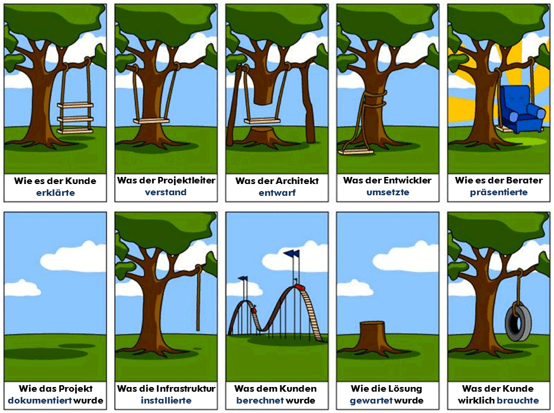
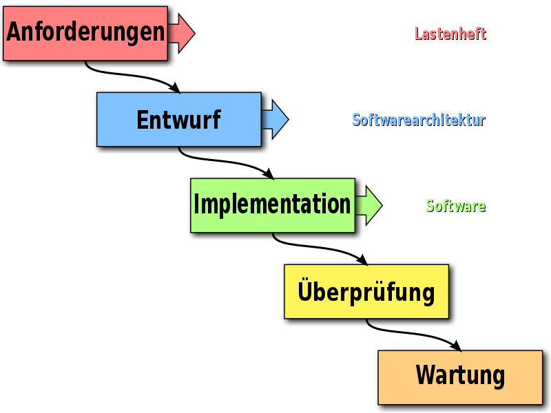
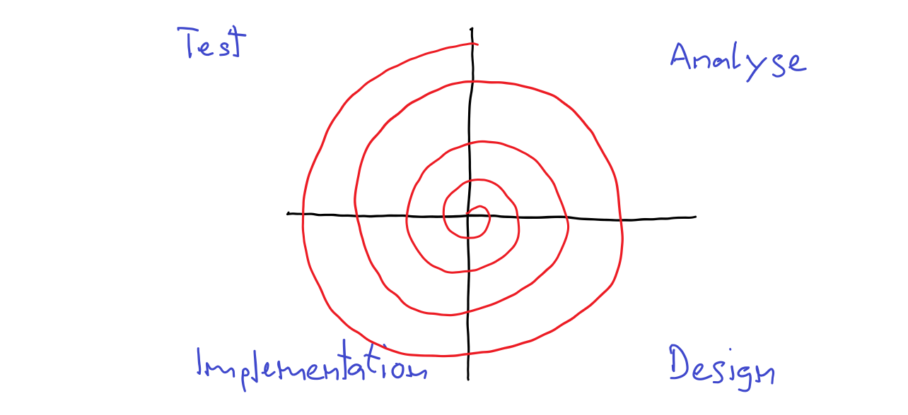

---
sidebar_custom_props:
  id: 8d2d1a03-6215-4682-bb1f-03795828d23d
  source:
    name: sdg
    ref: https://gitlab.gbsl.website/gymbefin23/material/-/wikis/Software-Engineering
---
# Software Engineering

## Einführung
Die Entwicklung von grossen Programmen ist sehr anspruchsvoll. Immer wieder scheitern grosse Software-Projekte, wobei Investitionen in Millionenhöhe verloren gehen. Schon früh wurden deshalb Methoden und Techniken entwickelt, um den Entwicklungsprozess zu steuern und möglichst erfolgreich zu machen. 

Diese Methoden orientierten sich anfänglich an Vorgehensweisen, wie man sie aus anderen Ingenieur-Disziplinen, wie der Elektrotechnik, dem Bauwesen, etc. kannte. Allerdings stellte man schnell fest, dass Software-Projekte viel dynamischer verlaufen. Man kann nicht, wie beim Bau einer Maschine, einen Plan zeichnen, dann alles genau so ausführen und am Schluss hat man eine funktionierende Maschine.

Oft weiss der Kunde am Anfang selber nicht genau, was er eigentlich braucht. Praktisch immer veränderen sich die Wünsche während der Laufzeit eines Projektes und es kommen neue Wünsche hinzu. Diesem Umstand muss im Software-Engineering Rechnung getragen werden.

## Software-Engineering-Disziplinen
Wie beim Sport, so gibt es auch im Software-Engineering verschiedene Disziplinen. In einem Software-Projekt müssen alle diese Disziplinen im notwendigen Mass vetreten sein. In den folgenden Abschnitten werden die vier wichtigsten Diszplinen erklärt.

### Analyse
Hier geht es darum zu verstehen, was der Kunde eigentlich gerne hätte. Oft ist das in Form von Anforderungen formuliert. Solche Anforderungen sind irgendwelche textuellen Beschreibungen, die aber teilweise unvollständig, oder gar widersprüchlich sind.

> In der Analyse geht es darum die Anforderungen zu anlaysieren, diese zu präzisieren, fehlende Teile zu ergänzen und Widersprüche zu beheben. 

### Entwurf
Während es in der Analyse darum geht zu verstehen, was eigentlich das Problem ist, geht es im Entwurf darum, eine möglich Lösung für das Problem zu entwerfen.

Hier geht es darum zu entscheiden, aus welchen Teilen die spätere Software bestehen wird, wie die zu verarbeitenden Informationen codiert werden sollen und welche Datenstrukturen für die Speicherung nötig sind.

> Im Entwurf geht es darum eine Lösung für das Problem zu skizzieren. Dabei entsteht oft ein **Modell**, welches die einzelnen Bestandteile der künftigen Software zeigt. Zur Darstellung von diesem Modell werden Diagramme verwendet (eine Art Baupläne für Software).

### Implementation
Die Implementation befasst sich mit der Umsetzung der im Entwurf skizierten Lösung in Programmcode.

> In der Implementation wird das entworfene Modell in Anweisungen in der gewählten Programmiersprache übersetzt.

### Test
Jede Software enthält Fehler. Im Test geht es darum möglichst viele davon zu finden und zu eliminieren. Dazu muss man sich überlegen, welche Situationen beim normalen Einsatz der Software vorkommen. Genau so wichtig ist aber auch, die Software unter vom Normalfall abweichenden Situationen zu testen. Was passiert, wenn der Benutzer eine ungültige Eingabe macht? Kann die Software damit umgehen, oder stürzt sie ab.

> Im Test wird eine Software unter genau definierten Bedingungen, den **Testfällen**, geprüft. Ein Testfall gibt vor, welche Eingangsdaten ins System eingespiesen werden und welche Resultate erwartet werden.

## Vorgehensmodelle
Ein Vorgehensmodell definiert wie und wann die oben beschriebenen Disziplinen während eines Projektes angewendet werden. Es gibt unzählige solche Modelle, welche über die Zeit entwickelt wurden. Zwei grundsätzlich unterschiedliche Modell sollen hier beschrieben werden.

### Wasserfall
Beim Wasserfallmodell werden die Disziplinen, beginnend mit der Analyse (im Bild als Anforderungen bezeichnet) und endend mit dem Test (im Bild Überprüfung), schön der Reihe nach durchgeführt. Man spricht jetzt von Phasen, statt von Disziplinen. Wichtig dabei ist, dass mit der nachfolgenden Phase erst dann gestartet wird, wenn die vorherige Phase vollständig abgschlossen ist.

Und genau da liegt das Problem. Wie in der Einleitung beschrieben, ändern sich die Wünsche des Kunden während der Projektlaufzeit, oder es kommen neue Wünsche hinzu. Wenn das Projekt aber schon in der Phase der Implementation angelangt ist, hat man keine Möglichkeit mehr zu reagieren. Man muss ja wieder zurück zur Analyse und dann den Design wiederholen. Das könnte aber dazu führen, dass ein grosser Teil des bisher erstellten Programms nicht mehr passt und verloren ist. Bei kleinen Projekten ist das nicht so schlimm. Bei grossen Projekten, wo viele Leute mehrere Jahre daran arbeiten, kann das aber zu einem finanziellen Desaster führen, wenn man nach einem Jahr Analyse, einem Jahr Entwurf und einem halben Jahr Implementation wieder vorne beginnen muss. Dies ist mit ein Grund, weshalb die Kosten von Informatikprojekten in der Vergangenheit immer wieder massiv aus dem Ruder gelaufen sind.

Aus diesem Grund hat man nach anderen Vorgehensweisen gesucht, welche den Anforderungen von Informatikprojekten besser gerecht werden.

### Iteratives Modell
Beim iterativen Modell macht man aus der Not eine Tugend. Weil es eben nicht möglich ist die vier Disziplinen nur einmal und in fester Reihenfolge zu durchlaufen, zerlegt man das Projekt in kleine Zyklen, welche dann wieder nach dem Wasserfall-Modell ablaufen. In jedem Zyklus wird ein kleiner Teil des angestrebten Programms realisiert. Es resultieren viele kleine "Mini-Wasserfälle".

Man kann das Modell auch als Spirale darstellen, bei welcher man sich rundherum durch die einzelnen Disziplinen bewegt, wobei der Umfang des realisierten Programms mit jedem Zyklus grösser wird.

Der grosse Vorteil von diesem Vorgehen ist, dass man am Anfang jedes Zyklus auf geänderte oder neue Kundenwünsche eingehen kann. Zwar muss man auch hier dann und wann bereits bestehende Programmteile umbauen oder gar entfernen. Das ist aber nicht so schlimm, da es sich um viel kleinere Korrekturen handelt, als wenn man wieder von vorne beginnen müsste. Zudem dauern solche Zyklen nur wenige Tage oder maximal ein paar Wochen. Das heisst das finanzielle Risiko ist auch kleiner.

Ein weiterer Vorteil liegt darin, dass man dem Kunden ab dem ersten vollendeten Zyklus ein lauffähiges Programm zeigen kann und der Kunde sich so besser vorstellen kann, was er erhalten wird. Er kann auch frühzeitig eingreifen, wenn das Resultat nicht seinen Vorstellungen entspricht.
