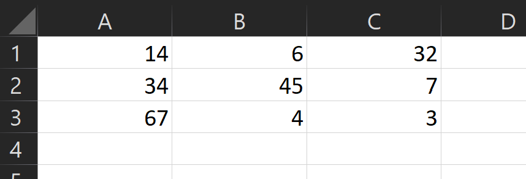

---
sidebar_custom_props:
  id: 4dd9b0d8-3e18-4fc8-ba79-f06dc4f17a4e
---
# Grundlagen

Ein Excel Dokument ist wie folgt aufgebaut
- Dokument
    - Arbeitsblatt (Mappe)
        - Zelle

Es gibt zwei Typen von Zellen: **Fix** oder **Berechnet**.

**Fixe zellen** besitzen einen **Wert** (Zahl, Text, Datum), sie können direkt gesetzt werden.

**Berechnete Zellen** starten immer mit einem `=` Zeichen und sind das **Resultat einer Rechnung**. Sobald die Zelle nicht mehr ausgewählt ist, wird dort das Resultat der Berechnung angezeigt und automatisch aktualisiert.

Damit man für Berechnungen nicht immer fixe Werte eingeben muss, kann auch der Wert einer anderen Zelle verwendet werden - es wird **auf eine andere Zelle verwiesen**. Ähnlich wie bei einem Schachbrett sind die **Spalten alphabetisch**, die **Zeilen numerisch** beschriftet. Um also die erste Zelle oben mit der Zelle unten Rechts zu addieren, kann eine neue Zelle mit dem Inhalt `=A1+C3` erstellt werden.

In berechneten Zellen können auch Funktionen verwendet werden, bspw. um den Durchschnitt der ersten Zeile zu bestimmen: `=MITTELWERT(A1:C1)`. Ein Bereich wird also durch zwei Zellen, die erste und die letzte, bestimmt. Es kann auch `=MITTELWERT(A1:C3)` verwendet werden, um den Mittelwert aller 9 ausgefüllter Zellen zu berechnen.

:::aufgabe
<Answer type="state" webKey="cec278c2-1b76-4dec-ac65-e89514a3016f" />

Dateiname
: __Informatik/Excel/00-intro.xlsx__
Vorlage
: 👉 [00-intro.xlsx](assets/00-intro.xlsx)

<Answer type="state" webKey="cbd91fcb-11f8-47a7-b170-325603d291d5">

Mittelwerte für die einzelnen Spalten und Zeilen bestimmen

</Answer>
<Answer type="state" webKey="adb2e507-7de7-43f8-8340-66d2adc62620">

In der Zelle `E30` soll der Mittelwert aller Zahlen stehen

</Answer>
<Answer type="state" webKey="97be9c28-5a72-4824-ad30-d54e60084c1d">

Eine neue **Arbeitsmappe** "Tabelle 2" erstellen

</Answer>
<Answer type="state" webKey="519fa9ef-48a1-4d5c-9e7e-166c6d7467ad">

Tabelle reproduzieren mit anderen, zufälligen Werten. Googeln, wie die Funktion "ZUFALLSBEREICH" funktioniert.

</Answer>
<Answer type="state" webKey="a1b9817e-6351-4852-a175-1de0fbb87ba6">

Ändern Sie die neue Tabelle so, dass alle Zahlen gerade sind.

Tipp: Mit welcher Operation können Sie aus einer ungeraden Zahl eine gerade Zahl erzeugen?

</Answer>
<Answer type="state" webKey="b37535e9-5b54-4b7d-91f6-289bab34388c">

Berechnen Sie den Mittelwert der Zeilen und runden Sie diesen auf 1 Nachkommastelle

</Answer>
<Answer type="state" webKey="0d42377a-68f8-4465-921c-a9e198da52c8">

Geben Sie den Mittelwert gerundet auf 0.5 an (daher 100.25 und 100.74 würden auf 100.5 gerundet)

</Answer>

:::