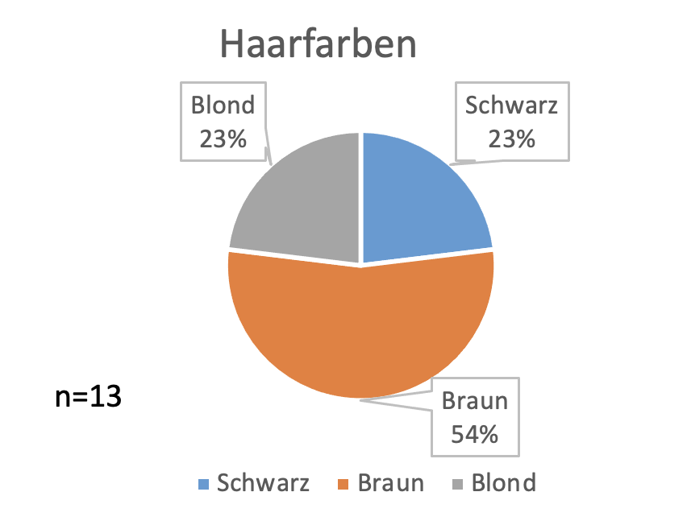
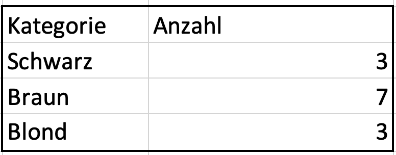
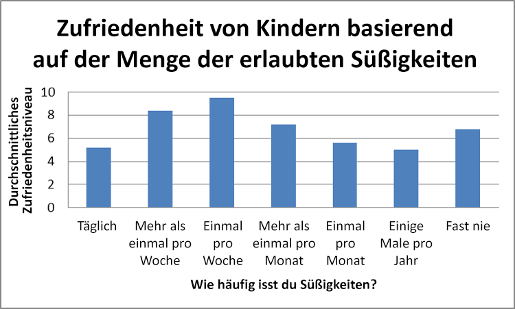

---
sidebar_custom_props:
  id: 74ab17ca-7a04-4d0a-9bd9-44b9c0b2bf4d
---

# Excel Diagramme

Daten können alles Mögliche sein: Messwerte, Ergebnisse von Umfragen, Beobachtungen und Zählungen. Nicht alle diese Daten lassen sich überhaupt mit Hilfe von Zahlen erfassen. Man sollte sich daher klar machen, dass es verschiedene Typen von Daten gibt. Daten sind entweder **quantitativ** (alles, was sich zählen und messen und überhaupt in Zahlen ausdrücken lässt) oder **qualitativ** (alles, was man zwar beobachten und ordnen, aber nicht in Form von Zahlen angeben kann). 

## Kreisdiagramm

Kreisdiagramme eignen sich dann besonders gut, wenn es um eine einfache Aufschlüsselung in genau einer Dimension geht. Anders gesagt: Verwenden Sie Kreisdiagramme, wenn Sie anhand einer Variable die Unterschiede zwischen den einzelnen Gruppen aufzeigen möchten. **Denken Sie immer daran, dass Kreisdiagramme nur dann eingesetzt werden sollten, wenn die Kategorien zusammengesetzt ein Ganzes ergeben.**[^1]

Kreisdiagramme werden für die Darstellung verschiedener Anteile an einem Ganzen verwendet.
- prozentuale Anteile der Augenfarben in der Klasse
- prozentualer Anteil der Haarfarben in der Bevölkerung
- prozentuale Anteile verschiedener Altersgruppen in der Gesellschaft

### Vorgehen

- Eine Tabelle mit der Kategorie und der effektiven Anzahl erzeugen. **Die Summe aller Kategorien muss der Stichprobengrösse _n_ entsprechen!**  
  Hilfreiche Feldfunktionen:

<ExcelBox>

=ZÄHLENWENN(A1:A12; "Schwarz")
</ExcelBox>

Zählt, wie oft der Wert "Schwarz" im Bereich `A1:A12` vorkommt

<ExcelBox>

=ZÄHLENWENNS(A1:A12; ">=10"; A1:A12; "<20")
</ExcelBox>

Zählt, wie viele Werte im Bereich `A1:A12` zwischen 10 und 20 liegen. Bemerke, dass der Bereich zweimal angegeben werden muss.

- Die ganze Tabelle auswählen und über __Einfügen > 2D-Kreis__ ein Kreisdiagramm einfügen.
- Über __Diagrammentwurf > Diagrammelemente hinzufügen__ die Datenbeschriftung hinzufügen.
- Mit einem Textfeld (__Einfügen > Formen > Textfeld__) ein Textfeld für die Anzahl Datensätze (**n**) hinzufügen.
- Rechtsklick auf eine weisse Fläche des Diagramms __:mdi-cursor-default-click: > Als Bild speichern...__

:::finding
- Die Stichprobengrösse **n** muss angegeben werden (=Anzahl der Datenpunkte)
- Die Prozentwerte der einzelnen Kreissegmente müssen bei Diagrammen mit weniger als 10 Segmenten beschriftet werden.
- Entweder in einer Legende oder direkt im Segment muss die Kategorie ersichtlich sein.
:::

## Liniendiagramm

Liniendiagramme werden für die Visualisierung von Entwicklungen im zeitlichen Verlauf verwendet. Sie werden daher vor allem dann eingesetzt, wenn die **langfristige Entwicklung** von Umsätzen oder anderen Grössen, die für Unternehmen oder Organisationen wichtig sind, gemessen werden sollen. Sie können auch für den **Vergleich** zweier Variablen über die Zeit genutzt werden. Im Beispiel wird gezeigt, wie die höhere staatliche Unterstützung für gesunde Lebensführung sich über einen Zeitraum von fünf Jahren auf die Umsätze bei den Süsswaren ausgewirkt hat.

## Säulendiaramm

Säulendiagramme kommen bei der Darstellung von Grössenvergleichen innerhalb eines Zeitraums vor.
Das Säulendiagramm eignet sich besonders, um wenige Ausprägungen (bis ca. 15) zu veranschaulichen. Bei mehr Kategorien leidet die Anschaulichkeit und es sind Liniendiagramme zu bevorzugen. Auch im Falle von metrisch stetigen Daten eignet sich das Säulendiagramm nicht, es ist ein Histogramm zu bevorzugen.

## Balkendiagramm

Das Balkendiagramm ist dem Säulendiagramm sehr ähnlich. Es entspricht einem Säulendiagramm mit vertauschten Achsen. So werden aus den vertikalen Säulen horizontale Balken und es wächst bei zunehmender Stichprobengrösse in die Länge und nicht in die Breite. Besonders gut sind Balkendiagramme für die Darstellung von Rangfolgen geeignet.

:::aufgabe Geeignetes Diagramm
Bestimmen Sie das geeignete Diagramm für die gegebene Ausgangslage.

1. Sie möchten die Ausgaben Ihres letzten Monatslohnes graphisch so darstellen, dass man sieht, wie gross die prozentualen Anteile der verschiedenen Ausgabeposten waren.
<Answer type="string" webKey="4c6640db-f04d-4049-8e94-944d3359f5ba" solution="Kreisdiagramm" select={['', 'Balkendiagramm', 'Liniendiagramm', 'Säulendiagramm', 'Kreisdiagramm']} />

2. Sie wollen die Preise verschiedene Smartphones vergleichen.
<Answer type="string" webKey="8fb7cc30-2565-415f-b227-60f35b5dcd95" solution="Balkendiagramm" select={['', 'Balkendiagramm', 'Liniendiagramm', 'Säulendiagramm', 'Kreisdiagramm']} />

3. Sie wollen in einem Diagramm die Tageshöchst- und -tiefsttemperaturen des letzten Monats aufzeigen.
<Answer type="string" webKey="71077fa7-e0de-4eef-b71b-7d9d05661fac" solution="Liniendiagramm" select={['', 'Balkendiagramm', 'Liniendiagramm', 'Säulendiagramm', 'Kreisdiagramm']} />

4. Sie wollen grafisch darstellen, wie hoch der TV-Konsum jedes Lernenden in Ihrer Klasse während einer Woche ist.
<Answer type="string" webKey="4a081b61-f7f6-4bc3-995c-9d9d14b101d9" solution="Balkendiagramm" select={['', 'Balkendiagramm', 'Liniendiagramm', 'Säulendiagramm', 'Kreisdiagramm']} />

5. Sie haben den Durchschnitt des täglichen TV-Konsums Ihrer Klasse ermittelt, und zwar während den letzten sieben Tagen. Nun visualisieren Sie das Resultat.
<Answer type="string" webKey="ae5eb985-4e04-413b-a55c-8570387ef199" solution="Säulendiagramm" select={['', 'Balkendiagramm', 'Liniendiagramm', 'Säulendiagramm', 'Kreisdiagramm']} />

6. Sie haben bei einer Klassenumfrage die Meinungen Ihrer Mitlernenden über das Angebot der Schulmensa eingeholt. Sie wollen das Resultat in einem Diagramm darstellen.
<Answer type="string" webKey="2309e16e-9d86-42a7-8e3b-2267dc4ef94a" solution="Kreisdiagramm" select={['', 'Balkendiagramm', 'Liniendiagramm', 'Säulendiagramm', 'Kreisdiagramm']} />

<Answer type="text" webKey="b11e0a1f-bfdb-4133-add6-5b756f481625" placeholder="✍️ Notizen..." />
:::

[^1]: Quelle: [www.surveymonkey.de](https://www.surveymonkey.de/mp/basic-chart-types-for-reports/)
