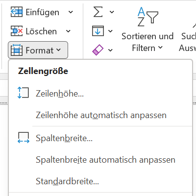
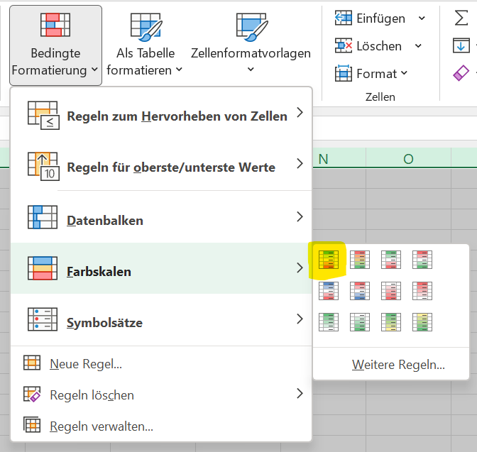

---
sidebar_custom_props:
  id: 43e83fea-50de-42f7-aaa5-50e5609a0fe2
---
# CSV Datein importieren

CSV
: *Comma Separated Values*
: also durch Kommas getrennte Werte.
: Es ist ein typisches Dateiformat für Tabellendaten und kann auch direkt von Excel geöffnet werden.

:::danger Achtung: Trennzeichen ändern
Wenn das angehängte CSV in Excel geöffnet wird, erscheinen die einzelnen Werte aber nicht als einzelne Zellen, weil das Schweizer-Excel statt Kommas "," Strichpunkte ";" als Trennzeichen erwartet. Unter 

__Daten > Text in Spalten__

lässt sich dies ändern.

👉 [:mdi-microsoft-excel: support.microsoft.com: Text zu Spalten](https://support.microsoft.com/de-de/office/aufteilen-von-text-in-verschiedene-spalten-mit-dem-textkonvertierungs-assistenten-30b14928-5550-41f5-97ca-7a3e9c363ed7)
:::

::::aufgabe
<Answer type="state" webKey="e04ae26f-487c-425b-a9f5-cc2e3724fdb7" />

Dateiname
: __Informatik/Excel/05-csv.xlsx__
Material
: 👉 [05-datafile.csv](assets/05-datafile.csv)

Laden Sie das Datenfile CSV herunter und öffnen Sie es in Excel. Überführen Sie die Texte in Öffnen Sie über __Daten > Text in Spalten__ die Werte in einzelne Zellen.

Anschliessend, ändern Sie das Aussehen des Datenblatts wie folgt (zuerst müssen alle Zellen ausgewählt werden):
:::flex --min-width=350px
- Die Höhe der Zellen auf `10`
- Die Breite der Zellen auf `2`
- Die Schriftgrösse auf `5pt`

***

:::

Sehen Sie bereits, was die Daten enthalten?

Verdeutilichen Sie dies, indem Sie den Datensatz einfärben:

und setzen Sie das Zoom-Level auf **10%**.

<Answer type="text" webKey="57bc1ffe-ddb6-46b4-a80d-e4c130525906" />
<Solution webKey="29c00b31-864f-439d-b2ec-410c0a6064f0">

</Solution>
::::