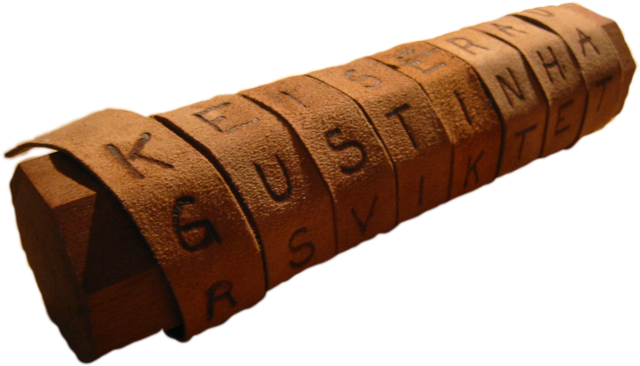

# Skytale [^1]

Um ca. 500 v. Chr. nutzten die Spartaner eine **Skytale** (griechisch für "*Stock*" oder "*Stab*"), um wichtige militärische Botschaften zu übermitteln. Der Absender wickelte dabei einen Streifen aus Pergament oder Leder spiralförmig um die Skytale und schrieb die Nachricht längs des Stabes auf das aufgewickelte Band. Auf dem abgewickelten Streifen, der dem Empfänger übermittelt wird, steht nun eine scheinbar sinnlose Buchstabenfolge. Der Empfänger kann die Botschaft mit einer Skytale vom selben Durchmesser aber wieder entziffern.



## Transposition
Die Skytale ist ein Beispiel einer Verschlüsselung durch Transposition. Das heisst, dass die Zeichen des Geheimtextes nicht ersetzt, sondern nur umgestellt (*transponiert*) werden.

## Skytale ausprobieren

```py live_py title=to__skytale.py
klartext = 'Skytale'
schlüssel = 3

zeilen = []

# füge für jede Zeile einen leeren Text ein
for i in range(schlüssel):
    zeilen.append('')

# verteile die Buchstaben auf die Zeilen
nr = 0
for buchstabe in klartext:
    zeilen[nr] = zeilen[nr] + buchstabe
    nr = nr + 1
    if nr == schlüssel:
        nr = 0
# alle Zeilen mit einer neuen Zeile verknüpfen
verschlüsselt = '\n'.join(zeilen)

print(verschlüsselt)
```


```py live_py title=from__skytale.py
verschlüsselt = '''\
Ste
ka
yl'''

zeilen = verschlüsselt.splitlines()
# die erste Zeile gibt vor, wie viele Spalten es gibt
spalten = len(zeilen[0])

klartext = ''

# für jede Spalte...
for spalte in range(spalten):
    # wird in jeder Zeile...
    for zeile in zeilen:
        if len(zeile) > spalte:
            # der Buchstabe in dieser Spalte dem Text hinzugefügt
            klartext = klartext + zeile[spalte]

print(klartext)
```

[^1]: Quelle: [rothe.io](https://rothe.io/?b=crypto&p=818731)