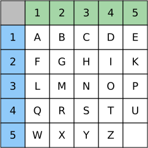

---
sidebar_custom_props:
  id: 1eada906-fef6-4800-b3fc-3b0ed4a54ae9
  source:
    name: rothe.io
    ref: https://rothe.io/?b=crypto&p=423844
---

import Polybios from "@site/src/components/VisualizationTools/Crypto/Polybios";

# Polybios-Chiffre

Die Polybios-Chiffre wurde vom griechischen Geschichtsschreiber Polybios (200 v.Chr. bis 120 v.Chr.) entwickelt.

Bei der Polybios-Verschlüsselung wird zunächst ein Quadrat mit den Buchstaben des Alphabets gefüllt. Die Anordnung der Buchstaben kann grundsätzlich beliebig gewählt werden. Polybios hat das griechische Alphabet mit 24 Buchstaben verwendet. Übertragen auf das lateinische Alphabet sieht dies folgendermassen aus:

Die beiden Buchstaben `J` und `V` finden keinen Platz in der Tabelle. `J` wird mit `I` zusammengefasst, `V` mit `U`.

Die Zeilen und Spalten im Quadrat werden durchnummeriert. Nun kann ein Buchstabe verschlüsselt werden, indem seine Zeilen- und Spaltennummer aufgeschrieben wird.

So wird der Klartext `HALLO` zum Geheimtext `23 11 31 31 34`.

## Polybios ausprobieren

<Polybios />

---

