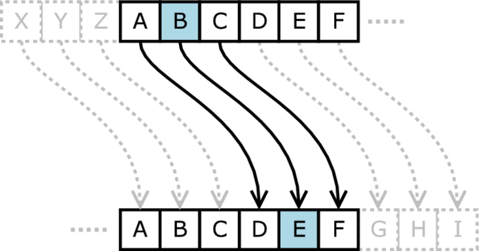

---
sidebar_custom_props:
  id: b4afdce9-5463-4a78-a0d4-cd6b137aaf04
  source:
    name: rothe.io
    ref: https://rothe.io/?b=crypto&p=544692
---

import Caesar from "@site/src/components/VisualizationTools/Crypto/Caesar";

# Caesar-Chiffre

Der römische Feldherr _Gaius Julius Caesar_ hat seine militärischen Nachrichten verschlüsselt. Der römische Schriftsteller Sueton hat Folgendes überliefert:

> … si qua occultius perferenda erant, per notas scripsit, id est sic structo litterarum ordine, ut nullum verbum effici posset: quae si qui investigare et persequi velit, quartam elementorum litteram, id est D pro A et perinde reliquas commutet.

_Übersetzt..._

> … wenn etwas Geheimes zu überbringen war, schrieb er in Zeichen, das heisst, er ordnete die Buchstaben so, dass kein Wort gelesen werden konnte: Um diese zu lesen, tauscht man den vierten Buchstaben, also D für A aus, und ebenso mit den restlichen.

Caesar hat also jeden Buchstaben seiner Nachrichten durch den Buchstaben ersetzt, welcher im Alphabet drei Stellen weiter hinten steht. Der Buchstabe `D`, welcher für `A` eingesetzt wird, wird **Schlüssel** genannt. Er muss bekannt sein, um die Nachricht wieder **entschlüsseln** zu können.

Die **Verschlüsselung** erfolgt, indem man in der folgenden Tabelle einen Klartextbuchstaben im Klartextalphabet sucht und durch den Buchstaben des Geheimtextalphabets ersetzt, der genau unterhalb steht. Die **Entschlüsselung** erfolgt in umgekehrter Richtung:

| Caesar-Chiffre     |                                                                                                          |
| :----------------- | :------------------------------------------------------------------------------------------------------- |
| Klartextalphabet   | `A` `B` `C` `D` `E` `F` `G` `H` `I` `J` `K` `L` `M` `N` `O` `P` `Q` `R` `S` `T` `U` `V` `W` `X` `Y` `Z` |
| Geheimtextalphabet | `D` `E` `F` `G` `H` `I` `J` `K` `L` `M` `N` `O` `P` `Q` `R` `S` `T` `U` `V` `W` `X` `Y` `Z` `A` `B` `C` |

:::tip Merke
Heute wird jede Verschlüsselung, die auf einer Verschiebung des Alphabets beruht, eine **Casear-Verschlüsselung** genannt.
:::

Die Nachricht `MORGEN UM ZEHN` wird verschlüsselt zu `PRUJHQ XP CHKQ`.

## ROT13

**ROT13** ist eine Caesar-Verschlüsselung, bei welcher die Buchstaben um `13` Stellen – also exakt um die Hälfte des Alphabets – verschoben werden. Der Buchstabe `A` wird folglich auf `N` abgebildet. Das Spezielle an dieser Verschlüsselung ist, dass man durch eine erneute Verschlüsselung wieder den Klartext erhält. Oder anders formuliert: Es spielt keine Rolle, ob man ver- oder entschlüsselt. Sie können dies in der folgenden Tabelle einfach nachvollziehen:

| ROT-13             |                                                                                                         |
| :----------------- | :------------------------------------------------------------------------------------------------------ |
| Klartextalphabet   | `A` `B` `C` `D` `E` `F` `G` `H` `I` `J` `K` `L` `M` `N` `O` `P` `Q` `R` `S` `T` `U` `V` `W` `X` `Y` `Z` |
| Geheimtextalphabet | `N` `O` `P` `Q` `R` `S` `T` `U` `V` `W` `X` `Y` `Z` `A` `B` `C` `D` `E` `F` `G` `H` `I` `J` `K` `L` `M` |

Eigentlich braucht man bei ROT13 nur die halbe Tabelle:

Die Nachricht `KOMM ALLEINE` wird verschlüsselt zu `XBZZ NYYRVAR`.

## Caesar-Chiffre ausprobieren

<Caesar />

