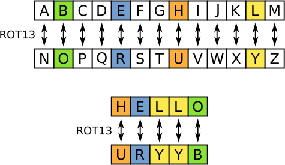

# Caesar-Chiffre [^1]

Der römische Feldherr _Gaius Julius Caesar_ hat seine militärischen Nachrichten verschlüsselt. Der römische Schriftsteller Sueton hat Folgendes überliefert:

> … si qua occultius perferenda erant, per notas scripsit, id est sic structo litterarum ordine, ut nullum verbum effici posset: quae si qui investigare et persequi velit, quartam elementorum litteram, id est D pro A et perinde reliquas commutet.

_Übersetzt..._

> … wenn etwas Geheimes zu überbringen war, schrieb er in Zeichen, das heisst, er ordnete die Buchstaben so, dass kein Wort gelesen werden konnte: Um diese zu lesen, tauscht man den vierten Buchstaben, also D für A aus, und ebenso mit den restlichen.

Caesar hat also jeden Buchstaben seiner Nachrichten durch den Buchstaben ersetzt, welcher im Alphabet drei Stellen weiter hinten steht. Der Buchstabe `D`, welcher für `A` eingesetzt wird, wird **Schlüssel** genannt. Er muss bekannt sein, um die Nachricht wieder **entschlüsseln** zu können.


Die **Verschlüsselung** erfolgt, indem man in der folgenden Tabelle einen Klartextbuchstaben im Klartextalphabet sucht und durch den Buchstaben des Geheimtextalphabets ersetzt, der genau unterhalb steht. Die **Entschlüsselung** erfolgt in umgekehrter Richtung:

| Caesar-Chiffre     |                                                                                                         |
| :----------------- | :------------------------------------------------------------------------------------------------------ |
| Klartextalphabet   | `A` `B` `C` `D` `E` `F` `G` `H` `I` `J` `K` `L` `M` `N` `O` `P` `Q` `R` `S` `T` `U` `V` `W` `X` `Y` `Z` |
| Geheimtextalphabet | `D` `E` `F` `G` `H` `I` `J` `K` `L` `M` `N` `O` `P` `Q` `R` `S` `T` `U` `V` `W` `X` `Y` `Z` `A` `B` `C` |

:::tip Merke
Heute wird jede Verschlüsselung, die auf einer Verschiebung des Alphabets beruht, eine **Casear-Verschlüsselung** genannt.
:::

Die Nachricht `MORGEN UM ZEHN` wird verschlüsselt zu `PRUJHQ XP CHKQ`.

## ROT13

**ROT13** ist eine Caesar-Verschlüsselung, bei welcher die Buchstaben um `13` Stellen – also exakt um die Hälfte des Alphabets – verschoben werden. Der Buchstabe `A` wird folglich auf `N` abgebildet. Das Spezielle an dieser Verschlüsselung ist, dass man durch eine erneute Verschlüsselung wieder den Klartext erhält. Oder anders formuliert: Es spielt keine Rolle, ob man ver- oder entschlüsselt. Sie können dies in der folgenden Tabelle einfach nachvollziehen:

| ROT-13             |                                                                                                         |
| :----------------- | :------------------------------------------------------------------------------------------------------ |
| Klartextalphabet   | `A` `B` `C` `D` `E` `F` `G` `H` `I` `J` `K` `L` `M` `N` `O` `P` `Q` `R` `S` `T` `U` `V` `W` `X` `Y` `Z` |
| Geheimtextalphabet | `N` `O` `P` `Q` `R` `S` `T` `U` `V` `W` `X` `Y` `Z` `A` `B` `C` `D` `E` `F` `G` `H` `I` `J` `K` `L` `M` |

Eigentlich braucht man bei ROT13 nur die halbe Tabelle:



Die Nachricht `KOMM ALLEINE` wird verschlüsselt zu `XBZZ NYYRVAR`.

## Caesar-Chiffre ausprobieren


```py live_py title=to__caesar.py id=4f0f7d8d-a2d3-4c2f-b05f-ed9bd6b52b33
ALPHABET = 'ABCDEFGHIJKLMNOPQRSTUVWXYZ'
SCHLÜSSEL = 'D'
ROT = ALPHABET.index(SCHLÜSSEL)

klartext = 'CAESAR'

klartext = klartext.upper()
verschlüsselt = ''
for buchstabe in klartext:
    index = ALPHABET.index(buchstabe) + ROT
    index = index % 26 # ganzzahliger Rest bei Division durch 26
    verschlüsselt = verschlüsselt + ALPHABET[index]

print(verschlüsselt)
```

:::aufgabe
Ändern Sie den Code so ab, dass der verschlüsselte Text wieder entschlüsselt werden kann.

```py live_py title=from__caesar.py id=ebc928b8-7ff6-4566-9438-475718cedc03
ALPHABET = 'ABCDEFGHIJKLMNOPQRSTUVWXYZ'
SCHLÜSSEL = 'D'
ROT = ALPHABET.index(SCHLÜSSEL)

verschlüsselt = 'JDLXV'

verschlüsselt = klartext.upper()
klartext = ''
for buchstabe in verschlüsselt:
    index = 0
    klartext = klartext + ALPHABET[index]

print(klartext)
```

<details><summary>⭐️ Zusatz</summary>

Sie haben eine geheime Nachricht abgefangen, kennen aber den Schlüssel nicht. Sie wissen aber, dass `ALCZLJ` ein sinnvolles Wort ergeben muss. Schreiben Sie ein Programm, das alle möglichen Schlüssel durchprobiert und jeweils den entschlüsselten Text ausdruckt.

Verwenden Sie die Ausgangslage aus dem obigen Programm.

```py live_py title=hack__caesar.py id=a99f0b6f-07cd-4498-b0d7-69af7aed70dd
verschlüsselt = 'ALCZLJ'
```

</details>
:::


---

[^1]: Quelle: [rothe.io](https://rothe.io/?b=crypto&p=544692)
