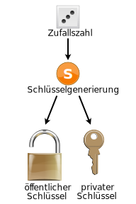
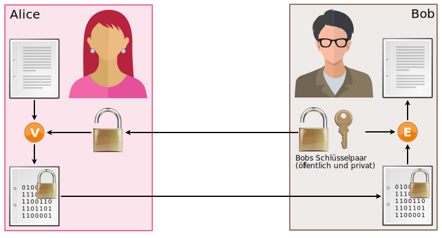

import Answer from '@site/src/components/Answer'
import Solution from '@site/src/components/Solution'

# Asymmetrische Verschlüsselung [^1]

Das Prinzip der asymmetrischen Verschlüsselung beruht also auf zwei verschiedenen Schlüsseln, dem sogenannten **Schlüsselpaar** (engl. key pair). Die beiden Schlüssel eines Schlüsselpaars nennt man **öffentlichen** und **privaten** Schlüssel (engl. public und private key).

Da für den Verschlüsselungsvorgang nicht derselbe Schlüssel verwendet wird wie für den Entschlüsselungsvorgang, spricht man von einem asymmetrischen Verfahren.

:::flex --min-width=200px

***--text-align=center

:::

## Schlüsselpaar
Jede Person besitzt ein eigenes Schlüsselpaar, so auch Bob. Die beiden Schlüssel, die dieses Schlüsselpaar bilden, sind mathematisch verwandt. Der private Schlüssel lässt sich jedoch nicht in sinnvoller Zeit aus dem öffentlichen Schlüssel  berechnen.

Bobs öffentlicher Schlüssel entspricht also dem Bügelschloss aus unserem ersten Beispiel. Bobs privater Schlüssel ist der Schlüssel, der zum Bügelschloss passt. Das Schloss kann (in geöffneter Form natürlich) bei einer vertrauenswürdigen Stelle (Trent) deponiert werden, wo es von Alice abgeholt werden kann. Den Schlüssel behält Bob stets für sich.

## Verschlüsselung
In der folgenden Abbildung sieht man auf der linken Seite, dass Alice bei der Verschlüsselung den öffentlichen Schlüssel von Bob (und nicht den eigenen) verwendet. Dieser öffentliche Schlüssel enthält keine geheime Information und ist für alle Leute zugänglich (z.B. via eine vertrauenswürdige Stelle), somit können alle eine Nachricht für Bob verschlüsseln.

## Entschlüsselung
In derselben Abbildung ist zu sehen, dass Bob bei der Entschlüsselung seinen privaten Schlüssel verwenden muss. Somit ist sichergestellt, dass nur Bob die Nachricht entschlüsseln kann.

:::warning Achtung
Um Verwechslungen zu vermeiden, spricht man bei der symmetrischen Verschlüsselung vom geheimen Schlüssel (engl. secret key), während man bei asymmetrischen Verfahren vom privaten Schlüssel spricht und nicht vom geheimen Schlüssel, weil jede involvierte Person ein eigenes Schlüsselpaar und somit einen eigenen privaten Schlüssel besitzt.
:::

:::aufgabe Asymmetrische Verschlüsselung
1. Überlegen Sie sich, wie die Verschlüsselung funktioniert, wenn ein Dokument an verschiedene Leute versendet wird. Machen Sie sich dazu eine Skizze.
2. Welche Nachteile erkennen Sie?

<Answer type="text" webKey="6f969d09-5b80-4553-8c21-3bbc70b53f52" />

<Solution webKey="eb555af1-a9d0-4165-8dcc-abf879e84a88">

**Nachteile**
- Das Dokument muss separat für zwei Personen verschlüsselt werden.
- Jeder Person muss eine andere Nachricht geschickt werden.

</Solution>

:::

## ⭐️ RSA Algorithmus

Der **RSA** Algorithmus ist der aktuell am weitesten verbreitete asymmetrische Verschlüsselungsalgorithmus und wird etwa für die SSL/TLS Verschlüsselung beim HTTPS-Protokoll verwendet. Der Algorithmus wurde 1977 von Ronald **R**ivest, Adi **S**hamir und Leonard **A**dlerman unter dem Namen **RSA** entwickelt und publiziert[^2].

### Funktionsweise

Die Funktionsweise basiert darauf, dass es leicht ist, $c = m^{e}\: mod\: n$ zu berechnen, aber praktisch unmöglich, ohne den privaten Schlüssel `d` die Umkehr­funktion zu berechnen.

|       |                                       |
| :---- | :------------------------------------ |
| $n$   | öffentliche Zahl                      |
| $e$   | öffentlicher Schlüssel des Empfängers |
| $d$   | privater Schlüssel des Empfängers     |
| $m<n$ | Klartext                              |
| $c$   | Geheimtext                            |

#### Verschlüsselung

Zur Verschlüsselung berechnet Bob den Geheimtext `c`:

$$
c=m^{e} \: mod \: n
$$

Wobei `mod` der Ganzzahlige Rest bei der Division mit `n` darstellt. Beispiel: $13 \: mod \: 4=1$, da $\frac{13}{4} = 3\: Rest\: 1$.

Die Zahl $n$ ist das Produkt von zwei ver­schiedenen Primzahlen $p$ und $q$, diese sind geheim. Wie können $p$ und $q$ geheim sein, wenn doch $n = p\cdot q$ öffentlich ist? Dies beruht nur darauf, dass die Primfaktor­zerlegung von $n$ zu rechen­aufwendig ist, da $n$ sehr gross ist (z.B. `1024` Bit lang).

Für die Zahl `e` muss gelten

$$
ggt(e, \phi(n)) = 1
$$

Hierbei ist

$$
\phi(n)  =  (p-1)(q-1)
$$
die Anzahl der zu n teiler­fremden Zahlen, die kleiner als n sind.

#### Entschlüsselung

Der Empfänger hat als privaten Schlüssel eine Zahl $d$ mit

$$
d\cdot e\: mod\: \phi(n) = 1
$$
daher
$$
d\cdot e  =  k\cdot \phi(n) + 1
$$
für irgend ein $k \in \N_{o}$.

Ist $n = pq$, so gilt nach einem Satz von Euler für alle Zahlen $m$ mit $m < n$ und für alle natürlichen Zahlen $k$:

$$
mk\cdot\phi(n)+1\: mod\: n  =  m
$$
 

Zur Ent­schlüsselung berechnet der Empfänger also

$$
\begin{aligned}
    
c^{d}\: mod\: n	&=  md\cdot e\: mod\: n \\
 	  &=  mk\cdot \phi(n) + 1\: mod\: n \\
 	  &=  m

\end{aligned}
$$

und erhält damit den Klartext $m$.

:::info ⭐️ RSA Schlüssellänge
Die RSA Schlüssel haben standardmässig `1024` oder `2048` bits, wobei Schlüssel mit `1024` bits mittelfristig als knackbar erachtet werden, so dass die Industrie heute oft mindestens `2048` bits voraussetzt.
:::

[^1]: Quelle: [rothe.io](https://rothe.io/?b=crypto&p=952331)
[^2]: Quelle: [techtarget.com](https://www.techtarget.com/searchsecurity/definition/asymmetric-cryptography)