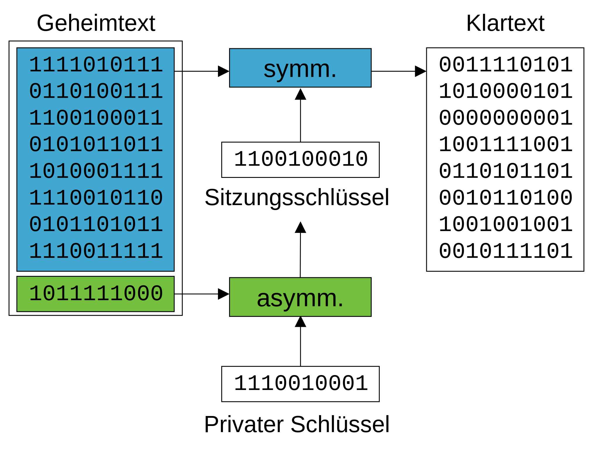

import Answer from '@site/src/components/Answer'
import Solution from '@site/src/components/Solution'

# Kombinierte Verfahren [^1]

## Vergleich symmetrischer und asymmetrischer Verschlüsselung
Wir haben in der letzten Aufgabe gesehen, dass asymmetrische Verschlüsselung auch Nachteile hat. Wir wollen die Vor- und Nachteile einander gegenüberstellen.

| Symmetrische Verschlüsselung     | Asymmetrische Verschlüsselung |
| :------------------------------- | :---------------------------- |
| ✔ sehr schnell                   | ✘ ~ 1'000x langsamer          |
| ✔ 1 Nachricht für alle           | ✘ 1 Nachricht pro Person      |
| ✘ geheimen Schlüssel austauschen | ✔ Public Key ist öffentlich   |
| → nur 1 gemeinsamer Schlüssel    | → 1 Schlüsselpaar pro Person  |

## Beide Verfahren kombinieren
In kryptographischen Verfahren, die heutzutage eingesetzt werden, ist das Ziel, die Vorteile beider Verfahren zu nutzen und die Nachteile zu eliminieren. Daher werden zur Verschlüsselung von Daten beide Verfahren eingesetzt:

## Symmetrische Verfahren zur Verschlüsselung der Daten
Da asymmetrische Verfahren ca. 1'000x langsamer sind als symmetrische Verfahren, werden zur Verschlüsselung der Daten symmetrische Verfahren eingesetzt. Denn kryptographische Verfahren werden nicht nur zur Verschlüsselung kurzer Nachrichten (wie z.B. Textnachrichten) eingesetzt, häufig müssen auch grosse Datenmengen (z.B. hochauflösende Bilder, Tondokumente, Videos, ...) verschlüsselt werden, folglich spielt die Geschwindigkeit eine zentrale Rolle.

Zudem ist bei symmetrischer Verschlüsselung praktisch, dass die Daten für sämtliche Empfänger gleich verschlüsselt sind und somit
- nicht mehrmals verschlüsselt werden müssen (Zeitbedarf) und
- in derselben Nachricht an alle Empfänger verschickt werden können, ohne dass die Nachricht unnötig ein Mehrfaches ihrer ursprünglichen Länge erreicht (Platzbedarf).

## Asymmetrische Verfahren zur sicheren Schlüsselübertragung
Asymmetrische Verfahren sind langsamer, aber zur **Verschlüsselung des symmetrischen Schlüssels** perfekt geeignet, da dieser sehr kurz ist und im Vergleich zu den Daten Geschwindigkeit keine Rolle spielt.

Zudem ist auch der verschlüsselte symmetrische Schlüssel sehr kurz, so dass die Nachricht nur unwesentlich länger wird, wenn diese für mehrere Personen verfasst wird.

## Zusätzlicher Vorteil
Der symmetrische Schlüssel kann so vom Computer gewählt werden. Dies hat zwei Vorteile:

1. Der Schlüssel ist wirklich zufällig und gleichverteilt im gesamten Schlüsselraum (ein Passwort, das von einer Person gewählt wird, schafft dies nicht).
2. Der Schlüssel kann für jede Nachricht neu gewählt werden. Somit erhält jede Nachricht einen eigenen Schlüssel.

Man spricht daher von einem **Sitzungsschlüssel** (engl. session key) für die symmetrische Verschlüsselung. Die folgende Übersicht stellt prinzipiell dasselbe dar wie die Abbildung oben, allerdings mit einem anderem Fokus.

:::finding Auch symmetrische Verfahren sind sicher!
Asymmetrische Verfahren sind also nicht besser als symmetrische! Sie erfüllen einen anderen Zweck und werden gleichzeitig mit symmetrischen Verfahren eingesetzt. Symmetrische Verfahren sind also nicht unsicher, einzig die Erstellung des Schlüssels und der Schlüsselaustausch sind ein Problem.
:::

:::aufgabe Kombinierte Entschlüsselung
Stellen Sie dar, wie die Umkehrung – also die Entschlüsselung – funktioniert, wenn symmetrische und asymmetrische Verfahren kombiniert verwendet werden.

<Answer type="text" webKey="4a33b602-eb5f-427d-ba5e-725756b5f112" />

<Solution webKey="1f2cf2b5-9a49-48e7-9b45-6bca55560abf">

</Solution>

:::

[^1]: Quelle: [rothe.io](https://rothe.io/?b=crypto&p=559732)
