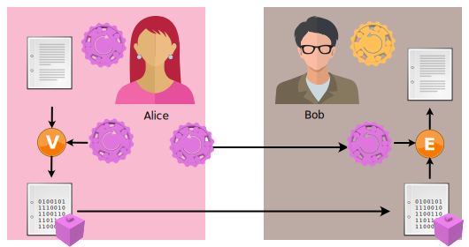

---
sidebar_custom_props:
  id: 1161bd5d-ed3c-4517-9bab-4b13629f07e1
---

# Asymmetrie umkehren

# Asymmetrie umkehren [^1]
Wir erinnern uns an das Prinzip der reinen [asymmetrische Verschlüsselung](../04-Asymmetrisch/03-asymmetrie.md):

## Gedankenexperiment
Was würde geschehen, wenn wir den Vorgang ändern?

Bei der asymmetrischen Verschlüsselung gibt es zwei Schlüssel, den öffentlichen und den privaten. Normalerweise verwendet Alice zur Verschlüsselung den öffentlichen Schlüssel von Bob. Bob wieder entschlüsselt den übermittelten Geheimtext mit seinem privaten Schlüssel.

> Was geschieht, wenn Alice den Klartext mit **ihrem eigenen privaten** Schlüssel «verschlüsselt»?

Dies lässt sich mit Schloss und Schlüssel leider nicht mehr sinnvoll und verständlich darstellen. Wir stellen uns die asymmetrische Ver-/Entschlüsselung einfach als rein mathematische Angelegenheit vor:

Der Verschlüsselungsfunktion ($E$) wird normalerweise der Klartext ($p$) und der öffentliche Schlüssel ($e$) übergeben, dabei entsteht der Geheimtext ($c$):

$$
c = E(p, e)
$$

Die Entschlüsselungsfunktion ($D$) berechnet aus dem Geheimtext ($c$) und dem privaten Schlüssel ($d$) wieder den Klartext ($p$):

$$
p = D(c, d)
$$

:::aufgabe Aufgabe Gedankenexperiment
a. Was erhalten wir, wenn wir der Verschlüsselungsfunktion anstelle des öffentlichen Schlüssels von Bob **den privaten Schlüssel d von Alice** übergeben?
$$
? = E(p, d)
$$

b. Wie lässt sich dieses «Produkt» wieder in einen Klartext verwandeln?

$$
p = ?(?, ?)
$$

<Answer type="text" webKey="a9f45069-3876-48ad-90db-6a2d9c1aa2ad">

a.)

b.)

</Answer>

<Solution webKey="7ff60a15-ccaa-4ab4-98f5-a908c6b89c6e">

a. Es entsteht ebenso ein «spezieller Geheimtext», also etwas, das nicht direkt verstanden werden kann, wir bezeichnen dieses Produkt mit dem Buchstaben $s$.

$$
s = E(p, d)
$$

b. Da dieser spezielle «spezielle Geheimtext» $s$ mit dem privaten Schlüssel von Alice «verschlüsselt» wurde, kann er nur mit dem zugehörigen öffentlichen Schlüssel $e$ von Alice wieder in Klartext umgewandelt werden.

$$
p = D(s, e)
$$

</Solution>

:::

:::aufgabe Aufgabe Bedeutung des Gedankenexperimentes
a. Was bedeutet es, wenn jemand einen Text mit seinem eigenen privaten Schlüssel «verschlüsselt», so dass der Geheimtext nur mit dem zugehörigen öffentlichen Schlüssel «entschlüsselt» werden kann?

b. Was sagt die Tatsache, dass man einen solchen Geheimtext mit einem fremden (nicht dem eigenen) öffentlichen Schlüssel entschlüsseln kann, aus?

<Answer type="text" webKey="8a3ee7b6-2cfb-4638-ad4d-064fc920c745">

a.)

b.)

</Answer>

<Solution webKey="7ff60a15-ccaa-4ab4-98f5-a908c6b89c6e">

a. Man erhält die digitale Unterschrift, also die **Signatur** `s` von Alice. Nur Alice kann mit ihrem privaten Schlüssel das Dokument so verschlüsseln, dass es mit ihrem öffentlichen Schlüssel wieder zum Original entschlüsselt werden kann.

b. Dieser Vorgang hat **nichts mit Geheimhaltung zu tun** - es geht ausschliesslich darum, ein Dokument von der Absender:in signieren zu lassen.

</Solution>
:::

## Digitale Signatur
Wir haben soeben das Prinzip der digitalen Signatur entdeckt.

:::finding Digitale Signatur
Wenn Bob die Nachricht mit dem öffentlichen Schlüssel von Alice entschlüsseln kann, dann muss diese Nachricht vorher mit dem privaten Schlüssel von Alice verschlüsselt worden sein. Somit kann sie von niemandem anders stammen als von Alice. D.h. diese Nachricht ist quasi digital signiert.
:::

:::aufgabe Aufgabe mehrere Leute
Überlegen Sie sich, wie ein signiertes Dokument von mehr als zwei Personen angeschaut und überprüft wird. Welche Schlüssel werden verwendet?

<Answer type="text" webKey="6e6c19e8-7a15-41cc-83b4-ca2987de22d1" />

<Solution webKey="7ff60a15-ccaa-4ab4-98f5-a908c6b89c6e">

</Solution>
:::

## Nachteile
Die bisher kennengelernte Art der digitalen Signatur ist nicht optimal, denn es gibt mehrere Probleme:
- Wegen der «Signatur» ist der Klartext nicht mehr lesbar (er ist ja nun speziell «verschlüsselt»). Dies ist umständlich, denn wenn Sie ein Dokument auf Papier unterschreiben, bleibt dieses trotzdem lesbar.
- Asymmetrische Verfahren sind langsam, d.h. wenn wir ein grosses Dokument (z.B. ein Video) signieren, dauert dieser Vorgang unnötig lange – ebenso das Überprüfen der Signatur (also das Entschlüsseln).

[^1]: Quelle: [rothe.io](https://rothe.io/?b=crypto&p=645224)
