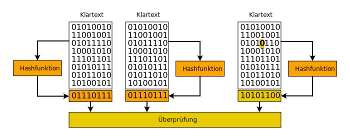

---
sidebar_custom_props:
  id: 8d2ca844-98be-499a-9ac1-24a4d93b01b5
  source:
    name: rothe.io
    ref: https://rothe.io/?b=crypto&p=713066
---

# Integrität
## Lesbarkeit und Signatur
Das im letzten Kapitel beschriebene Verfahren hat den grossen Nachteil, dass ein Dokument erst lesbar ist, wenn es «entschlüsselt» – oder anders ausgedrückt: wenn die **Signatur entfernt** – wurde. Das ist unpraktisch, schliesslich sind sämtliche deine von Hand unterschriebenen Dokumente trotzdem stets lesbar. Sobald das Dokument entschlüsselt (also lesbar) ist, ist aber auch die Signatur verschwunden – und somit auch die Überprüfbarkeit, welche Person was unterschrieben hat.

Wir suchen folglich eine Lösung, die das gleichzeitige Betrachten des Dokuments und der Signatur ermöglicht.

## Manipulationen erkennen
Ist der Klartext stets sichtbar, so müssen wir sicherstellen, dass er nicht manipuliert werden kann. Schliesslich wollen wir nicht, dass ein Vertrag nach dem Signieren noch unentdeckt verändert werden kann.

## Hashwerte
:::flex --min-width=150px
Hashwerte kennen wir bisher nur zur sicheren Speicherung von Passwörtern. Hashfunktionen können allerdings nicht nur Passwörter in Hashwerte umwandeln, sondern irgendwelche Daten.

Wir haben gesehen, dass Hashwerte eine Art digitale **Fingerabdrücke** sind. Es ist extrem schwierig (resp. in vernünftiger Zeit nicht möglich), zu einem bestehenden Text einen anderen zu finden, der denselben Hashwert erzeugt.

*** --align-self=center

:::

Auch wenn verschiedene Personen den Hashwert desselben Textes berechnen, ergibt sich stets derselbe Hashwert – aber natürlich nur, wenn dieselbe Hashfunktion verwendet wird. Ist ein Text auch nur ein wenig anders (wie im untenstehenden Beispiel gezeigt), so ergibt sich sofort ein völlig anderer Hashwert, womit leicht zu erkennen ist, dass die Texte **nicht** übereinstimmen.

