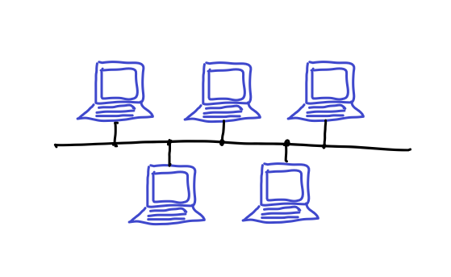
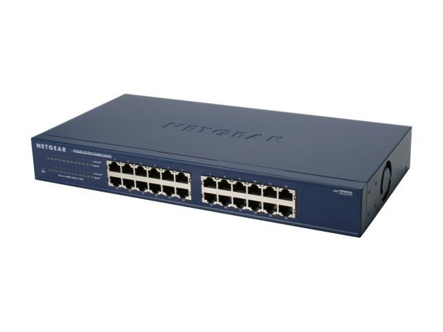
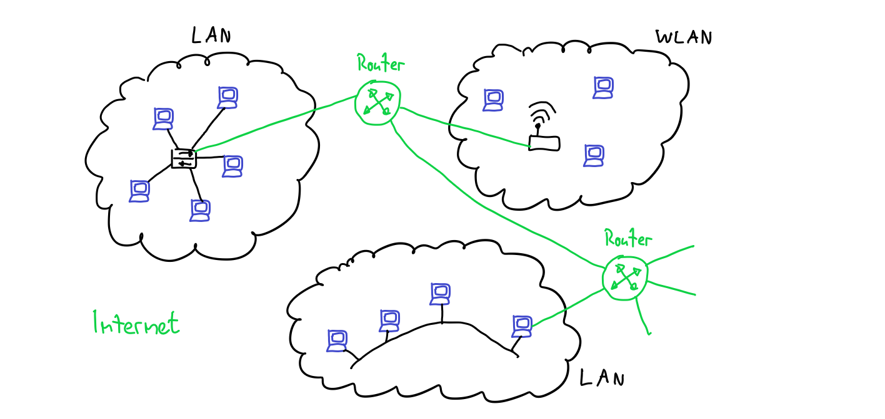
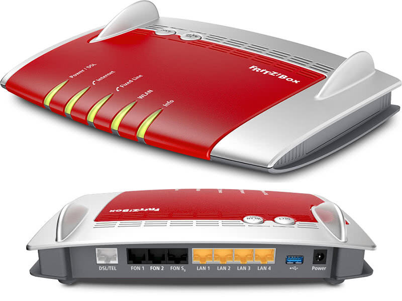

---
sidebar_custom_props:
  id: 73cbf920-9726-4f01-8d8d-8486fcbf28eb
---

# Vom LAN zum Internet
Verbindet man zwei oder mehrere Computer über ein geeignetes **Medium**, so entsteht ein Computernetzwerk. In den Anfängen war dieses Medium immer ein Kabel, heute können das auch Funkwellen sein.
Je nach geografischer Ausdehnung des Netzwerkes spricht man von einem **Local Area Network (LAN)** oder einem **Wide Area Network (WAN)**. Es gibt auch weitere Abstufungen, welche hier aber nicht näher betrachtet werden.

Beispiele:
- Das **Schulhausnetzwerk** ist ein **LAN**
- Das **Telefonnetzwerk** ist ein **WAN**

## Topologien
Ein Kommunikationsmedium kann auf verschiedene Weisen genutzt werden. So kann man alle Computer über ein und dasselbe Kabel verbinden, oder man kann zwischen allen Computern im Netzwerk ein separates Kabel legen. Beides hat Vor- und Nachteile. Je nach Art der Verbindung entsteht eine andere **Topologie**. Die gebräuchlichsten Topologien werden nachfolgend gezeigt.

### Bus
In der **Bus-Topologie** sind alle Computer über **ein und dasselbe** Kabel verbunden. Die Computer teilen sich das Kabel also. Man spricht von einem **shared Medium**. Das hat zur Folge, dass immer nur **ein** Computer auf's Mal senden kann. Sonst würden sich die zur gleichen Zeit von verschiedenen Computern gesendeten Bits überlagern und auslöschen. Andererseits können **alle** Computer alle Nachrichten empfangen, auch diejenigen, welche gar nicht für Sie bestimmt sind.

Bus-Topologien mit Kabel sind heute veraltet. Es gibt aber ein allgegenwärtiges Pendant: **Wireless-LANs (WLAN)**. Hier werden **Funkwellen** als Medium verwendet. Zwar gibt es verschiedene **Funkkanäle** (Frequenzen), aber in einem Kanal kann zu einem bestimmten Zeitpunkt immer nur ein Sender auf Sendung sein. Andererseits können alle Stationen die gesendeten Nachrichten empfangen, auch wenn diese gar nicht an sie gerichtet sind.

### Stern
In **kabelgebundnen** Netzwerken sind heute meist **Sterntopologien** zu finden. Dabei ist jeder Computer über ein eigenes Kabel mit einem zentralen Gerät, dem **Switch**, verbunden. Nachrichten von einem Computer werden vom Switch empfangen und auf Grund einer **Adresse** an den Zielcomputer weitergeleitet. Das hat den Vorteil, dass nur die beteiligten Computer und der Switch die Nachricht lesen können. Alle anderen Computer sehen die Nachricht nicht. Allerdings muss der Switch je nach Anzahl der angeschlossenen Computer sehr schnell sein, damit es zu keinen Rückstaus kommt.

Ein Switch für den Anschluss von 24 Computern:

## Das Internet, ein Verbund von LANs
Ein **isoliertes LAN** reicht aus, wenn die angeschlossenen Computer nur untereinander Nachrichten austauschen. Sobald aber Nachrichten zwischen zwei Computern in verschiedenen LANs fliessen sollen, braucht es ein **Bindeglied** zwischen den einzelnen LANs. Diese Bindeglieder sind die **Router**. Sie verbinden zwei oder mehrere LANs miteinander und **vermitteln** Nachrichten zwischen den angeschlossenen Netzwerken. Eine Nachricht muss, wenn nötig, über **mehrere** Router weitergereicht werden, bis Sie im richtigen Ziel-LAN und dort beim Zielcomputer abgeliefert wedrden kann. So entsteht schliesslich ein weltweiter Verbund von Netzwerken, das **Internet**.

Router sind Geräte und sehen praktisch gleich aus, wie Switches. Oft kommen auch **kombinierte** Geräte, welche z.B. einen WLAN-Access-Point (Antenne), einen Switch und einen Router im selbern Gehäuse vereinen.

Typischer WLAN-Switch-Router für das Heimnetz:

