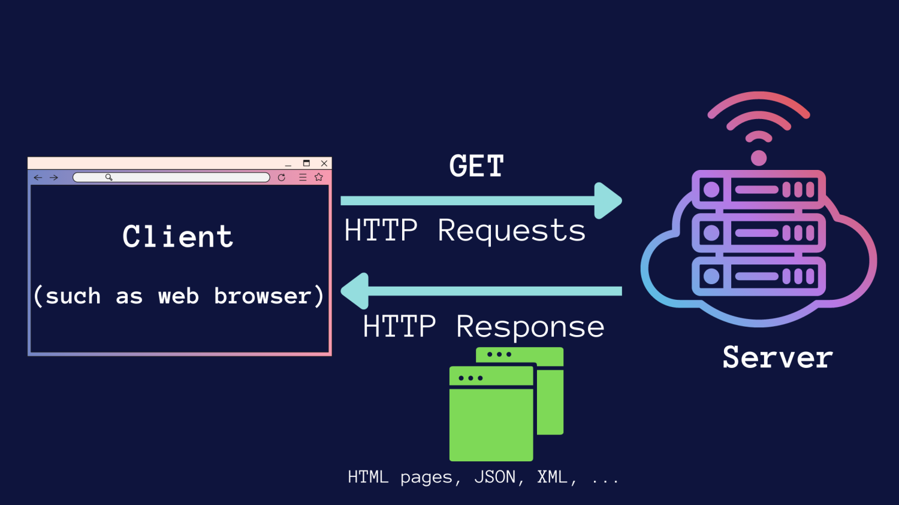

---
sidebar_custom_props:
  id: c63ef328-1005-4edf-af1c-9129a62df28c
  source:
    name: sdg
    ref: https://gitlab.gbsl.website/gymbefin23/material/-/snippets/20
---

import BrowserWindow from '@site/src/components/BrowserWindow';

# 1. Webserver mit Python




## Server, Client, Nachrichten, Prokolle - Die Grundlagen

Ein Webserver ist ein Computer, der darauf wartet, dass über das Netzwerk Anfragen für Webseiten eintreffen, welche auf dem Webserver gespeichert sind. Der Webserver sendet dann die angefragten Seiten als Antwort zurück an den Computer, von welchem die Anfrage stammt.

Server
:   Ein Computer, welcher auf Anfragen wartet und diese beantwortet.
Client
:  Ein Computer, welcher Anfragen an einen Server sendet.
Request
:   Eine Nachricht, welche vom Client an den Server gesendet wird.
Response
:   Die Antwort auf einen Request, welche vom Server an den Client gesendet wird.

Man spricht bei Request und Response auch von **Nachrichten**, welche zwischen Client und Server ausgetauscht werden.

Sowohl auf dem Client, wie auf dem Server braucht es Programme, welche die ausgetauschten Nachrichten verarbeiten können. Im Fall vom Web sind das der **Browser** auf der Clientseite und das **Webserver-Programm** auf der Serverseite.

Webseiten sind Dateien, deren Inhalt in der Sprache **HTML** (Hypertext Markup Language) geschrieben ist. HTML dient dabei dazu die Darstellung der Webseite festzulegen (Überschriften, Abschnitte Tabellen, Links auf andere Seiten, etc.).

Damit sich Client und Server gegenseitig verstehen, müssen die Nachrichten in einer genau festgelegten Reihenfolge und mit genau definiertem Inhalt ausgetauscht werden. Diese Vorschriften nennt man ein **Protokolle** (siehe auch [👉 2. Protokolle](../02-Protokolle/index.md)). Im Falle des Webs heisst das Protokoll **HTTP** (Hypertext Transfer Protocol).

HTTP
: Hypertext Transfer Protocol

Das folgende Sequenzdiagramm verdeutlicht diese Zusammenhänge. Es zeigt die Reihenfolge der ausgetauschten Nachrichten für die Abfrage einer Webseite aus dem Browser heraus. Beachten Sie, dass der Browser nur ein Programm ist, welches auf dem Client-Computer läuft. Das entsprechende Programm auf der Serverseite ist nicht separat dargestellt. Statt dessen ist die Datei dargestellt, welche auf dem Server gespeichert ist und deren Inhalt zum Client zurückgesendet wird.

```mermaid
sequenceDiagram
    participant B as Browser
    participant C as Client (IP-Adresse 10.0.123.68)
    participant S as Webserver (IP-Adresse 10.0.123.4)
    participant F as HTML-Datei index.htm
    B->>C: http://10.0.123.4/index.html
    C-)S: HTTP-Request: GET /index.htm
    S->>F: liest Datei
    F->>S: Inhalt der Datei (HTML)
    S-)C: HTTP-Response: 200 OK, HTML-Inhalt
    C->>B: HTML-Inhalt
```

## Webserver mit Python

Python stellt eine Library zur Verfügung, mit welcher man ein einfaches Webserver-Programm erstellen kann. Ein solches ist in folgendem Snippet enthalten. Dieses Programm empfängt Requests für HTML-Dateien und sendet den Inhalt dieser Dateien zurück. Im Moment ist die Seite `hello.html` die einzige Seite, welche vom Webserver zurückgeschickt werden kann.

Da auf einem Server gleichzeitig verschiedene **Dienste** angeboten werden können (z.B. könnte auch noch ein E-Mail-Server laufen), muss man für jeden Dienst eine **Port-Adresse** festlegen, unter welcher der Dienst auf ankommende Anfragen horcht. Für unseren einfachen Webserver wird im Snippet der Port mit der Nummer `8000` festgelegt.

IP-Adresse
: Die IP-Adresse ist eine eindeutige Adresse, welche jedem Computer (somit auch jedem Server) im Internet zugewiesen wird.
Localhost
: Lokale IP-Adresse, welche auf dem eigenen Computer verweist. Sie ist immer `127.0.0.1`.
Port
: Ein Port ist eine Nummer, welche den Dienst auf einem Computer identifiziert. Dadurch kann ein Computer mehrere Dienste gleichzeitig anbieten.
URL / URI
: Universal Resource Locator / Universal Resource Identifier


Um von einem Browser aus die Seite `hello.html` anzeigen zu lassen, muss man im Browser folgende **URL** (Universal Resource Locator) eingeben:

<BrowserWindow url="http://Server-IP-Adresse:8000/Pfad/hello.html">

<h1>Hello</h1>
<p>Wenn Sie dies sehen, so haben Sie eine erfolgreiche Abfrage auf den <b>SimlpeWebServer</b>
getätigt.</p>


</BrowserWindow>

- Die IP-Adresse des Servers könnte zum Beispiel `10.0.123.4` sein.
- Der Pfad entspricht der Ordnerreihenfolge, ausgehend vom Workspace in VSC, in dem die Datei `hello.html` gespeichert ist, z.B. `2258084`.


:::aufgabe Python Webserver
<Answer type="state" webKey="6a13422c-52ba-410a-a3f6-5bc362731241" />

Ordner
: __EF-Informatik/docs/Netzwerke/webserver__

1. Speichern Sie folgende Snippets in Ihrem Repository unter dem Ordner `docs/Netzwerke/webserver` ab.

    :::details Snippets
    ```py reference title="SimpleWebServer.py"
    https://github.com/lebalz/ofi-blog/blob/main/docs/Netzwerke-ef/01-Server/snippets/simple-server.py
    ```

    ```html reference title="hello.html"
    https://github.com/lebalz/ofi-blog/blob/main/docs/Netzwerke-ef/01-Server/snippets/hello.html
    ```
    :::
2. Öffnen Sie auf Ihrem Notebook einen Browser und versuchen Sie die Seite hello.html anzuzeigen. Dazu müssen Sie in Ihrem Browser die richtige URL eingeben. Weil Ihr Browser auf dem selben Computer läuft, wie der Webserver, können Sie statt der IP-Adresse Ihres Computers auch `localhost` oder die lokale IP-Adresse `127.0.0.1` schreiben. Beim Pfad müssen Sie darauf achten, in welchen Ordner die Datei `hello.html` gespeichert ist.

3. Wenn Sie erfolgreich waren, machen Sie einen Screenshot von Ihrem Browser, in welchem man die URL und die Seite sieht und laden Sie diesen als Antwort hoch (die URL soll erkennbar sein).

<Answer type="text" webKey="d24cea7c-6310-4d0b-bab7-ab4206c1b55f" />

4. Nun ist dies wohl eine recht umständliche URL. Jenachdem aus welchem Ordner heraus das Python-Skript gestartet wurde, ändert sich die URL. Um diese möglichst kurz zu halten, kann man das Skript direkt im Ordner `docs/Netzwerke/webserver` ausführen. Dazu müssen Sie in VSC links in der Ordnerübersicht auf den Ordner __webserver__ rechtsklicken und dort `Open in Integrated Terminal` auswählen. Nun öffnet sich ein Terminalfenster, welches sich im Ordner `docs/Netzwerke/webserver` befindet. In diesem Fenster können Sie nun das Python-Skript mit dem Befehl `python3 simple-server.py` starten. Die URL wird nun wie folgt aussehen: `http://localhost:8000/hello.html`.

:::