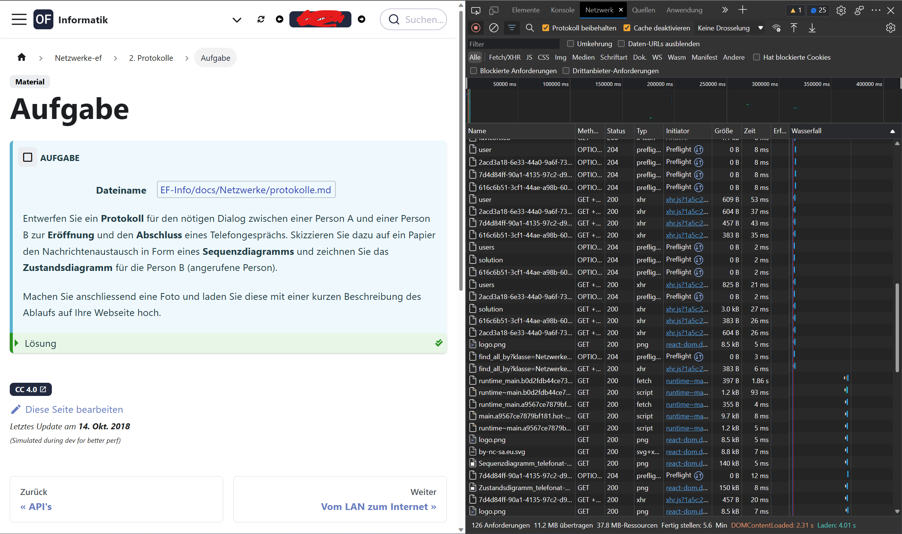

---
sidebar_custom_props:
  id: 4467e49f-ba50-4e7c-b866-4ce4a2526676
---
# API's

:::aufgabe

<Answer type="state" webKey="f298a852-af85-49b5-b03f-8a35a33d48cb" />

Zeit
: 60 Minuten
Grundlage
: **PDF** [👉 download](assets/zappier-apis.pdf)
: **Online** (bessere Qualität) [👉 https://zapier.com/learn/apis/](https://zapier.com/learn/apis/)
Dateiname
: __EF-Info/docs/Netzwerke/apis.md__

**Ziel der Aufgabe**: Sie schreiben ein Cheat-Sheet für die Grundlagen von API's. **Grundlage** dafür sind die **Kapitel 1-4** und **Kapitel 7 bis "Long Polling"** des obigen Buches. Sicherlich sollen im Cheat-Sheet folgende Punkte enthalten sein (nicht unbedingt in dieser Reihenfolge):
- Was ist eine API? 
- JSON Format
- XML Format
- HTTP Request: 
  - URL
  - Methoden
  - Headers
  - Body
- HTTP Status Codes
- Endpunkte
- Polling
:::

## HTTP Netzwerkverkehr untersuchen

Der Netzwerkverkehr kann auf unterschiedliche Weise untersucht werden. Eine Möglichkeit ist die Verwendung eines Web-Browsers. Der Browser zeigt den Netzwerkverkehr an, wenn er eine Webseite lädt. Die Anzeige kann über __Weitere Tools > Entwicklertools > Netzwerk__ (oder [[:mdi-microsoft:]] + [[:mdi-apple-keyboard-shift:]] + [[I]] bzw. [[:mdi-apple-keyboard-option:]] + [[:mdi-apple-keyboard-command:]] + [[J]]) aufgerufen werden (detailierte Anleitung: 👉 https://balsamiq.com/support/faqs/browserconsole).

Hier sieht man nun die einzelnen Netzwerkanfragen, die der Browser beim Laden der Webseite gestellt hat. Die Anzeige zeigt die URL, die Methode (GET, POST, etc.), die Grösse der Antwort, die Zeit, die die Anfrage benötigt hat, und den Statuscode (200 = OK, 404 = nicht gefunden, etc.).

:::aufgabe
<Answer type="state" webKey="ffa8e0c7-0fb2-4988-8781-4203b785fa6f" />

Öffnen Sie die Entwicklertools und darin das Netzwerkpanel. Laden Sie die Seite neu und schauen Sie sich einige der Anfragen an. 

- Finden Sie die Anfrage, welche das obige Bild (vom Netzwerkpanel) geladen hat.
  - Wie lange hat diese Anfrage gedauert?
  - Wie gross war die Antwort?
  - Was stand im Header der Anfrage? Ist der Header bei Ihrer Pultnachbar:in gleich? Was ist unterschiedlich?
  - Was stand im Header der Antwort?
  - Status-Code? Verwendete Methode?
  
  <Answer type="text" webKey="dd6e4d84-5f2f-4b31-a83f-8f72d4ae4afa" />

- Finden Sie heraus, mit welcher Anfrage Ihre Benutzerdaten geladen werden? Welche Informationen werden von der API gesendet? Unter welcher Adresse ist die API erreichbar?

  <Answer type="text" webKey="a5a76fca-32f5-4168-9374-1f0235acbc95" />

- Finden Sie einen POST Request? Was ist enthalten? Durch welche Aktion auf der Webseite können Sie selber einen POST Request auslösen? Stimmt die verwendete HTTP-Methode? Was wäre allenfalls passender?

  <Answer type="text" webKey="3ea9cbc6-99d7-48c4-b4ed-7fd7621ec765" />

:::

## API abfragen

:::aufgabe Jokes
<Answer type="state" webKey="e9606896-3d52-413c-b0ed-d8437d6d960e" />

Studieren Sie die Dokumentation der API auf 👉 https://icanhazdadjoke.com/api?ref=apilist.fun.

- Wieso soll bei der Verwendeung dieser API ein individualisierter `User-Agent` verwendet werden?

  <Answer type="text" webKey="ea513d39-b9ab-4f26-a914-bb923ed8e58f" />

- Verwenden Sie Postman (am IoT-Tag installiert, bei Node-RED...) um einen zufälligen Dad-Joke abzufragen. Experimentieren Sie dabei mit den unterschiedlichen `Accept`-Headers. Halten Sie einen Screenshot der Abfrage fest.

  <Answer type="text" webKey="49c2fde6-041e-40da-9874-e572d98e74ff" />

- Können Sie auch Witze mit einem bestimmten Wort suchen? Experimentieren Sie mit verschiedenen Suchbegriffen. Halten Sie einen Screenshot der Abfrage fest.

  <Answer type="text" webKey="019dc887-fddd-4320-96cf-55b5f4da98e2" />

:::
