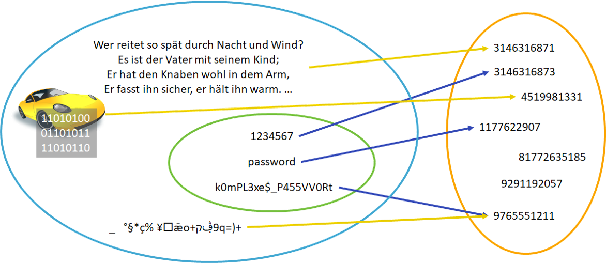

---
sidebar_custom_props:
  id: 79c8cca9-e452-4e59-9445-e5c06cb23b90
  source:
    name: rothe.io
    ref: https://rothe.io/?b=crypto&p=103784
---

import HashSHA2 from '@site/src/components/VisualizationTools/Crypto/HashSHA2'

# Hashfunktionen

:::info[Hashfunktion]
«Eine Hashfunktion ist eine Abbildung, die eine grosse Eingabemenge auf eine kleinere Zielmenge abbildet.»
:::

Da eine **Eingabe beliebiger Länge** auf eine **Ausgabe mit fester Länge** abgebildet wird, ist die Umkehrung (vom Ausgabewert auf den  Eingabewert zu schliessen... wird auch "Injektivität" genannt) unmöglich. Die Eingabemenge ist folglich unendlich gross (Texte, Videos und Tonaufnahmen beliebiger Länge, Bilder beliebiger Grösse, ...). Die Ausgabemenge ist allerdings endlich, da die Hashwerte eine fixe Länge haben.

## Hashfunktion
In der Abbildung oben sieht man, dass die Menge der Passwörter nur eine Teilmenge aller theoretisch möglichen Eingaben darstellt. Es ist im Beispiel Oben nicht zu verhindern, dass Kollisionen auftreten.

:::info[Kollisionsresistenz]
Um genügend Sicherheit zu bieten, soll eine gute kryptographische Hashfunktion folglich kollisionsresistent sein. Das heisst, es soll praktisch unmöglich sein, Kollisionen zu finden.
:::

## Hashwert

:::flex
Die Ausgabe der Hashfunktion wird **Hashwert** genannt.

Man kann einen Hashwert mit einem Fingerabdruck vergleichen, weil er gewissermassen eindeutig zu einem Passwort passt wie ein Fingerabdruck zu einem Menschen. So wie mit einem Fingerabdruck nicht auf die Persönlichkeit/Charakter einer Person geschlossen werden kann, lässt sich auch nicht von einem Hashwert auf das Passwort schliessen. 

::br{align-self=end}

:::
## Aktuelle Beispiele
Es gibt verschiedene aktuelle Hashfunktionen. Nachfolgend ein Tool, welches SHA-2 Hashes (Secure Hash Algorithm Version 2) berechnet.

<HashSHA2 />

:::aufgabe
<Answer type="state" webKey="3107459a-1598-4eec-b45d-4c2c539d721f" />

1. Halten Sie den SHA-2 Hash ihres Namens und ihrer E-Mail Adresse fest.
2. Wie viele Buchstaben ändern sich, wenn Sie einen einzigen Tippfehler machen? 

<Answer type="text" webKey="34f7ade1-bd99-46ef-a2f2-883c02573eb1" placeholder="Notizen..." monospace />

:::

:::finding
Die letzten beiden Beispiele zeigen, dass bereits kleinste Änderungen zu komplett anderen Hashwerten führen. Kryptographische Hashfunktion sind so konstruiert, dass bei einer Änderung an einem Bit min. 50% der Hashwert-Bits ändern.
:::

