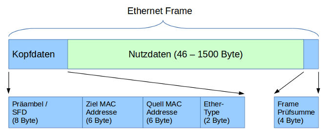

---
sidebar_custom_props:
  id: 5618a33f-cbb5-408f-b661-eef77df00390
  source:
    name: sdg
    ref: https://gitlab.gbsl.website/gymbefin23/material/-/wikis/Netzwerke/Die-Netzzugangsschicht,-Frames-und-ARP
---

# 6. Netzwerkzugangsschicht

<Answer type="state" webKey="65810b52-2edd-42ba-85ab-051af7dd1e41" label="Barbeitet?" />

---

<Answer type="state" webKey="103f3876-8c6e-4427-8331-d680c8ba2a5d" label="Gesehen?" />

[@youtube](https://www.youtube-nocookie.com/embed/gYN2qN11-wE)

---
<Answer type="state" webKey="817cfd63-1257-491a-9aa6-bd4f4424d8fe" label="Gesehen?" />

[@youtube](https://www.youtube-nocookie.com/embed/JI9Zm2tbUoE)

---
<Answer type="state" webKey="2a1fd649-537e-45ad-9bd3-95d595ef21a8" label="Gesehen?" />

[@youtube](https://www.youtube-nocookie.com/embed/AhOU2eOpmX0)

---
<Answer type="state" webKey="9faf9dc5-f531-402f-834d-ad24906757d7" label="Gesehen?" />

Ohne den Teil **VLAN**.

[@youtube](https://www.youtube-nocookie.com/embed/G7GyWjJtjNs)

---

Innerhalb eines **LAN** tauschen die angeschlossenen Geräte Nachrichten in Form von **Frames** aus. Handelt es sich um ein kabelgebundenes LAN, wird auch von einem **Ethernet-Frame** gesprochen. Ethernet ist der Name der am häufigsten verwendeten Netzwerktechnologie über Kabel. Das folgende Bild zeigt den Aufbau eines Ethernet-Frames:

Die einzelnen Bereiche des Frames haben folgende Bedeutung:

Präambel und Start Frame Delimitter (SFD)
: Enthält keine Information, sondern nur abwechselnde auf 0 und 1 gesetzte Bits. Dadurch können sich die Empfänger auf die Übertragungsgeschwindigkeit des Senders einstellen.
Ziel-MAC-Adresse
: Die lokale Adresse des Gerätes, an welches der Frame gerichtet ist.
Quell-MAC-Adresse
: Die lokale Adresse des Gerätes, von welchem der Frame gesendet worden ist.
Ether-Type
: Gibt an welches Protokoll in den Nutzdaten verwendet wird (also zum Beispiel IP).
Nutzdaten
: Die eigentliche Nachricht. Im Falle des TCP/IP-Protokollstapels ein IP-Paket.
Frame Prüfsumme (Frame Check Sequence, FCS)
: Wird vom Sender berechnet und erlaubt dem Empfänger zu überprüfen, ob der Frame korrekt übertragen und empfangen worden ist.

In einem **WLAN** werden ebenfalls Frames verwendet. Darin sind grundsätzlich die gleichen Informationen, wie in einem Ethernet-Frame enthalten. Weitere, WLAN-spezifische Informationen kommen hinzu.

## MAC-Adressen
Innerhalb eines LANs werden **MAC-Adressen** zur Adressierung von einzelnen angeschlossenen Geräten verwendet. MAC-Adressen sind **6 Bytes** lang und werden normalerweise in **hexadezimaler** Form geschrieben.

Beispiele:

Hexadezimal
: Binär
`A8-6D-AA-C6-66-00`
: `10101000 1101101 10101010 11000110 1100110 00000000`

`00:50:56:C0:00:08`
: `00000000 01010000 01010110 1100000 00000000 00001000`

Als Trennzeichen zwischen den einzelnen Bytes findet man sowohl `-`, wie auch `:`.

Jeder **Netzwerkadapter** (die Elektronik, welche es zum Anschluss am Netzwerk braucht) auf der Welt hat eine eigene **eindeutige** MAC-Adresse. Das heisst, eine bestimmte MAC-Adresse kommt weltweit nur einmal vor. Die MAC-Adresse ist im Netzwerkadapter vom Hersteller fest eingestellt.

### Broadcast-MAC-Adresse
Normalerweise sendet ein Gerät einen Frame immer an einen bestimmten Empfänger. Nur dieser soll den Frame verarbeiten. Es gibt aber Fälle, wo ein Gerät einen Frame an **alle** im LAN angeschlossenen Empfänger sen den will. Ein solcher Vorgang wird **Broadcast** genannt. Dazu muss im Frame die Broadcast-MAC-Adresse als Zieladresse gesetzt werden. Diese lautet:

Broadcast
: An alle Netzwerkteilnehmenden
`FF-FF-FF-FF-FF-FF`
: `11111111 11111111 11111111 11111111 11111111 11111111`

## Das Adress-Resolution-Protocol (ARP)

Jeder Frame muss mit der richtigen **Empfänger-MAC-Adresse** angeschrieben sein. Empfänger ist immer ein Gerät, welches im **gleichen** lokalen Netzwerk liegt. Entweder handelt es sich um das eigentliche **Ziel** des IP-Pakets (z.B. ein Webserver im gleichen Netzwerk) oder um den **Standardgateway** (auch als Router bezeichnet), der dann das IP-Paket in ein anderes Netzwerk weiterleiten wird.

In beiden Fällen weiss das sendende Gerät vorerst nur die IP-Adresse des Empfängers. Für das sendende Gerät stellt sich also die Frage, wie die MAC-Adresse des Gerätes, an welches der Frame gesendet werden muss, herausgefunden werden kann.

Dazu dient das **Address-Resolution-Protocol (ARP)**. Das Prinzip ist einfach:

Wenn man sein Bio-Buch verloren hat und es gerne wieder haben möchte, so ruft man in in die **Runde** "Wer hat mein Bio-Buch gesehen?". Man sendet also eine Nachricht an alle Personen in der Runde, was nichts anderes, als ein **Broadcast** ist. Diejenige Person, welche das Bio-Buch gesehen hat, meldet sich dann und sagt "Ich habe das Buch gesehen. Es ist dort und dort."

Genau so funktioniert das ARP-Protokoll. Der Sender sendet zuerst einen Frame an alle mit der Frage, wer eine bestimmte IP-Adresse hat und welche MAC-Adresse dazu gehört. Der betroffene Empfänger meldet sich dann und gibt sein MAC-Adresse bekannt.

