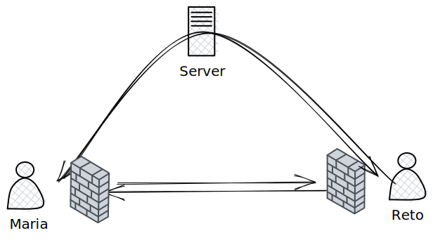
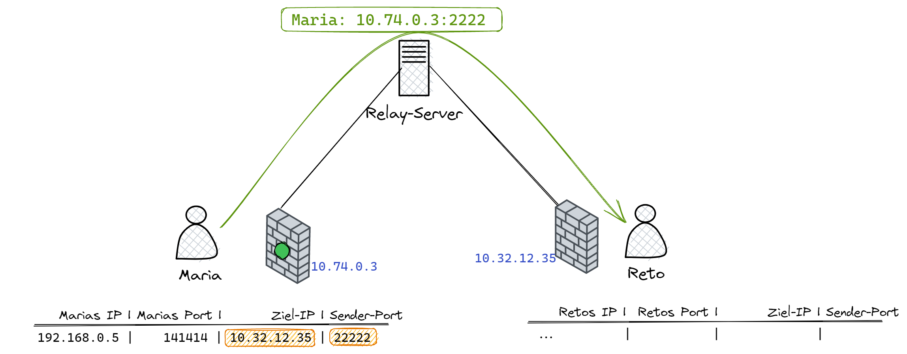
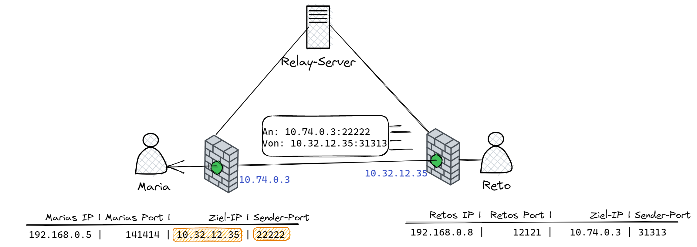

---
sidebar_custom_props:
  id: 4ddf5e10-b449-4918-9880-8303f2be10fe
---
# 11. NAT

:::details[Präsentation]

<iframe src="/slides/tcp-nat-ef.html" style={{border:'0px',width:'100%',height:'500px'}} allowFullScreen="true" webkitallowfullscreen="true" mozallowfullscreen="true" />

:::

## Network Address Translation
NAT (Network Address Translation) ist ein Verfahren, dass in IP-Routern eingesetzt wird, die lokale Netzwerke mit dem Internet verbinden. Weil Internet-Zugänge in der Regel nur über eine einzige öffentliche und damit routbare IPv4-Adresse verfügen, müssen sich alle anderen Hosts im lokalen Netzwerk mit privaten IPv4-Adressen begnügen. Private IP-Adressen dürfen zwar mehrfach verwendet werden, aber besitzen in öffentlichen Netzen keine Gültigkeit. Hosts mit einer privaten IPv4-Adresse können somit nicht mit Hosts ausserhalb des lokalen Netzwerks kommunizieren.

Damit trotzdem alle Computer mit privater IPv4-Adresse Zugang zum Internet bekommen können, muss der Internet-Zugangs-Router in allen ausgehenden Datenpaketen die private IPv4-Adresse der lokalen Hosts durch seine eigene, öffentliche IPv4-Adresse ersetzen. Damit die eingehenden Datenpakete dem lokalen Host zugeordnet werden können, speichert der Router zusätzliche die Port-Nummern der TCP-Verbindungen in einer sogenannten NAT-Tabelle.

In Verbindung mit den privaten IPv4-Adressen wird NAT eingesetzt, damit über die Netzgrenzen hinweg Daten ausgetauscht, E-Mails verschickt und empfangen, sowie auf das World Wide Web (WWW) zugegriffen werden können.
NAT ist allerdings nur eine Notlösung, um die Adressknappheit von IPv4 zu umgehen. Um die damit einhergehenden Probleme zu lösen muss langfristig auf ein Internet-Protokoll mit einem grösseren Adressraum umgestellt werden. IPv6 ist ein solches Protokoll.

## Warum NAT?
Die ersten IPv4-Netze waren anfangs eigenständige Netz ohne Verbindung nach aussen. Hier begnügte man sich mit IPv4-Adressen aus den privaten Adressbereichen. Parallel dazu kam es bereits Ende der 1990er Jahre zu Engpässen bei öffentlichen IPv4-Adressen. Die steigende Anzahl der Einwahlzugänge über das Telefonnetz mussten mit IPv4-Adressen versorgt werden.
Bis heute bekommt ein Internet-Anschluss nur eine IPv4-Adresse für ein Gerät. Damals war es undenkbar, dass an einem Internet-Anschluss ein ganzes Heimnetzwerk betrieben wird. Wenn ein Haushalt einen PC per Modem an das Telefonnetz angeschlossen und sich ins Internet eingewählt hat, dann war das schon etwas besonderes.

Heute betreibt jeder Haushalt mit Internet-Zugang sein eigenes lokales Netzwerk, in dem jedes Endgerät eine IPv4-Adresse braucht. In solchen Fällen bekommen die Geräte IPv4-Adressen aus den privaten Adressräumen 10.0.0.0/8, 192.168.0.0/16 oder 172.16.0.0/12 zugeteilt, um die wenigen öffentlichen IPv4-Adressen einzusparen.

Allerdings sind private IPv4-Adressen nicht routbar. Das heisst, sie sind aus dem Internet nicht erreichbar und es kann keine direkte Verbindung zu Geräten hinter einem NAT aufgebaut werden. Die Andere Richtung, aus dem privaten Netzwerk ins öffentliche Netzwerk, ist jedoch dank einem Austausch der privaten IP-Adresse mit der öffentlichen IP-Adresse des NAT's möglich. Diese Zuordnung wird in der **NAT-Tabelle** gespeichert, so dass beim Erhalt der Antwort die Öffentliche Adresse wieder durch die Private ausgetauscht werden kann.

## Funktionsweise NAT

Innerhalb des lokalen Netzwerks hat der Router die IP-Adresse `192.168.0.1`, die für den LAN-Port gilt und über die der Router im LAN direkt erreichbar und konfiguriert ist. Gleichzeitig handelt es sich dabei um die Adresse des Standard-Gateways und zum Beispiel des lokalen DNS-Servers. Der Router ist also das Standard-Gateway über das alle Verbindung laufen. Mit seiner öffentlichen IP-Adresse tritt der Router als Stellvertreter für alle Stationen seines lokalen Netzwerks (LAN) auf.

Wenn ein Datenpaket mit einer Ziel-Adresse ausserhalb des lokalen Netzwerks adressiert ist, dann ersetzt der Router die Quell-Adresse durch seine öffentliche IP-Adresse. Die Port-Nummer (TCP oder UDP) wird durch eine andere Port-Nummer ersetzt. Um später die Antwortpakete der richtigen Station zuordnen zu können führt der Router eine Tabelle mit den geänderten Quell-Adressen und den dazugehörigen Port-Nummern. Wenn also Pakete mit einer bestimmten Port-Nummer zurückkommen, dann ersetzt NAT die Ziel-Adresse durch die richtige Adresse und Port-Nummer.

In der NAT-Tabelle hat jeder Eintrag auch eine Zeitmarkierung. Nach einer bestimmten Zeit der Inaktivität wird der betreffende Eintrag gelöscht. Auf diese Weise wird sichergestellt, dass keine Ports offen bleiben.
Weil dieses Verfahren die Absender-Adresse (Source) jedes ausgehenden Datenpakets ändert, nennt man dieses Verfahren Source NAT (SNAT). SNAT bezeichnet man in der Regel einfach als NAT.

### Ablauf

WAN
: Wide Area Network
LAN
: Local Area Network

:::flex[--align=center]
1.	Der Client schickt seine Datenpakete mit der IP-Adresse __192.168.0.2__ und dem TCP-Port __10101__ an sein Standard-Gateway, bei dem es sich um einen NAT-Router handelt.
2.	Der NAT-Router tauscht IP-Adresse (LAN-Adresse) und TCP-Port (LAN-Port) aus und speichert beides mit der getauschten Port-Nummer (WAN-Port) in der NAT-Tabelle.
3.	Der Router leitet das Datenpaket mit der WAN-Adresse __220.0.0.1__ und der neuen TCP-Port __20202__ ins Internet weiter.
4.	Der Empfänger (Server) verarbeitet das Datenpaket und schickt seine Antwort zurück.
5.	Der NAT-Router stellt nun anhand der Port-Nummer __20202__ (WAN-Port) fest, für welche IP-Adresse (LAN-Adresse) das Paket im lokalen Netz gedacht ist.
6.	Er tauscht die IP-Adresse und die Port-Nummer wieder aus und leitet das Datenpaket ins lokale Netz weiter, wo es der Client entgegennimmt.
*** --flex-basis=250px

:::

:::details[⭐ D-NAT & Port-Forwarding]
### DNAT - Destination Network Address Translation (Port-Forwarding)

NAT setzt dynamisch eine öffentliche IP-Adresse auf mehrere private IP-Adressen um. Jede ausgehende Verbindung wird mit IP-Adresse und Portnummer festgehalten. Anhand der Portnummer kann NAT eingehende Datenpakete einer lokalen Station zuordnen. Diese Zuordnung ist allerdings nur für kurze Zeit gültig. Das bedeutet, dass Verbindungen nur aus dem lokalen Netzwerk ins öffentliche Netz aufgebaut werden können, nicht umgekehrt.
Wenn man doch einen Host innerhalb des lokalen Netzwerks dauerhaft aus dem öffentlichen Netz erreichbar machen will, dann ist das nur über einen Umweg möglich. Das Verfahren nennt sich Destination NAT (DNAT), allgemein als Port-Forwarding oder auch Port-Weiterleitung bekannt. Dabei wird in der Router-Konfiguration ein TCP-Port fest einer IP-Adresse zugeordnet. Daraufhin leitet der Router alle auf diesem Port eingehenden Datenpakete an diesen Host weiter.
Vorsicht ist beim Freischalten von TCP-Ports (Port-Forwarding) geboten. Wer keine Server-Dienste im Internet zur Verfügung stellt, sollte alle TCP-Ports des Routers (von 0 bis 1.023) sperren. Gut vorkonfigurierte Router haben das schon automatisch eingestellt.
Wer auf Port-Forwarding nicht verzichten kann, sollte aus Sicherheitsgründen eine demilitarisierte Zone (DMZ) einrichten und so den Datenverkehr aus dem Internet aus dem lokalen Netzwerk heraus halten.
:::

### Probleme durch NAT

Ein Problem ist, dass die Anwendungen und Anwendungsprotokolle nichts davon wissen, wenn sie auf einem Host laufen, der nur eine private IPv4-Adresse hat. Solange Protokolle und Anwendungen nach dem Client-Server-Prinzip arbeiten stellt das noch kein Problem dar. Wenn jedoch eine Anwendung dem Ende-zu-Ende-Prinzip folgt, dann bedarf es Hilfskonstruktionen, damit Hosts mit privater IPv4-Adresse erreichbar sind.
Für viele Protokolle existieren Umgehungsmechanismen für NAT, die jedoch die Komplexität und Fehleranfälligkeit steigern und viele Systeme und Anwendungen von deren Verfügbarkeit abhängig machen. Dadurch werden viele Internet-Anwendungen und -Dienste komplizierter, was insgesamt auch zu mehr Sicherheitslücken führt.

#### Beispiel VoIP
Bei der Internet-Telefonie (VoIP) st keine direkte Verbindung zu einem VoIP-Telefon möglich, wenn dieses in einem privaten LAN ist. Hierbei bedarf es zentraler Gateways, an denen sich die VoIP-Telefone anmelden und regelmässig Kontakt herstellen müssen, damit das Telefon durch NAT-Router erreichbar bleibt.

Probleme gibt es auch bei FTP, Messaging und Push Notifications. Auch hier wird vorausgesetzt, dass der Client direkt erreichbar ist, was er wegen der privaten IPv4-Adresse nicht ist.

Die Einträge in der NAT-Tabelle des Routers sind nur für eine kurze Zeit gültig. Für eine Anwendung, die nur sehr unregelmässig Daten austauscht, bedeutet das, dass ständig die Verbindung abgebrochen wird und dadurch die Erreichbarkeit eingeschränkt ist. Das hat zur Folge, dass diese Anwendung unter Umständen in einer NAT-Umgebung nicht funktioniert. Und somit kann sich diese Anwendung im Internet nicht durchsetzen. Den die meisten Clients befinden sich typischerweise in einer NAT-Umgebung.
Um dauerhaft ein Loch in den NAT-Router zu bekommen, wird mit Port-Forwarding (DNAT) gearbeitet. Das bedeutet, dass ein eingehendes Datenpaket mit einem bestimmten TCP-/UDP-Port an eine bestimmte IP-Adresse im lokalen Netzwerk geschickt wird.

Probleme mit NAT gibt es auch da, wo innerhalb des Protokolls die IPv4-Adresse des Hosts mitgeteilt wird. Wenn zum Beispiel bei verschlüsselten IPv4-Paketen eine Checksumme über die IPv4-Adresse zur Integritätskontrolle gebildet wird. Aber durch den Einsatz von NAT werden die Adressen im IPv4-Header geändert. Dadurch scheitern Protokoll, die darauf angewiesen sind, dass die Integrität des IPv4-Headers erhalten bleibt. Zum Beispiel IPsec für VPN.

Wegen den Auswirkungen durch NAT haben sich zentralistische Dienste wie Skype, YouTube und TikTok entwickelt, die die Inhalte aller Internet-Teilnehmer stellvertretend bereitstellen. Diese Dienste haben dadurch die Kontrolle über persönliche Daten gewonnen und können auf dieser Basis ihre äusserst lukrativen Geschäftsmodelle betreiben.

### NAT als Sicherheitsfeature?
NAT wird oft in Beschreibungen von Geräten als Sicherheitsmerkmal bezeichnet. Damit ist der Mechanismus gemeint, der als Nebenprodukt verhindert, dass ein Host hinter einem NAT-Router von ausserhalb direkt ansprechbar ist. Die Systeme im NAT-Netzwerk sind von aussen nicht mehr anhand ihrer IPv4-Adresse voneinander zu unterscheiden. Weil alle dieselbe öffentliche IPv4-Adresse für ihre externen Verbindungen vom NAT-Router bekommen. Das verschafft den Nutzern einen gewissen Grad an Privatsphäre und Sicherheit.

Private IPv4-Adressen in Kombination mit NAT wirken in gewisser Weise wie eine eingebaute "Firewall". Denn von aussen initiierte Verbindungsversuche werden verworfen, wenn vorher keine ausgehende Verbindung bestanden hat. NAT wirkt wie eine rudimentäre Firewall, die alle unberechtigten Zugriffe von aussen blockiert. Es handelt sich dabei um eine gewollte Schutzfunktion für unberechtigten und unsicheren Datenverkehr.

NAT ist deshalb **durchaus ein Sicherheitsmerkmal** für lokale Netzwerke. NAT ersetzt aber keinen Paketfilter und schon gar keine vollwertige Firewall. NAT verhindert nur Datenverbindungen, die nicht vom internen Netzwerk (LAN) aus initiiert wurden und somit kein vorhergehender Datenverkehr existiert hat.
Die grössten Sicherheitsprobleme liegen meist auf der Anwendungsebene bzw. werden durch unsachgemässe Handhabung der Anwender ausgelöst, was man mit NAT nicht verhindern kann - mit einer „Stateful Inspection“ Firewall schon.

::::aufgabe[Aufbohren der NAT-Regeln / Firewall]

<Answer type="state" webKey="149f79b9-7336-4220-8a10-93c661d98cb9" />

Im Unterricht haben wir mit zwei Servern (einer in Deutschland, einer in Finnland) nachgestellt, wie die Schützende Wirkung von NAT (oder auch von Firewalls) umgangen werden können. Beschreiben Sie in eigenen Worten, was gemacht wurde, um eine UDP-Verbindung mit einem Server hinter einem NAT aufzubauen.

Erstellen Sie dabei eine Situationsübersicht (entweder per Hand oder mit [👉 Excalidraw](https://excalidraw.com/))

<Answer type="text" webKey="9eaf1ceb-bb52-4400-8ca7-913dd9c37766" />

<Solution webKey="cbbea909-5c59-4524-9dd2-ac2f8d385ee8" open>

Ausgangslage: Maria und Reto sind in einem privaten Netzwerk und haben über eine Firewall (oder eine Firewall) Zugang zu einer öffentlichen IP-Adresse. Maria möchte mit Reto kommunizieren.

Damit Maria einen Facetime-Anruf an Reto starten kann, gibt es zwei Möglichkeiten:
Relay-Server
: Maria und Reto sind mit einem __Relay-Server__ verbunden, welcher die Datenpakete jeweils weiterleitet. Wenn Maria nun Reto anrufen möchte, leitet der __Relay-Server__ die Pakete an Reto weiter - es klingelt. Dies funktioniert, da die Firewall von Reto standardmässig Verbindungen von innen nach aussen zulässt. Die Firewall von Maria ist nicht vorhanden, somit kann sie auch Verbindungen von aussen nach innen aufbauen. Die Voraussetzung hier also, dass Beide mit einem Relay-Server verbunden sind. 
: **Nachteil**: Die Verbindung ist langsam, da die Datenpakete über den Relay-Server laufen müssen.
: 
Hole-Punching
: Der Verbindungsaufbau läuft wie oben, doch das eigentliche Telefonat soll nicht über den Relay-Server laufen; Die Datenpakete sollen den **direkten** Weg zwischen Maria und Reto nehmen. Wegen der Firewall kann aber keine direkte Verbindung von Maria zu Reto (oder umgekehrt) aufgebaut werden, da eingehende Verbindungen abgelehnt werden.
: 

### Hole-Punching

:::cards[--basis=450px]

***

***

***

:::

</Solution>
::::