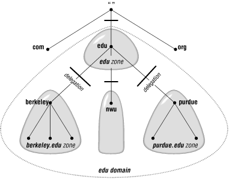

# 12. Domain-Name-System

## Hosts-Datei

<div className="float-right">


</div>

IP-Adressen kann man sich schlecht merken. Trotzdem braucht man sie, wenn man auf einen anderen Rechner, z.B. einen Webserver zugreifen will. Was also tun?

Wir verwenden gut merkbare Namen als Platzhalter für die eigentlichen IP-Adressen. Sie sagen ja auch "Ich telefoniere mit meiner Mam" und nicht ich telefonieren mit "Ich telefonieren mit 078 123 45 67".

Jetzt brauchen wir nur noch einen Ort, wo wir die IP-Adresse zu einem bestimmten Namen nachschlagen können, also ein Verzeichnis.

In den Anfängen des Internets wurde dazu auf jedem Rechner eine Textdatei mit dem Namen hosts abgespeichert. Darin sind die Namen von allen anderen Rechnern und deren IP-Adressen gespeichert.

Diese Datei gibt es noch heute auf allen Rechnern.

:::aufgabe
<Answer type="state" webKey="8cfeb298-ead4-4c6a-84b9-7e041d723dc2" />

Lassen Sie sich in einem Cmd- oder Terminal-Fenster die hosts-Datei auf Ihrem Notebook anzeigen. Der Befehl dazu lautet:
```bash
# Windows: 
type C:\Windows\System32\drivers\etc\hosts

# Mac
cat /etc/hosts
```

1. Wieviele Einträge finden Sie (alles, was mit # beginnt, ist nur Kommentar und zählt nicht)?
2. Heute gibt es ca. 1 Milliarde Rechner, welche über einen Namen erreicht werden können. Wie gross würde die hosts-Datei in GB, wenn wir pro Namen mit ca. `50B` Speicherplatz rechnen?
3. Welches sind die Nachteile des Systems mit der hosts-Datei?

<Answer type="text" webKey="0c35a41f-453c-4349-95af-cbbe314fb5fb" />
<Solution webKey="767ed998-c49e-4c90-aa89-b08016ba2bfc">

1. Die Datei enthält `0` Einträge (in der Regel, ausser Sie haben bspw. Docker installiert, dann gibt es einige wenige Einträge).
2. `50GB`
3. Die hosts-Datei wären heute sehr gross. Zudem müssten bei einer Änderung die Hosts-Dateien auf allen Rechnern, weltweit aktualisiert werden. Bei einer Milliarde Rechnern mit Namen, wäre der Aufwand dazu immens. Zudem würden sicher viele Fehler passieren.

</Solution>
:::

## Grundlagen

Sie haben in der letzten Aufgabe gesehen, dass die hosts-Datei kein taugliches Mittel für unser Problem "Welche IP-Adresse hat der Server mit dem Namen www.gbsl.ch?" ist.

Was Sie da gerade gelesen haben ist ein Domain-Name.

In dieser Aufgabe lernen Sie, wie Domain-Namen, welche die Basis des Domain-Name-System (kurz DNS) sind, gebildet werden. In der nachfolgenden Aufgabe erfahren Sie dann, wieso das DNS der Lösung mit den hosts-Dateien so überlegen ist.

:::aufgabe
<Answer type="state" webKey="71e000e8-035c-477f-98ec-983b1e96d52e" />

1. Lesen Sie auf der Seite https://www.elektronik-kompendium.de/sites/net/0901141.htm Die Abschnitte Domain oder Domainname bis und mit Geografisch Toplevel-Domains.
2. Folgende Abbildung zeigt einen Ausschnitt des DNS-Namensraumes:

  

  Eine solche Darstellung wird in der Informatik als Baum bezeichnet. Die Wurzel ist dabei zuoberst. Diese entspricht der Root-Domain, dargestellt durch den Punkt. Zuunterst sind die Blätter des Baums. Diese entsprechen den verschiedenen Host-Namen.

3. Zeichnen Sie den Baum für die folgenden Domain-Namen:

```
www.gbsl.ch
www.instagram.com
mail.sunrise.ch
matrix.distop.ie
```
Machen Sie eine Foto von Ihrer Zeichnung und laden Sie diese als Antwort hoch.

<Answer type="text" webKey="d755ca0c-b7ff-4002-b0b8-d3565c7ac6eb" />
:::

## DNS-Zonen und -Server

Die Informationen des DNS (Domain- / Host-Namen und zugehörige IP-Adressen) werden auf Servern gespeichert, sogenannten __Nameservern__. Dabei gibt es nicht nur einen solchen Server im Internet, sondern ganz viele. Jeder Server ist für eine bestimmten Bereich des DNS-Namensraumes zuständig, man spricht von __Zonen__. Wie das Genau funktioniert und welche Arten von Servern es gibt, lernen Sie hier.

### Domain vs. Zone



Im obigen Bild sehen Sie nochmals einen __Namensraum__. Der gestrichelt umramte Bereich entspricht der __Domain edu__. Sie umfasst alle __Subdomains__ (berkley, nwu, purdue). Die Punkte stellen die Domain-Namen dar. Zuoberst, d.h. der Domain edu übergeordnet, befindet sich die __Root-Domain__ "."

Für die __Verwaltung__ der Domain-Namen werden nun Zonen gebildet (graue Bereiche). Jede Zone verfügt über einen eigenen Nameserver. Jeder Nameserver kann Auskunft über seine eigene Zone geben.

### Delegation
Damit ein Nameserver nicht alle Domain-Namen und IP-Adressen seiner Zone kennen muss, kann er die Verwaltung von __Subdomains__ an untergeordnete Nameserver delegieren. Z.B. delegiert der Nameserver der Zone edu die Verwaltung der Namen aus der Domain berkley an den Nameserver der Zone berkley.edu. Auf diese Weise entsteht eine __Hierarchie__ von Nameservern.

Erhält nun ein Nameserver eine Anfrage für die IP-Adresse zu einem Domain-Namen, welcher in einer untergeordneten Zone verwaltet wird, so verweist er den Anfrager an den Nameserver der untergeordneten Zone weiter.

### Root-Server
Im obigen Bild ist keine Zone für die Root-Domain "." eingezeichnet. Es gibt aber trotzdem Nameserver, welche für diese Zone verantwortlich sind, die Root-Server. Sie kenne alle Nameserver welche die Top-Level-Domain-Zonen (edu, ch, de, org, ...) verwalten und delegieren Anfragen an diese.

Im Prinzip würde ein einziger Root-Server ausreichen. Da dieser aber sehr viele Anfragen beantworten müsste und ein Ausfall praktisch das gesamte Internet lahmlegen würde, gibt es über 100 Root-Server, welche auf der ganzen Welt verstreut sind. Allerdings teilen sich diese Root-Server genau 13 fest reservierte IP-Adressen.

### Autoritativer Server und Resolver
Ein Nameserver, welcher für die Verwaltung einer Zone zuständig ist, wird __autoritativer Nameserver__ genannt. Daneben gibt es auch Nameserver, welche ihre Informationen von autoritativen Nameservern beziehen und bei sich zwischenspeichern (Caching). Das erhöht die Verfügbarkeit des DNS und senkt die Antwortzeiten bei einer Abfrage. Solche Nameserver werden oft als __Resolver__ bezeichnet.

Der bei Ihrem Notebook als DNS-Server eingetragene Server ist ein solcher Resolver. Der eingetragene DNS-Server wird von Ihrem Netzwerk automatisch konfiguriert, kann aber auch angepasst werden. (Achtung: Im Schulnetzwerk funktionieren selber eingtragene DNS-Server nicht, da diese von der Firewall geblockt werden.)

### Resource-Records
Die DNS-Informationen werden als lesbarer Text in sogenannten __Zonendateinen__ konfiguriert. Ein Nameserver kann dann in dieser Zonendatei nachschauen, welche IP-Adresse zu einem bestimmten Domain-Namen gehört.

Die Einträge in der Zonendatei werden als __Resource-Records__ bezeichnet. Es gibt eine ganz Reihe von unterschiedlichen Recordarten. Zwei davon sind für uns wichtig:

A-Record
: Er enthält die **IP-Adresse** zu einem bestimmten **Host-Namen**
: Beispiel:
: `gbsl.ch. 3600 IN A 95.128.37.7`
NS-Record
: Er **verweist** auf einen anderen Nameserver (Delegation)
: Beispiel:
: `gbsl.ch. 3600 IN NS ns.namespace4you.de.`


:::aufgabe Selbsttest
<Answer type="state" webKey="89c880ef-e046-40d0-8007-7f9542306cf1" />


<iframe src="https://learningapps.org/watch?v=pafu9joyk22" style={{border:'0px',width:'100%',height:'500px'}} allowFullScreen="true" webkitallowfullscreen="true" mozallowfullscreen="true"></iframe>

<Answer type="text" webKey="976dbb72-ae3a-4b38-8892-7bd17dc1c773" />
:::

## Sicherheit und Datenschutz

Seit einigen Jahren wurde bekannt, dass DNS-Daten für Werbezwecke verwendet wurden. Diese Metadaten (Daten über Daten) geben ja an, auf welche Webseiten ein Benutzer zugreift. Zudem ist die Sicherheit von DNS gering: die erste Antwort auf eine Anfrage gilt. Ein Angreifer kann deshalb, wenn er nahe dem Opfer ist, diesem falsche IP-Adressen übergeben und es auf eine falsche Site lenken (Man in the Middle).

Aus diesen Gründen gibt es drei neue Konzepte, die diese Probleme lösen sollen. DNS over HTTPS (DOH) und DNS over TLS (DOT) sowie DNSSEC sollen sicherstellen, dass die Daten vertraulich und kryptografisch gesichert ausgetauscht werden. Sie werden in aktuellen Browsern schon eingesetzt. Allerdings weiss der Anbieter der DNS-Dienste immer noch, auf welche Sites der User gegangen ist – potentiell sind das wieder nutzbare Daten.

## Ablauf DNS-Abfrage

Sie haben nun die Struktur des DNS kennengelernt und gesehen, dass es zur Verwaltung in Zonen aufgeteilt wird. Jede Zone steht unter der Aufsicht eines autoritativen Name-Servers. Doch wie funktioniert das nun, wenn Ihr Notebook einen Domain-Name zu einer IP-Adresse auflösen muss? Das werden Sie in dieser Aufgabe herausfinden.

:::aufgabe 
<Answer type="state" webKey="575005e2-40fb-47c6-9c51-52b6cdfb5024" />

1. Gehen Sie auf die Seite 👉 https://tools.keycdn.com/dig Geben Sie den Domain-Name www.gbsl.ch ein, klicken Sie __:mdi-checkbox-marked: Trace__ an und lassen Sie den Namen auflösen.

#### Erklärungen
Was passiert hier genau?

Die Webseite stellt einen Resover zur Verfügung, über welchen Abfragen des DNS getätigt werden können. Dabei kann der Auflösungsprozess im Detail verfolgt werden.

Der Resolver frägt zunächst einen wohlbekannten, aber nicht autoritativen Webserver im Internet an. Zum Beispiel denjenigen von Google, der unter der IP-Adressse `8.8.8.8` erreichbar ist oder Cloudflare, der unter `1.1.1.1` zu finden ist.

Dieser kennt den angefragten Domain-Name nicht und **leitet den Resolver an die Root-Server weiter**.

Der Resolver wählt nun einen der Root-Server aus und wiederholt die Abfrage bei diesem.

Der ausgewählte Root-Server kann zwar den angefragten Domain-Name auch nicht auflösen, aber er kann sagen, welches die autoritativen Name-Server für die Top-Level-Domain sind. Hier wird die Delgation sichtbar.

Der Resolver wendet sich nun an einen der TLD-Name-Server und das Spiel wiederholt sich, bis der autoritative Name-Server für die unterste Subdomain im Domain-Name gefunden ist. Dieser kann nun den Domain-Name auflösen und die gesuchte IP-Adresse zurückgeben.

2. Zeichnen Sie ein Sequenzdiagramm, welches die Nachrichten vom Resolver zu den verschiedenen Name-Server, sowie deren Antworten zeigt. Beachten Sie, dass die Webseite aus Teil 1 der Aufgabe, jeweils **nur die Antworten** von den einzelnen Name-Server zeigt. Die Abfrage selber sieht man nicht. Sie können diese durch einen Pfeil mit der Beschriftung `DNS-Request([abgefragter Domain-Name])` darstellen.
   
   Die Antwortpfeile können Sie dann mit `DNS-Response(…)` beschriften, wobei Sie die Punkte durch einen der erhaltenen DNS-Resource-Records ersetzen (idealerweise derjenige DNS-Resource-Record, der dann in der nächsten Abfrage verwendet wird).

Laden Sie Ihr Sequenzdiagramm als Antwort zu dieser Aufgabe hoch.

<Answer type="text" webKey="379817e8-eb18-4d08-a019-623fbfd63363" />

:::
