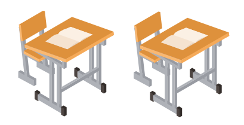
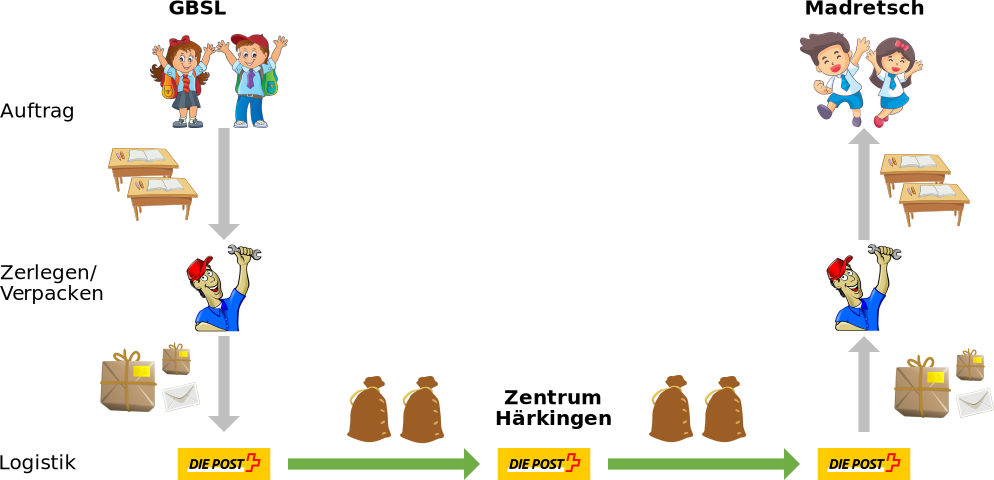
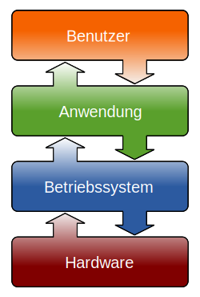
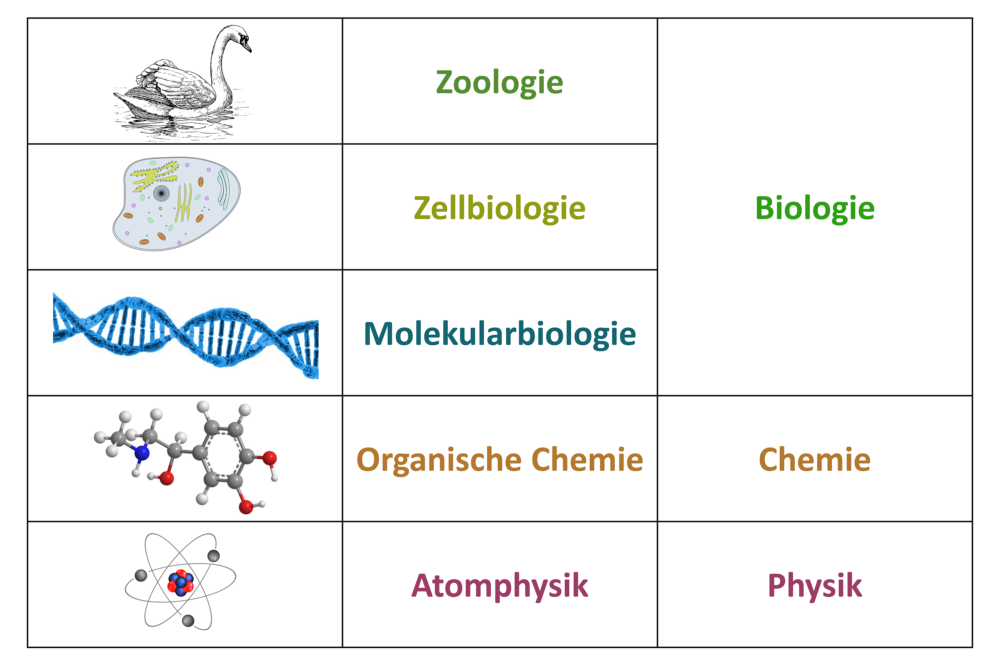

# Schichtenmodell

Viele komplexe Vorgänge und Konstruktionen können mit Hilfe eines sogenannten Schichtenmodells in einfachere Einzelteile aufgespalten werden.

## Beispiel "Schule"

Die Schule Madretsch feiert 100-jähriges Jubiläum und braucht für ihr Fest zusätzliche Schulpulte. Wir möchten helfen und einige Pulte schicken.

- Wie funktioniert dies?
- Wer ist alles involviert?

<Tabs
  defaultValue="step-1"
  values={[
    {label: 'Details 1', value: 'step-1'},
    {label: 'Details 2', value: 'step-2'},
    {label: 'Details 3', value: 'step-3'},
    {label: 'Details 4', value: 'step-4'},
  ]}>
  <TabItem value="step-1">

Den Schüler:innen ist egal, wie die Pulte in die Schule kommen. Sie freuen sich einfach über die zusätzlichen Schulpulte.

  </TabItem>
  <TabItem value="step-2">

Da die Pulte zu sperrig sind, werden diese vom GBSL-Hausdienst **zerlegt** und in einzelne Pakete verpackt.
Wenn die Pakete ankommen, kann der Madretsch-Hausdienst die Pakete **auspacken** und die Pulte wieder **zusammensetzen**.  

  </TabItem>
  <TabItem value="step-3">

Der Hausdienst trägt diese Pakete aber nicht selber zur Schule Madretsch.
Nein, die Pakete werden an die Post übergeben.
Diese ist für die **Organisation des Transports** zuständig.
Die Pakete machen auch einen Zwischenstopp im **Verteilzentrum** Härkingen.

  </TabItem>
  <TabItem value="step-4">

Die Post verwendet für den eigentlichen Transport verschiedene **Fahrzeuge und Berufschauffeur:innen**.
Im Verteilzentrum wird der Inhalt entladen und gemäss Adresse weitergeleitet.

  </TabItem>
</Tabs>

## Vorteile des Schichtenmodells

### Aufbau auf bestehendem

Ohne Probleme liesse sich das obenstehende Beispiel verwenden, um andere Inhalte zu transportieren. So könnten statt Pulten auch Stühle – oder z.B. auch Esswaren transportiert werden.

- So funktioniert auch unser Postsystem: Bis auf wenige Ausnahmen transportiert die Post alles.
- Die Übertragung von E-Mails und die einer Webseite unterscheidet sich nur in der obersten Schicht. Beide bauen auf den 3 identischen unteren Schichten auf

:::aufgabe Aufbau auf bestehendem

Was könnte noch Übertragen werden, wobei die unteren Schichten verwendet werden?
<Answer type="state" webKey="2b285845-e980-448e-9126-5b8dc7be9d20" />
<Answer type="text" webKey="64c4cfae-45dd-4961-b127-3d77964bcf96" />
:::

### Austauschbare Schichten
Die Schichten können ausgetauscht werden, solange sie ihre Aufgabe erfüllen und die Schnittstelle zwischen der darüber- und der darunterliegenden Schicht erfüllt wird.

- Die Post kann auch mit dem Flugzeug oder dem Zug transportiert werden. 
- Statt der Post kann man einen privaten Transportservice wie Planzer oder DHL engagieren.
- Statt des Hauswartes können auch Schüler:innen die Pulte auseinanderschrauben und wieder zusammensetzen.

:::aufgabe Schichten austauschen
Suchen Sie in anderen Bereichen des Alltags Schichtenmodelle und finden Sie dort Austauschbare Schichten.

<Answer type="state" webKey="72e68783-ab68-4e2b-8501-45b7b7eb7dad" />
<Answer type="text" webKey="0e1a8f90-44df-4c82-8e81-7b98a3bf09f1" />
<Solution webKey="818dd047-4ae7-4bce-84b3-4b95c7655292">

#### Beispiel Daten
- Daten können Kabelgebunden oder per Funk übertragen werden.
- Es kann zwischen verschiedenen Technologien für den Internetzugang gewählt werden: Glasfaser __FTTH__, Koaxialkabel (Kabelanschluss von UPC), Kupferkabel (Telefonanschluss).

</Solution>
:::

## Andere Schichtenmondelle
### Informatik

### Andere Wissenschaften

Verschiedene Naturwissenschaften bauen aufeinander auf und bilden so eine Art Schichtenmodell, um die ungeheure Komplexität der Natur in den Griff zu bekommen. Somit kann man sich z.B. auf sehr verschiedenen Abstraktionsebenen mit dem Organismus «Schwan» auseinandersetzen (Körperbau? Verhalten? DNA?) und kann die jeweils anderen Ebenen grösstenteils ausblenden.

