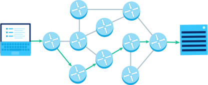
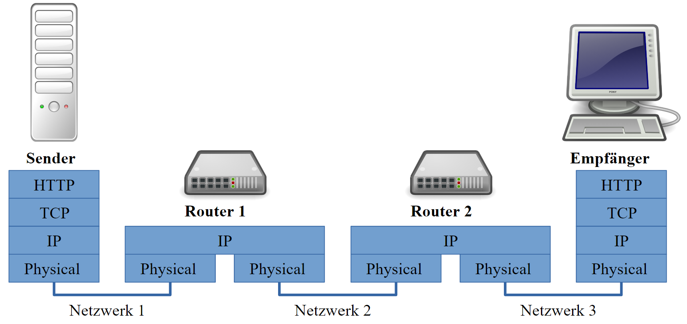
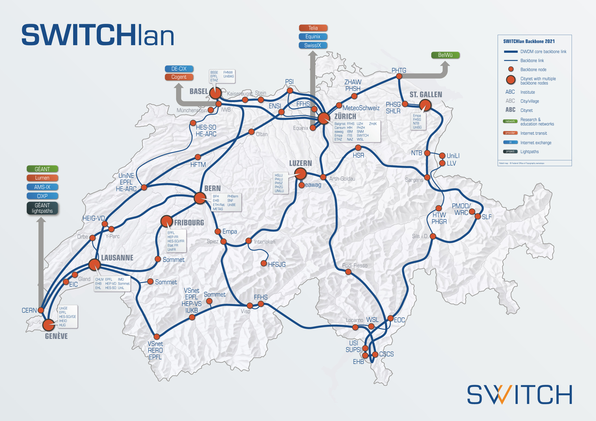
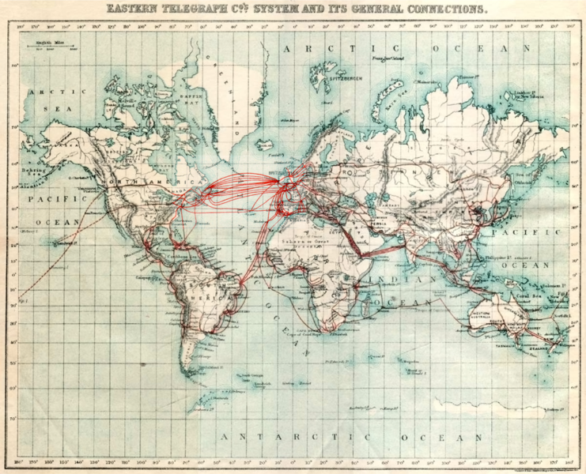

import Answer from "@site/src/components/Answer";
import Finding from "@site/src/components/Finding";
import TabItem from '@theme/TabItem';
import OsTabs from '@site/src/components/OsTabs';

# Routing im Internet [^1]

Wie Pakete eine Postadresse haben, brauchen auch Datenpakete eine Adresse, damit sie korrekt zugestellt werden können. Diese Adressen nennt man **IP-Adressen**, wobei IP für *Internet Protocol* steht.
## Adressierung

Normalerweise erhält jedes Gerät beim Beitritt zu einem Rechnernetz eine IP-Adresse zugewiesen. Die Adresse gehört zum entsprechenden Netz und erlaubt die Kommunikation mit allen Geräten die sich ebenfalls im selben Netz befinden. Deshalb erhält Ihr Gerät hier am GBSL eine andere Adresse als bei Ihnen zu Hause.

### Aufbau
Eine IP-Adresse (genauer, IPv4 Adresse) setzt sich aus 4 Zahlen zu je 8 Bit zusammen. Diese 4 Zahlen werden im Dezimalsystem notiert und mit Punkten verbunden.

```
194.124.132.216
```

Es gibt also insgesamt $2^{32} = 4'294'967'296$ verschiedene IP-Adressen. Auf den ersten Blick scheint die Anzahl sehr gross zu sein. Durch die Vielzahl an internetfähigen Geräten weltweit sind ein Grossteil der Adressen inzwischen vergeben. Deshalb gibt es eine neuere IP-Version 6, die aber den alten Standard noch nicht ersetzt hat. Mehr dazu [hier: IPv6](../010-Begriffe/1-ip-adresse.md#ipv6-adressen).

### Meine IP

Jedes Gerät das mit dem Internet verbunden ist, braucht eine IP-Adresse.

:::aufgabe IP-Adresse finden

Finden und notieren Sie die IP-Adresse

- Ihres Computers
- Ihres Smartphones

Vergleichen Sie die beiden IP-Adressen. Was stellen Sie fest?

<Answer type="text" id="q1" placeholder="IP-Adressen"/>

<details><summary>Wie finde ich die IP-Adresse?</summary>

Sie wissen nicht, wie man die IP-Adresse des eigenen Geräts findet?

Es gibt zahlreiche Anleitungen: Googeln Sie z.B.

```
IP-Adresse finden Android
```

oder

```
IP-Adresse finden Windows 10
```
oder etwas Ähnliches, das auf Ihr Gerät resp. Ihr  Betriebssystem abgestimmt ist.
</details>
:::

:::aufgabe 🏠 IP-Adresse finden

Finden und notieren Sie die IP-Adresse

- Ihres Computers
- Ihres Smartphones

bei Ihnen zu Hause!

<Answer type="text" id="q2" placeholder="IP-Adressen"/>

:::

### Ping
Beim Ping-Befehl handelt es sich um ein Netzwerkdiagnose-Tool, womit man die Datenübertragung zu einem anderen Gerät überprüfen kann. Dabei sendet man ein Signal an ein entferntes Gerät. Dieses Gerät sollte dann ein Signal zurücksenden.

```sh title="In der Kommandozeile"
ping 194.124.132.216
```
    
:::aufgabe Ping ausführen

Führen Sie einen Ping mit folgenden IP-Adressen aus:

```sh
194.124.132.216
8.8.8.8
185.237.144.226
194.150.245.142
```

- Was bedeutet die Ausgabe?
- Wieso gibt es Unterschiede?

<Answer type="text" id="q3"/>

:::

## Routing für Datenpakete

Routing-Algorithmen sorgen dafür, dass Datenpakete ihren Weg durch das Internet finden. Dabei kann es sein, dass mehrere Pakete mit dem selben Ziel unterschiedliche Routen nehmen.



### Router im Schichtenmodell

Der **Router** ist das **Paketverteilzentrum** und verbindet mehrere Netzwerke miteinander. Er besitzt also mindestens **zwei Netzwerkkarten** und somit auch mindestens **zwei IP-Adressen** um sich mit den einzelnen Netzwerken zu verbinden.

Sie müssen die **IP-Pakete auspacken**, damit diese gemäss der IP-Adresse **weitergeleitet** werden können. Dabei bedienen sich Router spezieller Tabellen, welche angeben, wohin ein Paket mit einer bestimmten IP-Adresse hingeleitet werden soll.



:::note

Damit ein Router ein IP-Paket weiterleiten kann, braucht er folgende, im Paket enthaltene Informationen:
- IP-Adresse Sender
- IP-Adresse Empfänger

:::


## Routen verfolgen
Der Befehl `traceroute` (macOS) resp. `tracert` (Windows) kann diese Route nachverfolgt werden. Dabei werden die Zwischenstationen – also dort wo das Paket entpackt und gemäss Ziel-IP-Adresse weitergeleitet wird – angezeigt.

:::aufgabe `traceroute`


<OsTabs>
<TabItem value="win">

Öffnen Sie eine Eingabeaufforderung (cmd) und geben Sie nacheinander die folgenden drei Befehl ein:

```.sh title="In der Kommandozeile (cmd)"
tracert office.com
tracert www.google.ch
tracert www.gbsl.ch
```

</TabItem>
<TabItem value="mac">

Öffnen Sie eine Eingabeaufforderung (terminal) und geben Sie nacheinander die folgenden drei Befehl ein:

```.sh title="In der Kommandozeile (terminal)"
traceroute office.com
traceroute www.google.ch
traceroute www.gbsl.ch
```

</TabItem>
</OsTabs>

Beobachten Sie den Output. Erkennen Sie Gemeinsamkeiten oder irgendeine spezielle Zwischenstation?
<Answer type="text" id="q4"/>

:::

## Standardgateway

Für die Kommunikation mit Geräten ausserhalb des eigenen Netzwerks müssen die Internetpakete zum nächsten Verteilzentrum geschickt werden. In der Analogie zum Öffentlichen Verkehr ist dies die nächstgelegene Haltestelle, die Sie zum Hauptbahnhof bringt: wollen Sie an einen Ort ausserhalb ihrer Stadt, so gehen Sie zum Hauptbahnhof, wo Sie in die richtige Richtung weitergeleitet werden. Dieser Weg zum Hauptbahnhof wird bei Netzwerkfähigen Geräten **Standardgateway** genannt.

### Standardgateway ihres Laptops

<OsTabs>
<TabItem value="win">

```.sh title="In der Kommandozeile (cmd) eingeben"
ipconfig
```


</TabItem>
<TabItem value="mac">

```.sh title="In der Koommandozeile (terminal) eingeben"
netstat -nr
```


</TabItem>
</OsTabs>

:::info
Zu Hause haben Sie als Standardgateway die IP-Adresse Ihres Routers/Modems eingetragen – also dem Gerät, das Sie von Ihrem Internet-Anbieter erhalten, um Zugang zum Internet zu erhalten.
:::

:::aufgabe
Gehen Sie auf die Webseite https://whatsmyip.org/. Was wird angezeigt?

<Answer type="text" id="q5"/>

<details><summary>Lösung</summary>

Bei der angezeigten Adresse handelt es sich um die IP-Adresse, welche im Internet sichtbar ist. Ihr Gerät befindet sich meist nicht direkt im Internet, sondern ist über den Router damit verbunden. Sie sehen hier also die externe IP-Adresse Ihres Routers/Modems.

(Router oder Hotspots haben immer mindestens zwei IP-Adressen, weil sie zwei Netze miteinander verbinden und deshalb in beiden Netzen eine IP-Adresse brauchen.)

</details>
:::

## ⭐️ MAC-Adresse

Die physikalische Adresse, auch Hardware-Adresse eines Computers (oder genauer gesagt die Adresse seiner Netzwerkschnittstelle) – nennt man **MAC-Adresse** (*MAC* steht für `Media Access Control` und hat entsprechen nichts mit Apple zu tun). Sie besteht aus 48 Bit oder 6 Bytes, so dass sie üblicherweise als Hexadezimalzahl (mit $16$ eindeutigen Zeichen) mit `6×2` Stellen angegeben wird, beispielsweise: `48:2C:6A:1E:59:3D`. Jede MAC-Adresse muss **weltweit eindeutig** sein, damit die Zustellung von Paketen, und somit auch die Transportsicherheit, garantiert werden kann. Die MAC-Adresse wird bei der Herstellung der Netzwerkkarte fix vergeben und kann nicht mehr verändert werden.

:::info

Ihre Persönlichkeit ändern Sie bei einem Umzug nicht, Ihre Wohnadresse aber schon. Gleiches gilt für die MAC-Adresse und IP-Adresse eines Geräts: Die MAC-Adresse bleibt gleich, die im Netzwerk sichtbare IP-Adresse ändert jedoch.
:::

### Wozu braucht es die MAC-Adresse?

Die MAC-Adresse erlaubt die direkte Kommunikation zwischen zwei Geräten im selben Netzwerk, ohne dabei den Router zu beauftragen, ihre Pakete weiterzuleiten. Da diese direkte Kommunikation effizienter ist, merkt sich bspw. der WLAN-Accesspoint\* bei Ihnen zuhause, welche IP-Adresse zu welcher MAC-Adresse gehört. So kann ein Paket direkt zu Ihrem Gerät geschickt werden, ohne jedes Mal den richtigen Empfänger im Netzwerk ausfindig zu machen.  

\* oft sind WLAN-Accesspoint und Router im selben Gerät kombiniert. Doch im Innern sind es zwei Geräte, ein Router und ein WLAN-Accesspoint.   
## «Highspeed-Routen»
### Schweiz
Auf der untenstehenden Karte erkennt man die schnellsten Leitungen von Switch. Diese Organisation verbindet die Universitäten und Forschungsinstitute miteinander und mit dem Ausland.



Andere Provider besitzen ebenfalls schnelle Leitungen zwischen den Städten und ins Ausland. z.B. wurden bestehenden Gas-Leitungen mit schnellen Glasfaser-Kabeln versehen.


### Interkontinental

Bei der Verbindung von Kontinenten hatte man schon vor dem Internet-Zeitalter Unterseekabel verlegt.



Heute laufen zahlreiche «Highspeed-Routen» über den Grund der Meere.

<iframe width="100%" height="315" src="https://www.youtube-nocookie.com/embed/0TZwiUwZwIE" title="YouTube video player" frameBorder="0" allow="accelerometer; autoplay; clipboard-write; encrypted-media; gyroscope; picture-in-picture" allowFullScreen></iframe>


:::aufgabe Unterseekabel

Wie kommt ein Datenpaket von Biel
- in die USA?
- nach Madagaskar?

https://www.submarinecablemap.com/

<Answer type="text" id="q6"/>

:::

[^1]: Quelle: [informatik.mygymer.ch](https://informatik.mygymer.ch/g23c/008.rechnernetze-kommunikation/05.routing.html)
