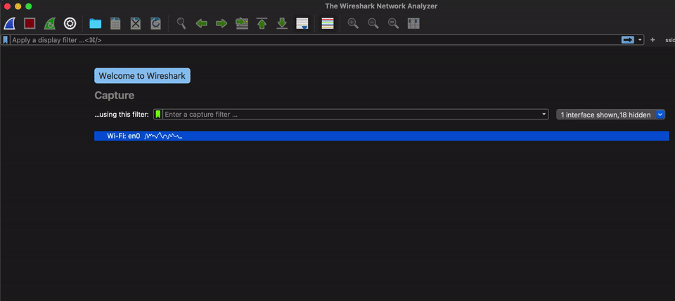

---
sidebar_custom_props:
  id: 96a6ac1a-1147-4a3e-af95-902658562aa6
---
# WIFI Sniffing Demo

- Wireshark im Monitor Mode (Achtung, aktive WLAN-Verbindungen müssen deaktiviert werden, damit der Monitor Mode auf MacOSX funktionert)
- Möglichst nahe ans WLAN-Signal, insbesondere bei billigem Hotspot...
- Etwas Geduld...
- Capturing Filter, damit Package-Loss reduziert werden kann



## WIFI-Karte muss auf denselben Channel wie der Router eingestellt sein
- bspw. WIFI auf Channel 7 setzen
- `export PATH="/System/Library/PrivateFrameworks/Apple80211.framework/Versions/Current/Resources:$PATH"` zum Pfad hinzufügen, so dass der Befehl `airport` verfügbar wird.

```sh
sudo airport -z # disassociate from any network
sudo airport en0 -c7 # no space after -c !
```

[Source](https://wiki.wireshark.org/CaptureSetup/WLAN)

```sh title="GET oder POST requests"
port 80 and ((tcp[((tcp[12:1] & 0xf0) >> 2):4] = 0x47455420) or (tcp[((tcp[12:1] & 0xf0) >> 2):4] = 0x504F5354))
```


```sh title="ip source starts with 192.168"
src net 192.168
```

